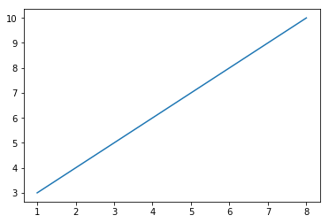
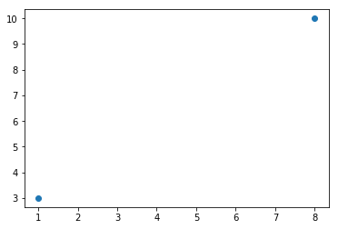
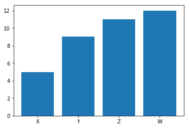
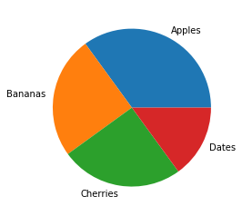
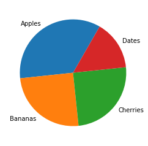

# 1 Day of Python Learning Tutorial

<div class="toctitle" dir="ltr" lang="en"></div>
<h2 id ="back">Contents</h2>
<label class="toctogglelabel" for="toctogglecheckbox"></label></div>
<ul>
<li class="toclevel-1 tocsection-1"><a href="#Introduction"><span class="toctext">Introduction</span></a></li>
<li class="toclevel-1 tocsection-2"><a href="#Python Indentation"><span class="toctext">Python Indentation</span></a></li>
<li class="toclevel-1 tocsection-3"><a href="#Python Comments"><span class="toctext">Python Comments </span></a></li>
<li class="toclevel-1 tocsection-4"><a href="#Python Variables"><span class="toctext">Python Variables </span></a></li>  
<li class="toclevel-1 tocsection-5"><a href="#Python Data Types"><span class="toctext">Python Data Types </span></a></li>   
<li class="toclevel-1 tocsection-6"><a href="#Python Numbers"><span class="toctext">Python Numbers </span></a></li>    
 <li class="toclevel-1 tocsection-7"><a href="#Python Casting"><span class="toctext">Python Casting </span></a></li> 
  <li class="toclevel-1 tocsection-8"><a href="#Python Strings"><span class="toctext">Python Strings </span></a></li> 
 <li class="toclevel-1 tocsection-9"><a href="#Python Booleans"><span class="toctext">Python Booleans  </span></a></li> 
  <li class="toclevel-1 tocsection-10"><a href="#Python Operators"><span class="toctext">Python Operators  </span></a></li> 
 <li class="toclevel-1 tocsection-11"><a href="#Python Lists"><span class="toctext">Python Lists  </span></a></li> 
  <li class="toclevel-1 tocsection-12"><a href="#Python Tuples"><span class="toctext">Python Tuples  </span></a></li> 
   <li class="toclevel-1 tocsection-13"><a href="#Python Sets"><span class="toctext">Python Sets  </span></a></li> 
  <li class="toclevel-1 tocsection-14"><a href="#Python Dictionaries"><span class="toctext">Python Dictionaries   </span></a></li> 
   <li class="toclevel-1 tocsection-15"><a href="#Python Lambda"><span class="toctext">Python Lambda   </span></a></li> 
 <li class="toclevel-1 tocsection-15"><a href="#Python Arrays"><span class="toctext">Python Arrays  </span></a></li> 
 <li class="toclevel-1 tocsection-16"><a href="#Python Classes"><span class="toctext">Python Classes </span></a></li>
 <li class="toclevel-1 tocsection-17"><a href="#Python Iterators"><span class="toctext">Python Iterators </span></a></li>
 <li class="toclevel-1 tocsection-17"><a href="#Python Math"><span class="toctext">Python Math  </span></a></li>
 <li class="toclevel-1 tocsection-18"><a href="#Python JSON"><span class="toctext">Python JSON   </span></a></li>
  <li class="toclevel-1 tocsection-18"><a href="#Python RegEx"><span class="toctext">Python RegEx  </span></a></li>
  <li class="toclevel-1 tocsection-19"><a href="#Python Try Exception"><span class="toctext">Python Try Exception  </span></a></li>
  <li class="toclevel-1 tocsection-20"><a href="#Python String Formatting"><span class="toctext">Python String Formatting   </span></a></li>
 <li class="toclevel-1 tocsection-21"><a href="#Python If ... Else"><span class="toctext">Python If ... Else   </span></a></li>
 <li class="toclevel-1 tocsection-22"><a href="#Python Loops"><span class="toctext">Python Loops </span></a></li>
 <li class="toclevel-1 tocsection-23"><a href="#Python User Input"><span class="toctext">Python User Input </span></a></li>
 <li class="toclevel-1 tocsection-24"><a href="#File Handling"><span class="toctext">File Handling </span></a></li>
 <li class="toclevel-1 tocsection-24a"><a href="#Python PIP"><span class="toctext">Python PIP </span></a></li>
 <li class="toclevel-1 tocsection-24b"><a href="#Python Remove List Duplicates"><span class="toctext">Python Remove List Duplicates </span></a></li>
<li class="toclevel-1 tocsection-24c"><a href="#Python Reverse a String"><span class="toctext">Python Reverse a String </span></a></li>
<li class="toclevel-1 tocsection-24d"><a href="#Pandas Read CSV"><span class="toctext">Python Pandas Read CSV </span></a></li>	
  <li class="toclevel-1 tocsection-25"><a href="#Python Datetime"><span class="toctext">Python Datetime </span></a></li>
<li class="toclevel-1 tocsection-24e"><a href="#Pandas Series"><span class="toctext">Python Pandas Series </span></a></li>
<li class="toclevel-1 tocsection-24f"><a href="#Pandas Read JSON"><span class="toctext">Python Pandas Read JSON </span></a></li>
<li class="toclevel-1 tocsection-24g"><a href="#Pandas Analyzing Data"><span class="toctext">Python Pandas Analyzing Data </span></a></li>
<li class="toclevel-1 tocsection-24h"><a href="#SciPy Constants"><span class="toctext">Python SciPy Constants </span></a></li>	
<li class="toclevel-1 tocsection-24i"><a href="#SciPy Sparse Data"><span class="toctext">Python SciPy Sparse Data </span></a></li>
<li class="toclevel-1 tocsection-24j"><a href="#Matplotlib Plotting"><span class="toctext">Python Matplotlib Plotting </span></a></li>
<li class="toclevel-1 tocsection-24k"><a href="#Matplotlib Bars"><span class="toctext">Python Matplotlib Bars </span></a></li>
<li class="toclevel-1 tocsection-24l"><a href="#Matplotlib Pie Charts"><span class="toctext">Python Matplotlib Pie Charts </span></a></li>
<li class="toclevel-1 tocsection-24o"><a href="#Python Statistics"><span class="toctext">Python Statistics </span></a></li>
<li class="toclevel-1 tocsection-24p"><a href="#Python Requests"><span class="toctext">Python Requests </span></a></li>
  <li class="toclevel-1 tocsection-26"><a href="#Python NumPy"><span class="toctext">Python NumPy  </span></a></li>
  <li class="toclevel-1 tocsection-27"><a href="#Python Papers"><span class="toctext">Python Papers </span></a></li>
  <li class="toclevel-1 tocsection-28"><a href="#books"><span class="toctext">Python Books </span></a></li>
	<li class="toclevel-1 tocsection-28a"><a href="#Python MySQL"><span class="toctext">Python MySQL </span></a></li>
	<li class="toclevel-1 tocsection-28b"><a href="#Python Global Keyword"><span class="toctext">Python Global Keyword </span></a></li>
  <li class="toclevel-1 tocsection-29"><a href="#Python Exercises"><span class="toctext">Python Exercises with Solutions [183 Exercises] </span></a></li>
</ul>

</br>

<h2 id ="Introduction"> Introduction </h2>
<h3>What is Python?</h3>
<p><a href="https://en.wikipedia.org/wiki/Python_(programming_language)">Python</a> is an&nbsp;<a title="Interpreted language" href="https://en.wikipedia.org/wiki/Interpreted_language">interpreted</a>,&nbsp;<a title="High-level programming language" href="https://en.wikipedia.org/wiki/High-level_programming_language">high-level</a>&nbsp;and&nbsp;<a title="" href="https://en.wikipedia.org/wiki/General-purpose_programming_language">general-purpose programming language</a>. It was created by</p>
<p></p>
<p><a href="https://en.wikipedia.org/wiki/Guido_van_Rossum"><strong>Guido van Rossum</strong></a>, and released in 1991. Python got its name from a BBC comedy series from seventies - "<a href="https://en.wikipedia.org/wiki/Monty_Python%27s_Flying_Circus">Monty Python's Flying Circus</a>".</p>
<p>&nbsp;</p>
<table style="width: 786px;">
<tbody>
<tr>
<td style="width: 776px;">
<h2>Publications</h2>
<ul>
<li><a href="https://github.com/manjunath5496/1Day-of-Python-Learning-Tutorial/blob/master/pyk(1).pdf">Extending and embedding the python interpreter</a></li>
<li><a href="https://github.com/manjunath5496/1Day-of-Python-Learning-Tutorial/blob/master/pyk(2).pdf">Python Tutorial</a></li>
<li><a href="https://github.com/manjunath5496/1Day-of-Python-Learning-Tutorial/blob/master/pyk(3).pdf">Python reference manual</a></li>
<li><a href="https://github.com/manjunath5496/1Day-of-Python-Learning-Tutorial/blob/master/pyk(4).pdf">Python library reference</a></li>
<li><a href="https://github.com/manjunath5496/1Day-of-Python-Learning-Tutorial/blob/master/pyk(5).pdf">The ABC Structure Editor: Structure-based Editing for the ABC Programming Environment</a></li>
<li><a href="https://github.com/manjunath5496/1Day-of-Python-Learning-Tutorial/blob/master/pyk(6).pdf">The Python Language Reference</a></li>
<li><a href="https://github.com/manjunath5496/1Day-of-Python-Learning-Tutorial/blob/master/pyk(7).pdf">Using Python for CGI programming</a></li>
<li><a href="https://github.com/manjunath5496/1Day-of-Python-Learning-Tutorial/blob/master/pyk(8).pdf">Python/C API Reference Manual</a></li>
<li><a href="https://github.com/manjunath5496/1Day-of-Python-Learning-Tutorial/blob/master/pyk(9).pdf">Distributing Python Modules</a></li>
<li><a href="https://github.com/manjunath5496/1Day-of-Python-Learning-Tutorial/blob/master/pyk(10).pdf">Python (programming language)</a></li>
<li><a href="https://github.com/manjunath5496/1Day-of-Python-Learning-Tutorial/blob/master/pyk(11).pdf">Introduction to Python</a></li>
<li><a href="https://github.com/manjunath5496/1Day-of-Python-Learning-Tutorial/blob/master/pyk(17).pdf">Interview with Guido van Rossum</a></li>
</ul>
</td>
</tr>
</tbody>
</table>
<h3>What can Python do?</h3>
<ul>
<li>Python can be used on a <a href="https://en.wikipedia.org/wiki/Server_(computing)">server</a> to create web applications.</li>
<li>Python can be used alongside software to create workflows.</li>
<li>Python can connect to <a href="https://en.wikipedia.org/wiki/Database">database</a> systems. It can also read and modify files.</li>
<li>Python can be used to handle <a href="https://en.wikipedia.org/wiki/Big_data">big data</a> and perform complex mathematics.</li>
<li>Python can be used for rapid <a href="https://en.wikipedia.org/wiki/Prototype">prototyping</a>, or for production-ready software development.</li>
</ul>
<h3>Why Python?</h3>
<ul>
<li>It is a general purpose <a href="https://en.wikipedia.org/wiki/Object-oriented_programming">object oriented programming</a> language which can be used for both scientific and non scientific programming.</li>
<li>It is a platform independent programming language. It works on different platforms (<a href="https://en.wikipedia.org/wiki/Microsoft_Windows">Windows</a>, <a href="https://en.wikipedia.org/wiki/Macintosh_operating_systems">Mac</a>, <a href="https://en.wikipedia.org/wiki/Linux">Linux</a>, <a href="https://en.wikipedia.org/wiki/Raspberry_Pi">Raspberry Pi</a>, etc).</li>
<li>Python has a simple syntax similar to the English language with vast library of <strong>add-on</strong> <strong>modules</strong>. It&nbsp;has syntax that allows developers to write programs with fewer lines than some other programming languages.</li>
<li>It is excellent for beginners as the language is interpreted, hence gives immediate results.</li>
<li>The programs written in Python are easily readable and understandable. It is suitable as an extension language for customizable applications. It is easy to learn and use.</li>
<li>Python can be treated in a procedural way, an object-oriented way or a functional way. It is free to use.</li>
</ul>
<h3>The language is used by companies in real revenue generating products, such as:</h3>
<ul>
<li>In operations of <a href="https://en.wikipedia.org/wiki/Google">Google</a> search engine, <a href="https://en.wikipedia.org/wiki/YouTube">youtube</a>, etc.</li>
<li><a href="https://en.wikipedia.org/wiki/BitTorrent">BitTorrent</a> peer to peer file sharing is written using python.</li>
<li><a href="https://en.wikipedia.org/wiki/Intel">Intel</a>, <a href="https://en.wikipedia.org/wiki/Cisco_Systems">Cisco</a>, <a href="https://en.wikipedia.org/wiki/Hewlett-Packard">HP</a>, <a href="https://en.wikipedia.org/wiki/IBM">IBM</a>, etc use Python for hardware testing.</li>
<li><a href="https://en.wikipedia.org/wiki/Autodesk_Maya">Maya</a> provides a python scripting API</li>
<li><a href="https://en.wikipedia.org/wiki/IRobot">i-Robot </a>uses python to develop commercial Robot for space exploration and military defense.</li>
<li><a href="https://en.wikipedia.org/wiki/NASA">NASA </a>and others use python for their scientific programming task.</li>
</ul>
<p>&nbsp;</p>

<table>
<tbody>
<tr>
<td width="205">
<p>print("hello"*3)</p>
</td>
<td width="184">
<p><strong>hellohellohello</strong></p>
</td>
<td width="171">
<p>repetition</p>
</td>
</tr>
<tr>
<td width="205">
<p>print("hello"+"world")</p>
</td>
<td width="184">
<p><strong>helloworld</strong></p>
</td>
<td width="171">
<p>concatenation</p>
</td>
</tr>
<tr>
<td width="205">
<p>print("hello"[0])</p>
</td>
<td width="184">
<p><strong>h</strong></p>
</td>
<td width="171">
<p>indexing</p>
</td>
</tr>
<tr>
<td width="205">
<p>print("hello"[-1])</p>
</td>
<td width="184">
<p><strong>o</strong></p>
</td>
<td width="171">
<p>from end</p>
</td>
</tr>
<tr>
<td width="205">
<p>print("hello"[1:4])</p>
</td>
<td width="184">
<p><strong>ell</strong></p>
</td>
<td width="171">
<p>slicing</p>
</td>
</tr>
<tr>
<td width="205">
<p>print(len("hello"))</p>
</td>
<td width="184">
<p><strong>5</strong></p>
</td>
<td width="171">
<p>size</p>
</td>
</tr>
</tbody>
</table>
</br>
<h2 id="Python Indentation"> Python Indentation </h2>
<h3> Code: </h3>

```python
if 4 > 3:
  print("Four is greater than three!") 
```
<h3> Output on the screen:</h3>

<pre> Four is greater than three! </pre>
<br>
<hr>

<h3> Code: </h3>

```python
if 4 > 3:
print("Four is greater than three!") 
```
<h3> Output on the screen:</h3>

<pre> print("Four is greater than three!")
       ^
IndentationError: expected an indented block </pre>
<hr>
<a href="#back"><span class="toctext">&#8593;Back</span></a>
</br>
<h2 id="Python Comments"> Python Comments </h2>
<h3> Code: </h3>

```python
#This is a comment 
print("Hello, World!")
```
<h3> Output on the screen:</h3>

<pre> Hello, World! </pre>
<hr>
<a href="#back"><span class="toctext">&#8593;Back</span></a>
</br>

<h2 id="Python Variables"> Python Variables </h2>
<h3> Code: </h3>

```python
a = 5
b = "Python"
print(a)
print(b) 
```
<h3> Output on the screen:</h3>

<pre> 
5
Python </pre>
<br>
<hr>

<h3> Code: </h3>

```python
a, b, c = "Tree", "Chair", "bench" 
print(a)
print(b) 
print(c) 
```
<h3> Output on the screen:</h3>

<pre>
Tree
Chair
bench </pre>

<br>
<hr>

<h3> Code: </h3>

```python
a = b = c = "Chair" 
print(a)
print(b) 
print(c)

```
<h3> Output on the screen:</h3>

<pre>
Chair
Chair
Chair </pre>

<br>
<hr>

<h3> Code: </h3>

```python
a = "easy to understand" 
print("Python is " + a)

```
<h3> Output on the screen:</h3>

<pre> Python is easy to understand </pre>

<br>
<hr>

<h3> Code: </h3>

```python
a = 4
b = 3
print(a + b)

```
<h3> Output on the screen:</h3>

<pre> 7 </pre>
<br>
<hr>

<h3> Code: </h3>

```python
a = 6
b = "Python" 
print(a + b)

```
<h3> Output on the screen:</h3>

<pre> TypeError: unsupported operand type(s) for +: 'int' and 'str' </pre>

<br>
<hr>

<h3> Code: </h3>

```python
a = "Hello"
b = "World"
c = a + b
print(c)

```
<h3> Output on the screen:</h3>

<pre> HelloWorld </pre>

<br>
<hr>

<h3> Code: </h3>

```python
a = "Hello"
b = "World"
c = a + " " + b
print(c)

```
<h3> Output on the screen:</h3>

<pre> Hello World </pre>

<br>
<hr>

<h3> Code: </h3>

```python
a = "easy to understand"

def myfunc(): 
 print("Python is " + a)

myfunc()

```
<h3> Output on the screen:</h3>

<pre> Python is easy to understand </pre>

<hr>
<a href="#back"><span class="toctext">&#8593;Back</span></a>
</br>
<h2 id="Python Data Types"> Python Data Types </h2>
<h3> Code: </h3>

```python
# Print the data type of the variable a:
a = 5 
print(type(a))
```
<h3> Output on the screen:</h3>

 <class 'int'>
<br>
<hr>
<table style="width: 462px;">
<tbody>
<tr>
<td style="width: 336px;">
<p>&nbsp;</p>
<p><strong>Value of a</strong></p>
</td>
<td style="width: 110px;">
<p>&nbsp;</p>
<p><strong>Data Type</strong></p>
</td>
</tr>
<tr>
<td style="width: 336px;">
<p>&nbsp;</p>
<p>a = "Hello World"</p>
</td>
<td style="width: 110px;">
<p>&nbsp;</p>
<p>str</p>
</td>
</tr>
<tr>
<td style="width: 336px;">
<p>&nbsp;</p>
<p>a = 20</p>
</td>
<td style="width: 110px;">
<p>&nbsp;</p>
<p>int</p>
</td>
</tr>
<tr>
<td style="width: 336px;">
<p>&nbsp;</p>
<p>a = 20.5</p>
</td>
<td style="width: 110px;">
<p>&nbsp;</p>
<p>float</p>
</td>
</tr>
<tr>
<td style="width: 336px;">
<p>&nbsp;</p>
<p>a = 1k</p>
</td>
<td style="width: 110px;">
<p>&nbsp;</p>
<p>complex</p>
</td>
</tr>
<tr>
<td style="width: 336px;">
<p>&nbsp;</p>
<p>a = ["Tree", "Chair", "bench"]</p>
</td>
<td style="width: 110px;">
<p>&nbsp;</p>
<p>list</p>
</td>
</tr>
<tr>
<td style="width: 336px;">
<p>&nbsp;</p>
<p>a = ("Tree", "Chair", "bench")</p>
</td>
<td style="width: 110px;">
<p>&nbsp;</p>
<p>tuple</p>
</td>
</tr>
<tr>
<td style="width: 336px;">
<p>&nbsp;</p>
<p>a = range(6)</p>
</td>
<td style="width: 110px;">
<p>&nbsp;</p>
<p>range</p>
</td>
</tr>
<tr>
<td style="width: 336px;">
<p>&nbsp;</p>
<p>a = {"name" : "Guido van Rossum", "age" : 65}</p>
</td>
<td style="width: 110px;">
<p>&nbsp;</p>
<p>dict</p>
</td>
</tr>
<tr>
<td style="width: 336px;">
<p>&nbsp;</p>
<p>a = {"Tree", "Chair", "bench"}</p>
</td>
<td style="width: 110px;">
<p>&nbsp;</p>
<p>set</p>
</td>
</tr>
<tr>
<td style="width: 334px;">
<p>&nbsp;</p>
<p>a&nbsp;= frozenset({"Tree", "Chair", "bench"})</p>
</td>
<td style="width: 114px;">
<p>&nbsp;</p>
<p>frozenset</p>
</td>
</tr>
<tr>
<td style="width: 334px;">
<p>&nbsp;</p>
<p>a&nbsp;= True</p>
</td>
<td style="width: 114px;">
<p>&nbsp;</p>
<p>bool</p>
</td>
</tr>
<tr>
<td style="width: 334px;">
<p>&nbsp;</p>
<p>a&nbsp;= b"Hello"</p>
</td>
<td style="width: 114px;">
<p>&nbsp;</p>
<p>bytes</p>
</td>
</tr>
<tr>
<td style="width: 334px;">
<p>&nbsp;</p>
<p>a&nbsp;= bytearray(5)</p>
</td>
<td style="width: 114px;">
<p>&nbsp;</p>
<p>bytearray</p>
</td>
</tr>
<tr>
<td style="width: 334px;">
<p>&nbsp;</p>
<p>a&nbsp;= memoryview(bytes(5))</p>
</td>
<td style="width: 114px;">
<p>&nbsp;</p>
<p>memoryview</p>
</td>
</tr>
</tbody>
</table>
<hr>
<a href="#back"><span class="toctext">&#8593;Back</span></a>
</br>
<h2 id="Python Numbers">Python Numbers </h2>

<h3> Code: </h3>

```python
# Display a random number between 1 and 9:

import random 
print(random.randrange(1, 10)) 

```
<h3> Output on the screen:</h3>

<pre> 7 </pre>

<hr>
<a href="#back"><span class="toctext">&#8593;Back</span></a>
</br>
<h2 id="Python Casting"> Python Casting  </h2>
<h3> Code: </h3>

```python
a = int(1)   # a will be 1
b = int(2.8) # b will be 2
c = int("3") # c will be 3 
print(a)
print(b)
print(c)
```
<h3> Output on the screen:</h3>

<pre> 
1
2
3 </pre>
<br>
<hr>

<h3> Code: </h3>

```python
a = float(1)     # a will be 1.0
b = float(2.8)   # b will be 2.8
c = float("3")   # c will be 3.0
print(a)
print(b)
print(c)
```
<h3> Output on the screen:</h3>

<pre> 
1.0
2.8
3.0 </pre>
<hr>

<h3> Code: </h3>

```python
a = str("s1") # a will be s1
b = str(2)    # b will be 2
c = str(3.0)  # c will be 3.0
print(a)
print(b)
print(c)
```
<h3> Output on the screen:</h3>

<pre> 
s1
2
3.0 </pre>
<hr>


<a href="#back"><span class="toctext">&#8593;Back</span></a>
</br>

<h2 id="Python Strings"> Python Strings  </h2>
<h3> Code: </h3>

```python
a = "Hello" 
b = """Python """ 
c = '''Python''' 
print(a)
print(b)
print(c)
```
<h3> Output on the screen:</h3>

<pre> 
Hello
Python 
Python </pre>
<br>
<hr>

<h3> Code: </h3>

```python
#Get the character at position 0
a = "Hello, World!"
print(a[0])
```
<h3> Output on the screen:</h3>

<pre> 
H </pre>
<hr>

<h3> Code: </h3>

```python
for a in "Chair":
  print(a) 
```
<h3> Output on the screen:</h3>

<pre> 
C
h
a
i
r</pre>
<hr>

<h3> Code: </h3>

```python
# get the length of a string
a = "Hello"
print(len(a))
```
<h3> Output on the screen:</h3>

<pre> 
5</pre>
<hr>

<h3> Code: </h3>

```python
# Check if "was" is present in the following text:
txt = "Albert Einstein was a German-born theoretical physicist."
print("was" in txt)
```
<h3> Output on the screen:</h3>

<pre> 
True</pre>
<hr>

<h3> Code: </h3>

```python
# Print only if "Einstein" is present:
txt = "Albert Einstein was a German-born theoretical physicist."
if "Einstein" in txt:
  print("Yes, 'Einstein' is present.")
```
<h3> Output on the screen:</h3>

<pre> 
Yes, 'Einstein' is present.</pre>
<hr>

<h3> Code: </h3>

```python
# Check if "newton" is NOT present in the following text:
txt = "Albert Einstein was a German-born theoretical physicist."
print("newton" not in txt)
```
<h3> Output on the screen:</h3>

<pre> 
True</pre>
<hr>


<h3> Code: </h3>

```python
# print only if "newton" is NOT present:
txt = "Albert Einstein was a German-born theoretical physicist."
if "newton" not in txt:
  print("Yes, 'newton' is NOT present.")
```
<h3> Output on the screen:</h3>

<pre> 
Yes, 'newton' is NOT present.</pre>
<hr>

<table style="width: 149px;">
<tbody>
<tr>
<td style="width: 52px;">0</td>
<td style="width: 40px;">1</td>
<td style="width: 38px;">2</td>
<td style="width: 28px;">3</td>
<td style="width: 52px;">4</td>
<td style="width: 77px;">5</td>
</tr>
<tr>
<td style="width: 52px;">N</td>
<td style="width: 40px;">E</td>
<td style="width: 38px;">W</td>
<td style="width: 28px;">T</td>
<td style="width: 52px;">O</td>
<td style="width: 77px;">N</td>
</tr>
</tbody>
</table>

<table style="width: 149px;">
<tbody>
<tr>
<td style="width: 52px;">-6</td>
<td style="width: 40px;">-5</td>
<td style="width: 38px;">-4</td>
<td style="width: 28px;">-3</td>
<td style="width: 52px;">-2</td>
<td style="width: 77px;">-1</td>
</tr>
<tr>
<td style="width: 52px;">N</td>
<td style="width: 40px;">E</td>
<td style="width: 38px;">W</td>
<td style="width: 28px;">T</td>
<td style="width: 52px;">O</td>
<td style="width: 77px;">N</td>
</tr>
</tbody>
</table>


<h3> Code: </h3>

```python
b = "NEWTON"
print(b[4])
```
<h3> Output on the screen:</h3>

<pre> 
O</pre>
<hr>

<h3> Code: </h3>

```python
b = "NEWTON"
print(b[-3])
```
<h3> Output on the screen:</h3>

<pre> 
T</pre>
<hr>

<h3> Code: </h3>

```python
b = "NEWTON"
print(b[2:5])
```
<h3> Output on the screen:</h3>

<pre> 
WTO</pre>
<hr>

<h3> Code: </h3>

```python
b = "NEWTON"
print(b[:5])
print(b[2:])
```
<h3> Output on the screen:</h3>

<pre> 
NEWTO
WTON</pre>
<hr>


<h3> Code: </h3>

```python
# count the number of times the character 'N' appears:
b = "NEWTON"
print(b.count("N"))
```
<h3> Output on the screen:</h3>

<pre> 
2</pre>
<hr>

<h3> Code: </h3>

```python
b = "Albert Einstein was a German-born theoretical physicist who developed the theory of relativity."
print(b.count("of"))
```
<h3> Output on the screen:</h3>

<pre> 
1</pre>
<hr>


<h3> Code: </h3>

```python
a = "ALBERT EINSTEIN"
print(a.lower())

b = "albert einstein"
print(b.upper())
```
<h3> Output on the screen:</h3>

<pre> 
albert einstein
ALBERT EINSTEIN</pre>
<hr>
<a href="#back"><span class="toctext">&#8593;Back</span></a>
</br>

<h2 id="Python Booleans"> Python Booleans  </h2>
<h3> Code: </h3>

```python
print(10 > 9)
print(10 == 9)
print(10 < 9)

```
<h3> Output on the screen:</h3>

<pre> 
True 
False 
False </pre>
<br>
<hr>
<a href="#back"><span class="toctext">&#8593;Back</span></a>
</br>

<h2 id ="Python Operators"><span style="color: #000009;">Python Operators</span></h2>
<ul>
<li><strong>Arithmetic Operators</strong></li>
</ul>
<p>&nbsp;</p>
<table style="width: 281px;">
<tbody>
<tr>
<td style="width: 61px;">
<p><strong>&nbsp;</strong></p>
<p><strong>Operator</strong></p>
</td>
<td style="width: 122px;">
<p><strong>&nbsp;</strong></p>
<p><strong>Name</strong></p>
</td>
<td style="width: 76px;">
<p><strong>&nbsp;</strong></p>
<p><strong>Example</strong></p>
</td>
</tr>
<tr>
<td style="width: 61px;">
<p><strong>&nbsp;</strong></p>
<p>+</p>
</td>
<td style="width: 122px;">
<p><strong>&nbsp;</strong></p>
<p>Addition</p>
</td>
<td style="width: 76px;">
<p><strong>&nbsp;</strong></p>
<p>x + y</p>
</td>
</tr>
<tr>
<td style="width: 61px;">
<p><strong>&nbsp;</strong></p>
<p>-</p>
</td>
<td style="width: 122px;">
<p><strong>&nbsp;</strong></p>
<p>Subtraction</p>
</td>
<td style="width: 76px;">
<p><strong>&nbsp;</strong></p>
<p>x - y</p>
</td>
</tr>
<tr>
<td style="width: 61px;">
<p><strong>&nbsp;</strong></p>
<p>*</p>
</td>
<td style="width: 122px;">
<p><strong>&nbsp;</strong></p>
<p>Multiplication</p>
</td>
<td style="width: 76px;">
<p><strong>&nbsp;</strong></p>
<p>x * y</p>
</td>
</tr>
<tr>
<td style="width: 61px;">
<p><strong>&nbsp;</strong></p>
<p>/</p>
</td>
<td style="width: 122px;">
<p><strong>&nbsp;</strong></p>
<p>Division</p>
</td>
<td style="width: 76px;">
<p><strong>&nbsp;</strong></p>
<p>x / y</p>
</td>
</tr>
<tr>
<td style="width: 61px;">
<p><strong>&nbsp;</strong></p>
<p>%</p>
</td>
<td style="width: 122px;">
<p><strong>&nbsp;</strong></p>
<p>Modulus</p>
</td>
<td style="width: 76px;">
<p><strong>&nbsp;</strong></p>
<p>x % y</p>
</td>
</tr>
<tr>
<td style="width: 61px;">
<p><strong>&nbsp;</strong></p>
<p>**</p>
</td>
<td style="width: 122px;">
<p><strong>&nbsp;</strong></p>
<p>Exponentiation</p>
</td>
<td style="width: 76px;">
<p><strong>&nbsp;</strong></p>
<p>x ** y</p>
</td>
</tr>
<tr>
<td style="width: 61px;">
<p><strong>&nbsp;</strong></p>
<p>//</p>
</td>
<td style="width: 122px;">
<p><strong>&nbsp;</strong></p>
<p>Floor division</p>
</td>
<td style="width: 76px;">
<p><strong>&nbsp;</strong></p>
<p>x // y</p>
</td>
</tr>
</tbody>
</table>
</br>
<ul>
<li><strong>Assignment Operators</strong></li>
</ul></br>
<table>
<tbody>
<tr>
<td width="127">
<p><strong>&nbsp;</strong></p>
<p><strong>Operator</strong></p>
</td>
<td width="120">
<p><strong>&nbsp;</strong></p>
<p><strong>Example</strong></p>
</td>
<td width="126">
<p><strong>&nbsp;</strong></p>
<p><strong>Same As</strong></p>
</td>
</tr>
<tr>
<td width="127">
<p><strong>&nbsp;</strong></p>
<p>=</p>
</td>
<td width="120">
<p><strong>&nbsp;</strong></p>
<p>x = 5</p>
</td>
<td width="126">
<p><strong>&nbsp;</strong></p>
<p>x = 5</p>
</td>
</tr>
<tr>
<td width="127">
<p><strong>&nbsp;</strong></p>
<p>+=</p>
</td>
<td width="120">
<p><strong>&nbsp;</strong></p>
<p>x += 3</p>
</td>
<td width="126">
<p><strong>&nbsp;</strong></p>
<p>x = x + 3</p>
</td>
</tr>
<tr>
<td width="127">
<p><strong>&nbsp;</strong></p>
<p>-=</p>
</td>
<td width="120">
<p><strong>&nbsp;</strong></p>
<p>x -= 3</p>
</td>
<td width="126">
<p><strong>&nbsp;</strong></p>
<p>x = x - 3</p>
</td>
</tr>
<tr>
<td width="127">
<p><strong>&nbsp;</strong></p>
<p>*=</p>
</td>
<td width="120">
<p><strong>&nbsp;</strong></p>
<p>x *= 3</p>
</td>
<td width="126">
<p><strong>&nbsp;</strong></p>
<p>x = x * 3</p>
</td>
</tr>
<tr>
<td width="127">
<p><strong>&nbsp;</strong></p>
<p>/=</p>
</td>
<td width="120">
<p><strong>&nbsp;</strong></p>
<p>x /= 3</p>
</td>
<td width="126">
<p><strong>&nbsp;</strong></p>
<p>x = x / 3</p>
</td>
</tr>
<tr>
<td width="127">
<p><strong>&nbsp;</strong></p>
<p>%=</p>
</td>
<td width="120">
<p><strong>&nbsp;</strong></p>
<p>x %= 3</p>
</td>
<td width="126">
<p><strong>&nbsp;</strong></p>
<p>x = x % 3</p>
</td>
</tr>
<tr>
<td width="127">
<p><strong>&nbsp;</strong></p>
<p>//=</p>
</td>
<td width="120">
<p><strong>&nbsp;</strong></p>
<p>x //= 3</p>
</td>
<td width="126">
<p><strong>&nbsp;</strong></p>
<p>x = x // 3</p>
</td>
</tr>
<tr>
<td width="127">
<p><strong>&nbsp;</strong></p>
<p>**=</p>
</td>
<td width="120">
<p><strong>&nbsp;</strong></p>
<p>x **= 3</p>
</td>
<td width="126">
<p><strong>&nbsp;</strong></p>
<p>x = x ** 3</p>
</td>
</tr>
<tr>
<td width="127">
<p><strong>&nbsp;</strong></p>
<p>&amp;=</p>
</td>
<td width="120">
<p><strong>&nbsp;</strong></p>
<p>x &amp;= 3</p>
</td>
<td width="126">
<p><strong>&nbsp;</strong></p>
<p>x = x &amp; 3</p>
</td>
</tr>
<tr>
<td width="127">
<p><strong>&nbsp;</strong></p>
<p>|=</p>
</td>
<td width="120">
<p><strong>&nbsp;</strong></p>
<p>x |= 3</p>
</td>
<td width="126">
<p><strong>&nbsp;</strong></p>
<p>x = x | 3</p>
</td>
</tr>
<tr>
<td width="127">
<p><strong>&nbsp;</strong></p>
<p>^=</p>
</td>
<td width="120">
<p><strong>&nbsp;</strong></p>
<p>x ^= 3</p>
</td>
<td width="126">
<p><strong>&nbsp;</strong></p>
<p>x = x ^ 3</p>
</td>
</tr>
<tr>
<td width="127">
<p><strong>&nbsp;</strong></p>
<p>&gt;&gt;=</p>
</td>
<td width="120">
<p><strong>&nbsp;</strong></p>
<p>x &gt;&gt;= 3</p>
</td>
<td width="126">
<p><strong>&nbsp;</strong></p>
<p>x = x &gt;&gt; 3</p>
</td>
</tr>
<tr>
<td width="127">
<p><strong>&nbsp;</strong></p>
<p>&lt;&lt;=</p>
</td>
<td width="120">
<p><strong>&nbsp;</strong></p>
<p>x &lt;&lt;= 3</p>
</td>
<td width="126">
<p><strong>&nbsp;</strong></p>
<p>x = x &lt;&lt; 3</p>
</td>
</tr>
</tbody>
</table>
</br>
<ul>
<li><strong>Comparison Operators</strong></li>
</ul>
<p><strong>&nbsp;</strong></p>
<table>
<tbody>
<tr>
<td width="121">
<p><strong>&nbsp;</strong></p>
<p><strong>Operator</strong></p>
</td>
<td width="144">
<p><strong>&nbsp;</strong></p>
<p><strong>Name</strong></p>
</td>
<td width="126">
<p><strong>&nbsp;</strong></p>
<p><strong>Example</strong></p>
</td>
</tr>
<tr>
<td width="121">
<p><strong>&nbsp;</strong></p>
<p>==</p>
</td>
<td width="144">
<p><strong>&nbsp;</strong></p>
<p>Equal</p>
</td>
<td width="126">
<p><strong>&nbsp;</strong></p>
<p>x == y</p>
</td>
</tr>
<tr>
<td width="121">
<p><strong>&nbsp;</strong></p>
<p>!=</p>
</td>
<td width="144">
<p><strong>&nbsp;</strong></p>
<p>Not equal</p>
</td>
<td width="126">
<p><strong>&nbsp;</strong></p>
<p>x != y</p>
</td>
</tr>
<tr>
<td width="121">
<p><strong>&nbsp;</strong></p>
<p>&gt;&nbsp;</p>
</td>
<td width="144">
<p><strong>&nbsp;</strong></p>
<p>Greater than</p>
</td>
<td width="126">
<p><strong>&nbsp;</strong></p>
<p>x &gt; y</p>
</td>
</tr>
<tr>
<td width="121">
<p><strong>&nbsp;</strong></p>
<p>&lt;&nbsp;</p>
</td>
<td width="144">
<p><strong>&nbsp;</strong></p>
<p>Less than</p>
</td>
<td width="126">
<p><strong>&nbsp;</strong></p>
<p>x &lt; y</p>
</td>
</tr>
<tr>
<td width="121">
<p>&nbsp;</p>
<p>&gt;=</p>
</td>
<td width="144">
<p>Greater than or equal to</p>
</td>
<td width="126">
<p><strong>&nbsp;</strong>x&gt;=y</p>
</td>
</tr>
<tr>
<td width="121">
<p>&nbsp;</p>
<p>&lt;=</p>
</td>
<td width="144">
<p>Less than or equal to</p>
</td>
<td width="126">
<p>x&lt;=y</p>
</td>
</tr>
</tbody>
</table>
<p>&nbsp;</p>
<ul>
<li><strong>Logical Operators</strong></li>
</ul>
<p><strong>&nbsp;</strong></p>
<table>
<tbody>
<tr>
<td width="85">
<p><strong>&nbsp;</strong></p>
<p><strong>Operator</strong></p>
</td>
<td width="348">
<p><strong>&nbsp;</strong></p>
<p><strong>Description</strong></p>
</td>
<td width="180">
<p><strong>&nbsp;</strong></p>
<p><strong>Example</strong></p>
</td>
</tr>
<tr>
<td width="85">
<p><strong>&nbsp;</strong></p>
<p>and</p>
</td>
<td width="348">
<p><strong>&nbsp;</strong></p>
<p>Returns True if both statements are true</p>
</td>
<td width="180">
<p><strong>&nbsp;</strong></p>
<p>x &lt; 5 and&nbsp; x &lt; 10</p>
</td>
</tr>
<tr>
<td width="85">
<p><strong>&nbsp;</strong></p>
<p>or</p>
</td>
<td width="348">
<p><strong>&nbsp;</strong></p>
<p>Returns True if one of the statements is true</p>
</td>
<td width="180">
<p><strong>&nbsp;</strong></p>
<p>x &lt; 5 or x &lt; 4</p>
</td>
</tr>
<tr>
<td width="85">
<p><strong>&nbsp;</strong></p>
<p>not</p>
</td>
<td width="348">
<p><strong>&nbsp;</strong></p>
<p>Returns False if the result is true</p>
</td>
<td width="180">
<p><strong>&nbsp;</strong></p>
<p>not(x &lt; 5 and x &lt; 10)</p>
</td>
</tr>
</tbody>
</table>
</br>
<ul>
<li><strong>Identity Operators</strong></li>
</ul>
<p><strong>&nbsp;</strong></p>
<table class="w3-table-all notranslate" style="width: 431px;">
<tbody>
<tr>
<th style="width: 56px;">Operator</th>
<th style="width: 300px;">Description</th>
<th style="width: 53px;">Example</th>
</tr>
<tr>
<td style="width: 56px;">
<p>is&nbsp;</p>
<p>&nbsp;</p>
</td>
<td style="width: 300px;">Returns True if both variables are the same object</td>
<td style="width: 53px;">x is y</td>
</tr>
<tr>
<td style="width: 56px;">
<p>is not</p>
<p>&nbsp;</p>
</td>
<td style="width: 300px;">Returns True if both variables are not the same object</td>
<td style="width: 53px;">x is not y</td>
</tr>
</tbody>
</table>
</br>
<ul>
<li><strong>Membership Operators</strong></li>
</ul>
<p>&nbsp;</p>
<table class="w3-table-all notranslate">
<tbody>
<tr>
<th>Operator</th>
<th>Description</th>
<th>Example</th>
</tr>
<tr>
<td>in&nbsp;</td>
<td>Returns True if a sequence with the specified value is present in the object</td>
<td>x in y</td>
</tr>
<tr>
<td>not in</td>
<td>Returns True if a sequence with the specified value is not present in the object</td>
<td>x not in y</td>
</tr>
</tbody>
</table>
</br>
<ul>
<li><strong>Python Bitwise Operators</strong></li>
</ul>
<p>&nbsp;</p>
<table class="w3-table-all notranslate">
<tbody>
<tr>
<th>Operator</th>
<th>Name</th>
<th>Description</th>
</tr>
<tr>
<td>&amp;&nbsp;</td>
<td>AND</td>
<td>Sets each bit to 1 if both bits are 1</td>
</tr>
<tr>
<td>|</td>
<td>OR</td>
<td>Sets each bit to 1 if one of two bits is 1</td>
</tr>
<tr>
<td>&nbsp;^</td>
<td>XOR</td>
<td>Sets each bit to 1 if only one of two bits is 1</td>
</tr>
<tr>
<td>~&nbsp;</td>
<td>NOT</td>
<td>Inverts all the bits</td>
</tr>
<tr>
<td>&lt;&lt;</td>
<td>Zero fill left shift</td>
<td>Shift left by pushing zeros in from the right and let the leftmost bits fall off</td>
</tr>
<tr>
<td>&gt;&gt;</td>
<td>Signed right shift</td>
<td>Shift right by pushing copies of the leftmost bit in from the left, and let the rightmost bits fall off</td>
</tr>
</tbody>
</table>
</br>
<h3> Code: </h3>

```python
a = 2
b = 4

print(a ** b) #same as 2*2*2*2
```
<h3> Output on the screen:</h3>

<pre> 
16</pre>
<hr>
<h3> Code: </h3>

```python
x = 4
y = 2

print(x % y)
```
<h3> Output on the screen:</h3>

<pre> 
0</pre>
<hr>
<h3> Code: </h3>

```python
#the floor division // rounds the result down to the nearest whole number

a = 17
b = 2

print(a // b)
```
<h3> Output on the screen:</h3>

<pre> 
8</pre>
<hr>
<h3> Code: </h3>

```python

a = 4

print(a > 3 and a < 9)
# returns True because 4 is greater than 3 AND 4 is less than 9

```
<h3> Output on the screen:</h3>

<pre> 
True</pre>
<hr>
<h3> Code: </h3>

```python

a = 5

print(a > 3 or a < 4)

# returns True because one of the conditions are true (5 is greater than 3, but 5 is not less than 4)

```
<h3> Output on the screen:</h3>

<pre> 
True</pre>
<hr>
<h3> Code: </h3>

```python

a = ["Chair", "bench"]

print("Car" not in a)

# returns True because a sequence with the value "Car" is not in the list

```
<h3> Output on the screen:</h3>

<pre> 
True</pre>
<hr>
<h3> Code: </h3>

```python
a = 6

a += 2 # same as a = a + 2

print(a)  

```
<h3> Output on the screen:</h3>

<pre> 
8</pre>
<hr>
<a href="#back"><span class="toctext">&#8593;Back</span></a>
</br>
<h2 id ="Python Lists"> Python Lists </h2>

<h3> Code: </h3>

```python
thislist = ["Car", "bench", "Chair"] 
print(thislist) 

```
<h3> Output on the screen:</h3>

<pre> 
['Car', 'bench', 'Chair']</pre>
<hr>


<h3> Code: </h3>

```python
thislist = ["Car", "bench", "Chair"] 
print(thislist[1])

```
<h3> Output on the screen:</h3>

<pre> 
bench</pre>
<hr>

<h3> Code: </h3>

```python
# Print the number of items in the list:
thislist = ["Car", "bench", "Chair"]
print(len(thislist))

```
<h3> Output on the screen:</h3>

<pre> 
3</pre>
<hr>

<h3> Code: </h3>

```python
thislist = ["Car", "bench", "Chair"]
print(thislist[-1])

```
<h3> Output on the screen:</h3>

<pre> 
Chair</pre>
<hr>
<h3> Code: </h3>

```python
thislist = ["Chair", "bench", "Car"] 
for a in thislist:
  print(a)


```
<h3> Output on the screen:</h3>

<pre> 
Chair
bench
Car
</pre>
<hr>
<h3> Code: </h3>

```python
# print the data type of a list
a = ["Chair", "bench", "Car"]

print(type(a))


```
<h3> Output on the screen:</h3>


<class 'list'>

<hr>
<h3> Code: </h3>

```python
thislist = ["Chair", "bench", "Car"] 
if "Chair" in thislist:
  print("Yes, 'Chair' is in the list")


```
<h3> Output on the screen:</h3>

<pre> 
Yes, 'Chair' is in the list
</pre>
<hr>
<h3> Code: </h3>

```python
thislist = ["Car", "bench", "Chair"] 
thislist[1] = "book"

print(thislist)


```
<h3> Output on the screen:</h3>

<pre> 
['Car', 'book', 'Chair']
</pre>
<hr>
<h3> Code: </h3>

```python
# add an item to the end of the list

thislist = ["Chair", "bench", "Car"] 
thislist.append("book") 
print(thislist)


```
<h3> Output on the screen:</h3>

<pre> 
['Chair', 'bench', 'Car', 'book']
</pre>
<hr>

<h3> Code: </h3>

```python
thislist = ["book", "Car", "bench"]
thislist.remove("Car") 
print(thislist)


```
<h3> Output on the screen:</h3>

<pre> 
['book', 'bench']
</pre>
<hr>

<h3> Code: </h3>

```python
thislist = ["book", "Car", "bench"]
thislist.clear()
print(thislist)

```
<h3> Output on the screen:</h3>

<pre> 
[]
</pre>
<hr>

<h3> Code: </h3>

```python
a = ["a", "b", "c"] 
b = [1, 2, 3]

c = a + b 
print(c)


```
<h3> Output on the screen:</h3>

<pre> 
['a', 'b', 'c', 1, 2, 3]
</pre>
<hr>

<h3> Code: </h3>

```python
# Append list2 into list1

list1 = ["a", "b", "c"] 
list2 = [1, 2, 3]

for x in list2: 
  list1.append(x)

print(list1)


```
<h3> Output on the screen:</h3>

<pre> 
['a', 'b', 'c', 1, 2, 3]
</pre>
<hr>

<h3> Code: </h3>

```python

# copy of a list with the copy() method

thislist = ["car", "bench", "chalk"] 
mylist = thislist.copy()
print(mylist)

```
<h3> Output on the screen:</h3>

<pre> 
['car', 'bench', 'chalk']
</pre>
<hr>

<h3> Code: </h3>

```python


# copy of a list with the list() method

thislist = ["car", "bench", "chalk"] 
mylist = list(thislist)
print(mylist)


```
<h3> Output on the screen:</h3>

<pre> 
['car', 'bench', 'chalk']
</pre>
<hr>

<h3> Code: </h3>

```python
# add list2 at the end of list1 using extend() method

list1 = ["a", "b", "c"] 
list2 = [1, 2, 3]

list1.extend(list2)
print(list1)

```
<h3> Output on the screen:</h3>

<pre> 
['a', 'b', 'c', 1, 2, 3]
</pre>
<hr>

<ul>
<li><strong><span style="color: #000009;">Python List Methods</span></strong></li>
</ul></br>
<table>
<tbody>
<tr>
<td width="130">
<p><strong>&nbsp;</strong></p>
<p><strong>Method</strong></p>
</td>
<td width="461">
<p><strong>&nbsp;</strong></p>
<p><strong>Description</strong></p>
</td>
</tr>
<tr>
<td width="130">
<p><strong>&nbsp;</strong></p>
<p>append()</p>
</td>
<td width="461">
<p><strong>&nbsp;</strong></p>
<p>Adds an element at the end of the list</p>
</td>
</tr>
<tr>
<td width="130">
<p><strong>&nbsp;</strong></p>
<p>clear()</p>
</td>
<td width="461">
<p><strong>&nbsp;</strong></p>
<p>Removes all the elements from the list</p>
</td>
</tr>
<tr>
<td width="130">
<p><strong>&nbsp;</strong></p>
<p>copy()</p>
</td>
<td width="461">
<p><strong>&nbsp;</strong></p>
<p>Returns a copy of the list</p>
</td>
</tr>
<tr>
<td width="130">
<p><strong>&nbsp;</strong></p>
<p>count()</p>
</td>
<td width="461">
<p><strong>&nbsp;</strong></p>
<p>Returns the number of elements with the specified value</p>
</td>
</tr>
<tr>
<td width="130">
<p><strong>&nbsp;</strong></p>
<p>extend()</p>
</td>
<td width="461">
<p><strong>&nbsp;</strong></p>
<p>Add the elements of a list (or any iterable), to the end of the current list</p>
</td>
</tr>
<tr>
<td width="130">
<p><strong>&nbsp;</strong></p>
<p>index()</p>
</td>
<td width="461">
<p><strong>&nbsp;</strong></p>
<p>Returns the index of the first element with the specified value</p>
</td>
</tr>
<tr>
<td width="130">
<p><strong>&nbsp;</strong></p>
<p>insert()</p>
</td>
<td width="461">
<p><strong>&nbsp;</strong></p>
<p>Adds an element at the specified position</p>
</td>
</tr>
<tr>
<td width="130">
<p><strong>&nbsp;</strong></p>
<p>pop()</p>
</td>
<td width="461">
<p><strong>&nbsp;</strong></p>
<p>Removes the element at the specified position</p>
</td>
</tr>
<tr>
<td width="130">
<p><strong>&nbsp;</strong></p>
<p>remove()</p>
</td>
<td width="461">
<p><strong>&nbsp;</strong></p>
<p>Removes the item with the specified value</p>
</td>
</tr>
<tr>
<td width="130">
<p><strong>&nbsp;</strong></p>
<p>reverse()</p>
</td>
<td width="461">
<p><strong>&nbsp;</strong></p>
<p>Reverses the order of the list</p>
</td>
</tr>
<tr>
<td width="130">
<p><strong>&nbsp;</strong></p>
<p>sort()</p>
</td>
<td width="461">
<p><strong>&nbsp;</strong></p>
<p>Sorts the list</p>
</td>
</tr>
</tbody>
</table>
<hr>

<a href="#back"><span class="toctext">&#8593;Back</span></a>
</br>
<h2 id="Python Tuples"> Python Tuples </h2>

<h3> Code: </h3>

```python
thistuple = ("chair", "bench", "car") 
print(thistuple)
  

```
<h3> Output on the screen:</h3>

<pre> 
('chair', 'bench', 'car')</pre>
<hr>

<h3> Code: </h3>

```python
thistuple = ("chair", "bench", "car") 
print(thistuple[1])
  
```
<h3> Output on the screen:</h3>

<pre> 
bench</pre>
<hr>

<h3> Code: </h3>

```python
thistuple = ("chair", "bench", "car") 
print(thistuple[-1])
  
```
<h3> Output on the screen:</h3>

<pre> 
car</pre>
<hr>

<h3> Code: </h3>

```python
thistuple = ("chair", "bench", "car") 
for x in thistuple:
  print(x)

  
```
<h3> Output on the screen:</h3>

<pre> 
chair
bench
car</pre>
<hr>

<h3> Code: </h3>

```python
thistuple = ("chair", "bench", "car") 
if "car" in thistuple:
  print("Yes, 'car' is in the tuple")
```
<h3> Output on the screen:</h3>

<pre> 
Yes, 'car' is in the tuple</pre>
<hr>

<h3> Code: </h3>

```python
# Print the number of items in the tuple:
thistuple = ("chair", "bench", "car") 
print(len(thistuple))
```
<h3> Output on the screen:</h3>

<pre> 
3</pre>
<hr>


<h3> Code: </h3>

```python
tuple1 = ("a", "b", "c") 
tuple2 = (1, 2, 3)
tuple3 = tuple1 + tuple2 
print(tuple3)
```
<h3> Output on the screen:</h3>

<pre> 
('a', 'b', 'c', 1, 2, 3)</pre>
<hr>

<h3> Code: </h3>

```python
x = ("chair", "bench", "car") 
y = list(x)
y[1] = "book" 
x = tuple(y)
print(x)
```
<h3> Output on the screen:</h3>

<pre> 
('chair', 'book', 'car')</pre>
<hr>
</br>
<ul>
<li><strong>Python Tuple Methods</strong></li>
</ul>
<p><strong>&nbsp;</strong></p>
<table>
<tbody>
<tr>
<td width="138">
<p><strong>&nbsp;</strong></p>
<p><strong>Method</strong></p>
</td>
<td width="452">
<p><strong>&nbsp;</strong></p>
<p><strong>Description</strong></p>
</td>
</tr>
<tr>
<td width="138">
<p><strong>&nbsp;</strong></p>
<p>count()</p>
</td>
<td width="452">
<p><strong>&nbsp;</strong></p>
<p>Returns the number of times a specified value occurs in a tuple</p>
</td>
</tr>
<tr>
<td width="138">
<p><strong>&nbsp;</strong></p>
<p>index()</p>
</td>
<td width="452">
<p><strong>&nbsp;</strong></p>
<p>Searches the tuple for a specified value and returns the position of where it was found</p>
</td>
</tr>
</tbody>
</table>
<hr>

<a href="#back"><span class="toctext">&#8593;Back</span></a>
</br>

<h2 id="Python Sets"> Python Sets  </h2>

<h3> Code: </h3>

```python
thisset = {"chair", "bench", "car"} 
print(thisset)
```
<h3> Output on the screen:</h3>

<pre> 
{'bench', 'car', 'chair'}</pre>
<hr>

<h3> Code: </h3>

```python
thisset = {"chair", "bench", "car"} 
print("book" in thisset)
```
<h3> Output on the screen:</h3>

<pre> 
False</pre>
<hr>

<h3> Code: </h3>

```python
thisset = {"chair", "bench", "car"} 
thisset.add("book")
print(thisset)
```
<h3> Output on the screen:</h3>

<pre> 
{'bench', 'book', 'car', 'chair'}</pre>
<hr>

<h3> Code: </h3>

```python
thisset = {"chair", "bench", "car"} 
thisset.update(["chalk", "pencil", "table"]) 
print(thisset)

```
<h3> Output on the screen:</h3>

<pre> 
{'table', 'chalk', 'bench', 'pencil', 'car', 'chair'}</pre>
<hr>

<h3> Code: </h3>

```python
# Get the number of items in a set:
thisset = {"chair", "bench", "car"} 
print(len(thisset))

```
<h3> Output on the screen:</h3>

<pre> 
3</pre>
<hr>

<h3> Code: </h3>

```python
# print the data type of a set
thisset = {"chair", "bench", "car"} 
print(type(thisset))

```
<h3> Output on the screen:</h3>

 
<class 'set'>
<hr>

<h3> Code: </h3>

```python
thisset = {"chair", "bench", "car"} 
thisset.remove("bench")  
print(thisset)

```
<h3> Output on the screen:</h3>

<pre>{'car', 'chair'} </pre>
<hr>

<h3> Code: </h3>

```python
thisset = {"chair", "bench", "car"} 
thisset.discard("bench")   
print(thisset)

```
<h3> Output on the screen:</h3>

<pre>{'car', 'chair'} </pre>
<hr>
<h3> Code: </h3>

```python
thisset = {"chair", "bench", "car"} 
thisset.clear()
print(thisset)

```
<h3> Output on the screen:</h3>

<pre> set() </pre>
<hr>
<h3> Code: </h3>

```python
# The union() method returns a new set with all items from both sets:
set1 = {"a", "b", "c"} 
set2 = {1, 2, 3}
set3 = set1.union(set2) 
print(set3)


```
<h3> Output on the screen:</h3>

<pre> {1, 2, 3, 'a', 'b', 'c'} </pre>
<hr>
<h3> Code: </h3>

```python
# The update() method inserts the items in set2 into set1:
set1 = {"a", "b", "c"} 
set2 = {1, 2, 3}
set1.update(set2) 
print(set1)


```
<h3> Output on the screen:</h3>

<pre> {1, 2, 3, 'a', 'b', 'c'} </pre>
<hr>
</br>

<ul>
<li><strong>&nbsp;</strong><strong>Python Set Methods</strong></li>
</ul>
<p><strong>&nbsp;</strong></p>
<table>
<tbody>
<tr>
<td width="247">
<p><strong>&nbsp;</strong></p>
<p><strong>Method</strong></p>
</td>
<td width="344">
<p><strong>&nbsp;</strong></p>
<p><strong>Description</strong></p>
</td>
</tr>
<tr>
<td width="247">
<p><strong>&nbsp;</strong></p>
<p>add()</p>
</td>
<td width="344">
<p><strong>&nbsp;</strong></p>
<p>Adds an element to the set</p>
</td>
</tr>
<tr>
<td width="247">
<p><strong>&nbsp;</strong></p>
<p>clear()</p>
</td>
<td width="344">
<p><strong>&nbsp;</strong></p>
<p>Removes all the elements from the set</p>
</td>
</tr>
<tr>
<td width="247">
<p><strong>&nbsp;</strong></p>
<p>copy()</p>
</td>
<td width="344">
<p><strong>&nbsp;</strong></p>
<p>Returns a copy of the set</p>
</td>
</tr>
<tr>
<td width="247">
<p><strong>&nbsp;</strong></p>
<p>difference()</p>
</td>
<td width="344">
<p><strong>&nbsp;</strong></p>
<p>Returns a set containing the difference between two or more sets</p>
</td>
</tr>
<tr>
<td width="247">
<p><strong>&nbsp;</strong></p>
<p>difference_update()</p>
</td>
<td width="344">
<p><strong>&nbsp;</strong></p>
<p>Removes the items in this set that are also included in another, specified set</p>
</td>
</tr>
<tr>
<td width="247">
<p><strong>&nbsp;</strong></p>
<p>discard()</p>
</td>
<td width="344">
<p><strong>&nbsp;</strong></p>
<p>Remove the specified item</p>
</td>
</tr>
<tr>
<td width="247">
<p><strong>&nbsp;</strong></p>
<p>intersection()</p>
</td>
<td width="344">
<p><strong>&nbsp;</strong></p>
<p>Returns a set, that is the intersection of two other sets</p>
</td>
</tr>
<tr>
<td width="247">
<p><strong>&nbsp;</strong></p>
<p>intersection_update()</p>
</td>
<td width="344">
<p><strong>&nbsp;</strong></p>
<p>Removes the items in this set that are not present in other, specified set(s)</p>
</td>
</tr>
<tr>
<td width="247">
<p><strong>&nbsp;</strong></p>
<p>isdisjoint()</p>
</td>
<td width="344">
<p><strong>&nbsp;</strong></p>
<p>Returns whether two sets have a intersection or not</p>
</td>
</tr>
<tr>
<td width="247">
<p><strong>&nbsp;</strong></p>
<p>issubset()</p>
</td>
<td width="344">
<p><strong>&nbsp;</strong></p>
<p>Returns whether another set contains this set or not</p>
</td>
</tr>
<tr>
<td width="247">
<p><strong>&nbsp;</strong></p>
<p>issuperset()</p>
</td>
<td width="344">
<p><strong>&nbsp;</strong></p>
<p>Returns whether this set contains another set or not</p>
</td>
</tr>
<tr>
<td width="247">
<p><strong>&nbsp;</strong></p>
<p>pop()</p>
</td>
<td width="344">
<p><strong>&nbsp;</strong></p>
<p>Removes an element from the set</p>
</td>
</tr>
<tr>
<td width="247">
<p><strong>&nbsp;</strong></p>
<p>remove()</p>
</td>
<td width="344">
<p><strong>&nbsp;</strong></p>
<p>Removes the specified element</p>
</td>
</tr>
<tr>
<td width="247">
<p><strong>&nbsp;</strong></p>
<p>symmetric_difference()</p>
</td>
<td width="344">
<p><strong>&nbsp;</strong></p>
<p>Returns a set with the symmetric differences of two sets</p>
</td>
</tr>
<tr>
<td width="247">
<p><strong>&nbsp;</strong></p>
<p>symmetric_difference_update()</p>
</td>
<td width="344">
<p><strong>&nbsp;</strong></p>
<p>inserts the symmetric differences from this set and another</p>
</td>
</tr>
<tr>
<td width="247">
<p><strong>&nbsp;</strong></p>
<p>union()</p>
</td>
<td width="344">
<p><strong>&nbsp;</strong></p>
<p>Return a set containing the union of sets</p>
</td>
</tr>
<tr>
<td width="247">
<p><strong>&nbsp;</strong></p>
<p>update()</p>
</td>
<td width="344">
<p><strong>&nbsp;</strong></p>
<p>Update the set with the union of this set and others</p>
</td>
</tr>
</tbody>
</table>

<hr>
<a href="#back"><span class="toctext">&#8593;Back</span></a>
</br>
<h2 id ="Python Dictionaries">Python Dictionaries  </h2>
<h3> Code: </h3>

```python
thisdict={
  "Name": "Albert Einstein",
  "Theory": "Theory of relativity",
  "year": 1905
}
print(thisdict)

```
<h3> Output on the screen:</h3>

<pre> {'Name': 'Albert Einstein', 'Theory': 'Theory of relativity', 'year': 1905} </pre>
<hr>

<h3> Code: </h3>

```python
thisdict={
  "Name": "Albert Einstein",
  "Theory": "Theory of relativity",
  "year": 1905
}
x = thisdict["Name"] 
print(x)


```
<h3> Output on the screen:</h3>

<pre> Albert Einstein </pre>
<hr>

<h3> Code: </h3>

```python
thisdict={
  "Name": "Albert Einstein",
  "Theory": "Theory of relativity",
  "year": 1905
}
thisdict["year"] = 2020
print(thisdict)


```
<h3> Output on the screen:</h3>

<pre> {'Name': 'Albert Einstein', 'Theory': 'Theory of relativity', 'year': 2020} </pre>
<hr>


<h3> Code: </h3>

```python
thisdict={
  "Name": "Albert Einstein",
  "Theory": "Theory of relativity",
  "year": 1905
}
for x in thisdict: 
 print(x)


```
<h3> Output on the screen:</h3>

<pre> 
Name
Theory
year </pre>
<hr>

<h3> Code: </h3>

```python
thisdict={
  "Name": "Albert Einstein",
  "Theory": "Theory of relativity",
  "year": 1905
}
for x in thisdict: 
 print(thisdict[x])

```
<h3> Output on the screen:</h3>

<pre> 
Albert Einstein
Theory of relativity
1905 </pre>
<hr>

<h3> Code: </h3>

```python
thisdict={
  "Name": "Albert Einstein",
  "Theory": "Theory of relativity",
  "year": 1905
}
for x in thisdict.values(): 
 print(x)


```
<h3> Output on the screen:</h3>

<pre> 
Albert Einstein
Theory of relativity
1905 </pre>
<hr>

<h3> Code: </h3>

```python
thisdict={
  "Name": "Albert Einstein",
  "Theory": "Theory of relativity",
  "year": 1905
}
for x, y in thisdict.items(): 
 print(x, y)

```
<h3> Output on the screen:</h3>

<pre> 
Name Albert Einstein
Theory Theory of relativity
year 1905 </pre>
<hr>
<h3> Code: </h3>

```python
thisdict={
  "Name": "Albert Einstein",
  "Theory": "Theory of relativity",
  "year": 1905
}
if "Theory" in thisdict:
  print("Yes, 'Theory' is one of the keys in the thisdict dictionary.")

```
<h3> Output on the screen:</h3>

<pre> 
Yes, 'Theory' is one of the keys in the thisdict dictionary. </pre>
<hr>

<h3> Code: </h3>

```python
# Print the number of items in the dictionary:
thisdict={
  "Name": "Albert Einstein",
  "Theory": "Theory of relativity",
  "year": 1905
}
print(len(thisdict))

```
<h3> Output on the screen:</h3>

<pre> 
3 </pre>
<hr>
<h3> Code: </h3>

```python
thisdict={
  "Name": "Albert Einstein",
  "Theory": "Theory of relativity",
  "year": 1905
}
thisdict["best known"] = "mass–energy equivalence" 
print(thisdict)

```
<h3> Output on the screen:</h3>

<pre> 
{'Name': 'Albert Einstein', 'Theory': 'Theory of relativity', 'year': 1905, 'best known': 'mass–energy equivalence'} </pre>
<hr>
<h3> Code: </h3>

```python
thisdict={
  "Name": "Albert Einstein",
  "Theory": "Theory of relativity",
  "year": 1905
}
del thisdict["year"] 
print(thisdict)

```
<h3> Output on the screen:</h3>

<pre> 
{'Name': 'Albert Einstein', 'Theory': 'Theory of relativity'} </pre>
<hr>

<h3> Code: </h3>

```python
thisdict={
  "Name": "Albert Einstein",
  "Theory": "Theory of relativity",
  "year": 1905
}
thisdict.clear() 
print(thisdict)

```
<h3> Output on the screen:</h3>

<pre> 
{} </pre>
<hr>
</br>

<ul>
<li style="margin-top: 7.1pt;"><strong><span style="color: #000009;">Python Dictionary Methods</span></strong></li>
</ul>
<p>&nbsp;</p>
<table>
<tbody>
<tr>
<td width="111">
<p><strong>&nbsp;</strong></p>
<p><strong>Method</strong></p>
</td>
<td width="526">
<p><strong>&nbsp;</strong></p>
<p><strong>Description</strong></p>
</td>
</tr>
<tr>
<td width="111">
<p><strong>&nbsp;</strong></p>
<p>clear()</p>
</td>
<td width="526">
<p><strong>&nbsp;</strong></p>
<p>Removes all the elements from the dictionary</p>
</td>
</tr>
<tr>
<td width="111">
<p><strong>&nbsp;</strong></p>
<p>copy()</p>
</td>
<td width="526">
<p><strong>&nbsp;</strong></p>
<p>Returns a copy of the dictionary</p>
</td>
</tr>
<tr>
<td width="111">
<p><strong>&nbsp;</strong></p>
<p>fromkeys()</p>
</td>
<td width="526">
<p><strong>&nbsp;</strong></p>
<p>Returns a dictionary with the specified keys and value</p>
</td>
</tr>
<tr>
<td width="111">
<p><strong>&nbsp;</strong></p>
<p>get()</p>
</td>
<td width="526">
<p><strong>&nbsp;</strong></p>
<p>Returns the value of the specified key</p>
</td>
</tr>
<tr>
<td width="111">
<p><strong>&nbsp;</strong></p>
<p>items()</p>
</td>
<td width="526">
<p><strong>&nbsp;</strong></p>
<p>Returns a list containing a tuple for each key value pair</p>
</td>
</tr>
<tr>
<td width="111">
<p><strong>&nbsp;</strong></p>
<p>keys()</p>
</td>
<td width="526">
<p><strong>&nbsp;</strong></p>
<p>Returns a list containing the dictionary's keys</p>
</td>
</tr>
<tr>
<td width="111">
<p><strong>&nbsp;</strong></p>
<p>pop()</p>
</td>
<td width="526">
<p><strong>&nbsp;</strong></p>
<p>Removes the element with the specified key</p>
</td>
</tr>
<tr>
<td width="111">
<p><strong>&nbsp;</strong></p>
<p>popitem()</p>
</td>
<td width="526">
<p><strong>&nbsp;</strong></p>
<p>Removes the last inserted key-value pair</p>
</td>
</tr>
<tr>
<td width="111">
<p><strong>&nbsp;</strong></p>
<p>setdefault()</p>
</td>
<td width="526">
<p><strong>&nbsp;</strong></p>
<p>Returns the value of the specified key. If the key does not exist: insert the key, with the specified value</p>
</td>
</tr>
<tr>
<td width="111">
<p><strong>&nbsp;</strong></p>
<p>update()</p>
</td>
<td width="526">
<p><strong>&nbsp;</strong></p>
<p>Updates the dictionary with the specified key-value pairs</p>
</td>
</tr>
<tr>
<td width="111">
<p><strong>&nbsp;</strong></p>
<p>values()</p>
</td>
<td width="526">
<p><strong>&nbsp;</strong></p>
<p>Returns a list of all the values in the dictionary</p>
</td>
</tr>
</tbody>
</table>

<hr>
<a href="#back"><span class="toctext">&#8593;Back</span></a>
</br>
<h2 id="Python Lambda"> Python Lambda  </h2>
<h3> Code: </h3>

```python
# Add 10 to argument a, and return the result:
x = lambda a: a + 10 
print(x(5))

```
<h3> Output on the screen:</h3>

<pre> 
15 </pre>
<hr>

<h3> Code: </h3>

```python
# Multiply argument a with argument b and return the result:
x = lambda a, b: a * b 
print(x(5, 6))

```
<h3> Output on the screen:</h3>

<pre> 
30 </pre>
<hr>


<h3> Code: </h3>

```python
# Summarize argument a, b, and c and return the result:
x = lambda a, b, c: a + b + c
print(x(5, 6, 2))

```
<h3> Output on the screen:</h3>

<pre> 
13 </pre>
<hr>

<h3> Code: </h3>

```python
def myfunc(n):
  return lambda a : a * n

mydoubler = myfunc(2)

print(mydoubler(11))


```
<h3> Output on the screen:</h3>

<pre> 
22 </pre>
<hr>
<a href="#back"><span class="toctext">&#8593;Back</span></a>
</br>

<h2 id="Python Arrays"> Python Arrays  </h2>
<h3> Code: </h3>

```python
# Create an array containing scientists names:
scientists = ["Aristotle", "Francis Bacon", "Niels Bohr"]
print(scientists)
```
<h3> Output on the screen:</h3>

<pre> 
['Aristotle', 'Francis Bacon', 'Niels Bohr']</pre>
<hr>

<h3> Code: </h3>

```python
# Get the value of the first array:
scientists = ["Aristotle", "Francis Bacon", "Niels Bohr"]

x = scientists[0]
print(x)

```
<h3> Output on the screen:</h3>

<pre> 
Aristotle</pre>
<hr>


<h3> Code: </h3>

```python
# Modify the value of the first array:
scientists = ["Aristotle", "Francis Bacon", "Niels Bohr"]

scientists[0] = "Newton"
print(scientists)


```
<h3> Output on the screen:</h3>

<pre> 
['Newton', 'Francis Bacon', 'Niels Bohr'] </pre>
<hr>

<h3> Code: </h3>

```python
# Return the number of names in the scientists array:
scientists = ["Aristotle", "Francis Bacon", "Niels Bohr"]

x = len(scientists)
print(x)


```
<h3> Output on the screen:</h3>

<pre> 
3 </pre>
<hr>
<h3> Code: </h3>

```python
scientists = ["Aristotle", "Francis Bacon", "Niels Bohr"]

for x in scientists: 
   print(x)

```
<h3> Output on the screen:</h3>

<pre> 
Aristotle
Francis Bacon
Niels Bohr </pre>
<hr>

<h3> Code: </h3>

```python
# Add one more name to the scientists array:
scientists = ["Aristotle", "Francis Bacon", "Niels Bohr"]
scientists.append("Newton") 
print(scientists)


```
<h3> Output on the screen:</h3>

<pre> 
['Aristotle', 'Francis Bacon', 'Niels Bohr', 'Newton'] </pre>
<hr>


<h3> Code: </h3>

```python
scientists = ["Aristotle", "Francis Bacon", "Niels Bohr"]
scientists.remove("Niels Bohr") 
print(scientists)


```
<h3> Output on the screen:</h3>

<pre> 
['Aristotle', 'Francis Bacon'] </pre>
<hr>

<h3> Code: </h3>

```python
# Delete the second name in the scientists array:
scientists = ["Aristotle", "Francis Bacon", "Niels Bohr"]
scientists.pop(1)
 
print(scientists)


```
<h3> Output on the screen:</h3>

<pre> 
['Aristotle', 'Niels Bohr'] </pre>
<hr>
</br>
<ul>
<li style="margin-top: 3.85pt;"><strong><span style="color: #000009;">Python Array Methods</span></strong></li>
</ul>
<p>&nbsp;</p>
<table>
<tbody>
<tr>
<td width="97">
<p><strong>&nbsp;</strong></p>
<p><strong>Method</strong></p>
</td>
<td width="438">
<p><strong>&nbsp;</strong></p>
<p><strong>Description</strong></p>
</td>
</tr>
<tr>
<td width="97">
<p><strong>&nbsp;</strong></p>
<p>append()</p>
</td>
<td width="438">
<p><strong>&nbsp;</strong></p>
<p>Adds an element at the end of the list</p>
</td>
</tr>
<tr>
<td width="97">
<p><strong>&nbsp;</strong></p>
<p>clear()</p>
</td>
<td width="438">
<p><strong>&nbsp;</strong></p>
<p>Removes all the elements from the list</p>
</td>
</tr>
<tr>
<td width="97">
<p><strong>&nbsp;</strong></p>
<p>copy()</p>
</td>
<td width="438">
<p><strong>&nbsp;</strong></p>
<p>Returns a copy of the list</p>
</td>
</tr>
<tr>
<td width="97">
<p><strong>&nbsp;</strong></p>
<p>count()</p>
</td>
<td width="438">
<p><strong>&nbsp;</strong></p>
<p>Returns the number of elements with the specified value</p>
</td>
</tr>
<tr>
<td width="97">
<p><strong>&nbsp;</strong></p>
<p>extend()</p>
</td>
<td width="438">
<p><strong>&nbsp;</strong></p>
<p>Add the elements of a list (or any iterable), to the end of the current list</p>
</td>
</tr>
<tr>
<td width="97">
<p><strong>&nbsp;</strong></p>
<p>index()</p>
</td>
<td width="438">
<p><strong>&nbsp;</strong></p>
<p>Returns the index of the first element with the specified value</p>
</td>
</tr>
<tr>
<td width="97">
<p><strong>&nbsp;</strong></p>
<p>insert()</p>
</td>
<td width="438">
<p><strong>&nbsp;</strong></p>
<p>Adds an element at the specified position</p>
</td>
</tr>
<tr>
<td width="97">
<p><strong>&nbsp;</strong></p>
<p>pop()</p>
</td>
<td width="438">
<p><strong>&nbsp;</strong></p>
<p>Removes the element at the specified position</p>
</td>
</tr>
<tr>
<td width="97">
<p><strong>&nbsp;</strong></p>
<p>remove()</p>
</td>
<td width="438">
<p><strong>&nbsp;</strong></p>
<p>Removes the first item with the specified value</p>
</td>
</tr>
<tr>
<td width="97">
<p><strong>&nbsp;</strong></p>
<p>reverse()</p>
</td>
<td width="438">
<p><strong>&nbsp;</strong></p>
<p>Reverses the order of the list</p>
</td>
</tr>
<tr>
<td width="97">
<p><strong>&nbsp;</strong></p>
<p>sort()</p>
</td>
<td width="438">
<p><strong>&nbsp;</strong></p>
<p>Sorts the list</p>
</td>
</tr>
</tbody>
</table>
<hr>
<a href="#back"><span class="toctext">&#8593;Back</span></a>
</br>
<h2 id ="Python Classes"> Python Classes  </h2>
<h3> Code: </h3>

```python
class MyClass: x = 5
p1 = MyClass() 
print(p1.x)

```
<h3> Output on the screen:</h3>

<pre> 
5 </pre>
<hr>

 <h3> Code: </h3>

```python
# Create a class named Person, 
# use the __init__() function to assign values 
# for name and age:

class Person:
  def __init__(self, name, age):
    self.name = name
    self.age = age

p1 = Person("Albert", 56)

print(p1.name)
print(p1.age)
```
<h3> Output on the screen:</h3>

<pre>
Albert
56 </pre>

<hr>


<a href="#back"><span class="toctext">&#8593;Back</span></a>
</br>
<h2 id ="Python Iterators"> Python Iterators   </h2>
<h3> Code: </h3>

```python
mytuple = ("bench", "pencil", "chalk")
myit = iter(mytuple)

print(next(myit))
print(next(myit))
print(next(myit))


```
<h3> Output on the screen:</h3>

<pre> 
bench
pencil
chalk </pre>
<hr>

<h3> Code: </h3>

```python
mystr = "newton"
myit = iter(mystr)

print(next(myit))
print(next(myit))
print(next(myit))
print(next(myit))
print(next(myit))
print(next(myit))


```
<h3> Output on the screen:</h3>

<pre> 
n
e
w
t
o
n </pre>
<hr>

<h3> Code: </h3>

```python
mytuple = ("bench", "board", "book")

for x in mytuple: 
   print(x)


```
<h3> Output on the screen:</h3>

<pre> 
bench
board
book</pre>
<hr>
<h3> Code: </h3>

```python
mystr = "newton"

for x in mystr: 
    print(x)
```
<h3> Output on the screen:</h3>

<pre> 
n
e
w
t
o
n</pre>
<hr>

<a href="#back"><span class="toctext">&#8593;Back</span></a>
</br>
<h2 id ="Python Math"> Python Math  </h2>

<h3> Code: </h3>

```python
a = min(5, 10, 25)
b = max(5, 10, 25)

print(a)
print(b)


```
<h3> Output on the screen:</h3>

<pre> 
5
25</pre>
<hr>
<h3> Code: </h3>

```python
c = abs(-6.35)

print(c)

```
<h3> Output on the screen:</h3>

<pre> 
6.35</pre>
<hr>
<h3> Code: </h3>

```python
x = pow(2, 3)

print(x)

```
<h3> Output on the screen:</h3>

<pre> 
8</pre>
<hr>
<h3> Code: </h3>

```python
# Import math library
import math

x = math.sqrt(4)

print(x)

```
<h3> Output on the screen:</h3>

<pre> 
2</pre>
<hr>

<h3> Code: </h3>

```python
import math

#Round a number upward to its nearest integer
a = math.ceil(2.4)

#Round a number downward to its nearest integer
b = math.floor(2.4)

print(a)
print(b)

```
<h3> Output on the screen:</h3>

<pre> 
3
2</pre>
<hr>

<h3> Code: </h3>

```python
import math

a = math.pi

print(a)

```
<h3> Output on the screen:</h3>

<pre> 
3.141592653589793</pre>
<hr>
</br>
<ul>
<li><strong>Math Methods</strong></li>
</ul></br>
<table>
<tbody>
<tr>
<th>Method</th>
<th>Description</th>
</tr>
<tr>
<td>math.acos()</td>
<td>Returns the arc cosine of a number</td>
</tr>
<tr>
<td>math.acosh()</td>
<td>Returns the inverse hyperbolic cosine of a number</td>
</tr>
<tr>
<td>math.asin()</td>
<td>Returns the arc sine of a number</td>
</tr>
<tr>
<td>math.asinh()</td>
<td>Returns the inverse hyperbolic sine of a number</td>
</tr>
<tr>
<td>math.atan()</td>
<td>Returns the arc tangent of a number in radians</td>
</tr>
<tr>
<td>math.atan2()</td>
<td>Returns the arc tangent of y/x in radians</td>
</tr>
<tr>
<td>math.atanh()</td>
<td>Returns the inverse hyperbolic tangent of a number</td>
</tr>
<tr>
<td>math.ceil()</td>
<td>Rounds a number up to the nearest integer</td>
</tr>
<tr>
<td>math.comb()</td>
<td>Returns the number of ways to choose k items from n items without repetition and order</td>
</tr>
<tr>
<td>math.copysign()</td>
<td>Returns a float consisting of the value of the first parameter and the sign of the second parameter</td>
</tr>
<tr>
<td>math.cos()</td>
<td>Returns the cosine of a number</td>
</tr>
<tr>
<td>math.cosh()</td>
<td>Returns the hyperbolic cosine of a number</td>
</tr>
<tr>
<td>math.degrees()</td>
<td>Converts an angle from radians to degrees</td>
</tr>
<tr>
<td>math.dist()</td>
<td>Returns the Euclidean distance between two points (p and q), where p and q are the coordinates of that point</td>
</tr>
<tr>
<td>math.erf()</td>
<td>Returns the error function of a number</td>
</tr>
<tr>
<td>math.erfc()</td>
<td>Returns the complementary error function of a number</td>
</tr>
<tr>
<td>math.exp()</td>
<td>Returns E raised to the power of x</td>
</tr>
<tr>
<td>math.expm1()</td>
<td>Returns E<sup>x</sup> - 1</td>
</tr>
<tr>
<td>math.fabs()</td>
<td>Returns the absolute value of a number</td>
</tr>
<tr>
<td>math.factorial()</td>
<td>Returns the factorial of a number</td>
</tr>
<tr>
<td>math.floor()</td>
<td>Rounds a number down to the nearest integer</td>
</tr>
<tr>
<td>math.fmod()</td>
<td>Returns the remainder of x/y</td>
</tr>
<tr>
<td>math.frexp()</td>
<td>Returns the mantissa and the exponent, of a specified number</td>
</tr>
<tr>
<td>math.fsum()</td>
<td>Returns the sum of all items in any iterable (tuples, arrays, lists, etc.)</td>
</tr>
<tr>
<td>math.gamma()</td>
<td>Returns the gamma function at x</td>
</tr>
<tr>
<td>math.gcd()</td>
<td>Returns the greatest common divisor of two integers</td>
</tr>
<tr>
<td>math.hypot()</td>
<td>Returns the Euclidean norm</td>
</tr>
<tr>
<td>math.isclose()</td>
<td>Checks whether two values are close to each other, or not</td>
</tr>
<tr>
<td>math.isfinite()</td>
<td>Checks whether a number is finite or not</td>
</tr>
<tr>
<td>math.isinf()</td>
<td>Checks whether a number is infinite or not</td>
</tr>
<tr>
<td>math.isnan()</td>
<td>Checks whether a value is NaN (not a number) or not</td>
</tr>
<tr>
<td>math.isqrt()</td>
<td>Rounds a square root number downwards to the nearest integer</td>
</tr>
<tr>
<td>math.ldexp()</td>
<td>Returns the inverse of math.frexp() which is x * (2**i) of the given numbers x and i</td>
</tr>
<tr>
<td>math.lgamma()</td>
<td>Returns the log gamma value of x</td>
</tr>
<tr>
<td>math.log()</td>
<td>Returns the natural logarithm of a number, or the logarithm of number to base</td>
</tr>
<tr>
<td>math.log10()</td>
<td>Returns the base-10 logarithm of x</td>
</tr>
<tr>
<td>math.log1p()</td>
<td>Returns the natural logarithm of 1+x</td>
</tr>
<tr>
<td>math.log2()</td>
<td>Returns the base-2 logarithm of x</td>
</tr>
<tr>
<td>math.perm()</td>
<td>Returns the number of ways to choose k items from n items with order and without repetition</td>
</tr>
<tr>
<td>math.pow()</td>
<td>Returns the value of x to the power of y</td>
</tr>
<tr>
<td>math.prod()</td>
<td>Returns the product of all the elements in an iterable</td>
</tr>
<tr>
<td>math.radians()</td>
<td>Converts a degree value into radians</td>
</tr>
<tr>
<td>math.remainder()</td>
<td>Returns the closest value that can make numerator completely divisible by the denominator</td>
</tr>
<tr>
<td>math.sin()</td>
<td>Returns the sine of a number</td>
</tr>
<tr>
<td>math.sinh()</td>
<td>Returns the hyperbolic sine of a number</td>
</tr>
<tr>
<td>math.sqrt()</td>
<td>Returns the square root of a number</td>
</tr>
<tr>
<td>math.tan()</td>
<td>Returns the tangent of a number</td>
</tr>
<tr>
<td>math.tanh()</td>
<td>Returns the hyperbolic tangent of a number</td>
</tr>
<tr>
<td>math.trunc()</td>
<td>Returns the truncated integer parts of a number</td>
</tr>
</tbody>
</table>
</br>
  <h3> Code: </h3>

```python
# Import math Library
import math

# Return the arc cosine of numbers
print(math.acos(0.56))
print(math.acos(-0.57))
print(math.acos(0))
print(math.acos(1))
print(math.acos(-1))

```

<h3> Output on the screen:</h3>


<pre> 
0.9764105267938343
2.1773021820079834
1.5707963267948966
0.0
3.141592653589793
</pre>
<hr>

</br>


<ul>
<li><strong>Math Constants</strong></li>
</ul></br>
<table>
<tbody>
<tr>
<th>Constant</th>
<th>Description</th>
</tr>
<tr>
<td>math.e</td>
<td>Returns Euler's number (2.7182...)</td>
</tr>
<tr>
<td>math.inf</td>
<td>Returns a floating-point positive infinity</td>
</tr>
<tr>
<td>math.nan</td>
<td>Returns a floating-point NaN (Not a Number) value</td>
</tr>
<tr>
<td>math.pi</td>
<td>Returns PI (3.1415...)</td>
</tr>
<tr>
<td>math.tau</td>
<td>Returns tau (6.2831...)</td>
</tr>
</tbody>
</table>
<hr>

<a href="#back"><span class="toctext">&#8593;Back</span></a>
</br>
<h2 id ="Python JSON"> Python JSON  </h2>

<h3> Code: </h3>

```python
import json

# some JSON:
a = '{ "name":"Albert", "age":21, "city":"Germany"}'

# parse x:
b = json.loads(a)

# the result is a Python dictionary:
print(b["age"])


```
<h3> Output on the screen:</h3>

<pre> 
21</pre>
<hr>
<a href="#back"><span class="toctext">&#8593;Back</span></a>
</br>

<h2 id ="Python RegEx"> Python RegEx </h2>

<h3> Code: </h3>

```python
import re

#Check if the string starts with "The" and ends with "Bangalore":

txt = "The rain in Bangalore"
x = re.search("^The.*Bangalore$", txt)

if x:
  print("YES! We have a match!")
else:
  print("No match")


```
<h3> Output on the screen:</h3>

<pre> 
YES! We have a match!</pre>
<hr>
<a href="#back"><span class="toctext">&#8593;Back</span></a>
</br>

<h2 id ="Python Try Exception"> Python Try Exception </h2>

<h3> Code: </h3>

```python
#The try block will generate an error, because x is not defined:

try:
  print(x)
except:
  print("An exception occurred")


```
<h3> Output on the screen:</h3>

<pre> 
An exception occurred</pre>
<hr>

<h3> Code: </h3>

```python
#The try block will generate a NameError, because x is not defined:

try:
  print(x)
except NameError:
  print("Variable x is not defined")
except:
  print("Something else went wrong")

```
<h3> Output on the screen:</h3>

<pre> 
Variable x is not defined</pre>
<hr>

<h3> Code: </h3>

```python
#The try block will generate a NameError, because x is not defined:

try:
  print(x)
except NameError:
  print("Variable x is not defined")
except:
  print("Something else went wrong")

```
<h3> Output on the screen:</h3>

<pre> 
Variable x is not defined</pre>
<hr>

<h2 id ="Python String Formatting"> Python String Formatting  </h2>

<h3> Code: </h3>

```python
cost = 56
txt = "The cost is {} Rupees"
print(txt.format(cost))


```
<h3> Output on the screen:</h3>

<pre> 
The cost is 56 Rupees</pre>
<hr>
<h3> Code: </h3>

```python
cost = 56
txt = "The cost is {:.2f} Rupees"
print(txt.format(cost))


```
<h3> Output on the screen:</h3>

<pre> 
The cost is 56.00 Rupees</pre>
<hr>
<h3> Code: </h3>

```python
age = 16
name = "Albert"
txt = "His name is {1}. {1} is {0} years old."
print(txt.format(age, name))


```
<h3> Output on the screen:</h3>

<pre> 
His name is Albert. Albert is 16 years old.</pre>
<hr>

<a href="#back"><span class="toctext">&#8593;Back</span></a>
</br>
<h2 id ="Python If ... Else"> Python If ... Else </h2>
<h3> Code: </h3>

```python
a = 40
b = 60

if b > a:
  print("b is greater than a")


```
<h3> Output on the screen:</h3>

<pre> 
b is greater than a</pre>
<hr>
<h3> Code: </h3>

```python
a = 30
b = 30
if b > a:
  print("b is greater than a")
elif a == b:
  print("a and b are equal")
else:
  print("a is greater than b")


```
<h3> Output on the screen:</h3>

<pre> 
a and b are equal</pre>
<hr>

<a href="#back"><span class="toctext">&#8593;Back</span></a>
</br>


<h2 id ="Python Loops"> Python Loops  </h2>
<h3> Code: </h3>

```python
items = ["pencil", "rubber", "chalk"]
for x in items:
  print(x) 


```
<h3> Output on the screen:</h3>

<pre> 
pencil
rubber
chalk</pre>
<hr>
<h3> Code: </h3>

```python
items = ["pencil", "rubber", "chalk"]
for x in items:
  print(x)
  if x == "rubber": 
   break


```
<h3> Output on the screen:</h3>

<pre> 
pencil
rubber</pre>
<hr>

<h3> Code: </h3>

```python
# Exit the loop when x is "rubber", but this time the break comes before the print:
items = ["pencil", "rubber", "chalk"]
for x in items:
  if x == "rubber":
    break
  print(x) 

```
<h3> Output on the screen:</h3>

<pre> 
pencil
</pre>
<hr>

<h3> Code: </h3>

```python
# Do not print rubber:
items = ["pencil", "rubber", "chalk"]
for x in items:
  if x == "rubber":
    continue
  print(x) 
```
<h3> Output on the screen:</h3>

<pre> 
pencil
chalk
</pre>
<hr>
<h3> Code: </h3>

```python
# The range() function returns a sequence of numbers, starting from 0 by default, 
# and increments by 1 (by default), and ends at a specified number: range(5)
# is not the values of 0 to 5, but the values 0 to 4.

for x in range(5):
  print(x) 


```
<h3> Output on the screen:</h3>

<pre> 
0
1
2
3
4</pre>
<hr>

<h3> Code: </h3>

```python
# range(1, 5), which means values from 1 to 5 (but not including 5):
for x in range(1, 5):
  print(x) 


```
<h3> Output on the screen:</h3>

<pre> 
1
2
3
4</pre>
<hr>
<h3> Code: </h3>

```python
# Increment the sequence with 2:
for x in range(2, 10, 2):
  print(x) 
```
<h3> Output on the screen:</h3>

<pre> 
2
4
6
8</pre>
<hr>

<h3> Code: </h3>

```python
# Print all numbers from 0 to 4 (but not including 4), 
# and print a message when the loop has ended:

for x in range(4):
  print(x)
else:
  print("Finally finished!")

```
<h3> Output on the screen:</h3>

<pre> 
0
1
2
3
Finally finished!</pre>
<hr>

<h3> Code: </h3>

```python
for x in range(5):
  if x == 3: break
  print(x)
else:
  print("Finally finished!")

#If the loop breaks, the else block is not executed.

```
<h3> Output on the screen:</h3>

<pre> 
0
1
2</pre>
<hr>

<h3> Code: </h3>

```python
adj = ["red", "big", "best"]
items = ["chalk", "board", "pencil"]

for x in adj:
  for y in items:
    print(x, y).

```
<h3> Output on the screen:</h3>

<pre> 
red chalk
red board
red pencil
big chalk
big board
big pencil
best chalk
best board
best pencil</pre>
<hr>

<h3> Code: </h3>

```python
# for loops cannot be empty, but if you for some reason 
# have a for loop with no content, put in the pass statement 
# to avoid getting an error.

for x in [0, 1, 2]:
  pass

```
<h3> Output on the screen:</h3>

<pre> 
</pre>
<hr>

<h3> Code: </h3>

```python
# Print i as long as i is less than 5:
i = 0
while i < 5:
  print(i)
  i += 1

```
<h3> Output on the screen:</h3>

<pre> 
0
1
2
3
4</pre>
<hr>

<h3> Code: </h3>

```python
# Exit the loop when i is 3:
i = 1
while i < 5:
  print(i)
  if (i == 3):
    break
  i += 1

```
<h3> Output on the screen:</h3>

<pre> 
1
2
3</pre>
<hr>

<h3> Code: </h3>

```python
# Continue to the next iteration if i is 3:

i = 0
while i < 6:
  i += 1
  if i == 3:
    continue
  print(i)

# Note that number 3 is missing in the result


```
<h3> Output on the screen:</h3>

<pre> 
1
2
4
5
6</pre>
<hr>


<h3> Code: </h3>

```python
# Print a message once the condition is false:

i = 1
while i < 6:
  print(i)
  i += 1
else:
  print("i is no longer less than 6")


```
<h3> Output on the screen:</h3>

<pre> 
1
2
3
4
5
i is no longer less than 6</pre>
<hr>


<a href="#back"><span class="toctext">&#8593;Back</span></a>
</br>
<h2 id ="Python User Input"> Python User Input</h2>

<h3> Code: </h3>

```python
# The following example asks for the username, and when you entered the username, 
# it gets printed on the screen:

username = input("Enter username:")
print("Username is: " + username)


```
<h3> Output on the screen:</h3>

<pre> 
Enter username:

If you enter the word "ram"

Username is: ram

will be outputted on the console screen.
</pre>
<hr>
<a href="#back"><span class="toctext">&#8593;Back</span></a>
</br>
<h2 id ="File Handling"> File Handling </h2>
<h3> Code: </h3>

```python
import os
if os.path.exists("demofile.txt"): os.remove("demofile.txt")
else:
  print("The file does not exist")

```
<h3> Output on the screen:</h3>

<pre> 
The file does not exist</pre>
<hr>
<a href="#back"><span class="toctext">&#8593;Back</span></a>
</br>


  <h2 id="Python PIP"> Python PIP </h2>
  
  
  <h3> Code: </h3>

```python
# pip is the standard package manager for Python. 
# We use pip to install additional packages that are not 
# available in the Python standard library.
pip install numpy
```

<br>
<hr>

  <h3> Code: </h3>

```python
# Display package information 
pip show numpy
```

<br>
<hr>

<a href="#back"><span class="toctext">&#8593;Back</span></a>
</br>

 <h2 id="Python Remove List Duplicates"> Python Remove List Duplicates </h2>
  
  
  <h3> Code: </h3>

```python
# Remove Duplicates From a Python List

mylist = ["a", "b", "a", "c", "c"]
mylist = list(dict.fromkeys(mylist))
print(mylist)

```

<h3> Output on the screen:</h3>

<pre> 
['a', 'b', 'c']</pre>


<hr>

<a href="#back"><span class="toctext">&#8593;Back</span></a>
</br>

  
  <h2 id="Python Reverse a String"> Python Reverse a String </h2>
  
  
  <h3> Code: </h3>

```python
# Reverse the string "World":

txt = "World"[::-1]
print(txt)

```

<h3> Output on the screen:</h3>

<pre> 
dlroW</pre>


<hr>

<a href="#back"><span class="toctext">&#8593;Back</span></a>
</br> 

  <h2 id="Pandas Read CSV"> Python Pandas Read CSV </h2>
  
  
  <h3> Code: </h3>

```python
# Load the CSV into a DataFrame:

import pandas as pd

b = pd.read_csv('data.csv')

print(b.to_string())

```

<h3> Output on the screen:</h3>

<pre> 
     Duration  Pulse  Maxpulse  Calories
0          60    110       130     409.1
1          60    117       145     479.0
2          60    103       135     340.0
3          45    109       175     282.4
4          45    117       148     406.0
5          60    102       127     300.5
6          60    110       136     374.0
7          45    104       134     253.3
8          30    109       133     195.1
9          60     98       124     269.0
10         60    103       147     329.3
11         60    100       120     250.7
12         60    106       128     345.3
13         60    104       132     379.3
14         60     98       123     275.0
15         60     98       120     215.2
16         60    100       120     300.0
17         45     90       112       NaN
18         60    103       123     323.0
19         45     97       125     243.0
20         60    108       131     364.2
21         45    100       119     282.0
22         60    130       101     300.0
23         45    105       132     246.0
24         60    102       126     334.5
25         60    100       120     250.0
26         60     92       118     241.0
27         60    103       132       NaN
28         60    100       132     280.0
29         60    102       129     380.3
30         60     92       115     243.0
31         45     90       112     180.1
32         60    101       124     299.0
33         60     93       113     223.0
34         60    107       136     361.0
35         60    114       140     415.0
36         60    102       127     300.5
37         60    100       120     300.1
38         60    100       120     300.0
39         45    104       129     266.0
40         45     90       112     180.1
41         60     98       126     286.0
42         60    100       122     329.4
43         60    111       138     400.0
44         60    111       131     397.0
45         60     99       119     273.0
46         60    109       153     387.6
47         45    111       136     300.0
48         45    108       129     298.0
49         60    111       139     397.6
50         60    107       136     380.2
51         80    123       146     643.1
52         60    106       130     263.0
53         60    118       151     486.0
54         30    136       175     238.0
55         60    121       146     450.7
56         60    118       121     413.0
57         45    115       144     305.0
58         20    153       172     226.4
59         45    123       152     321.0
60        210    108       160    1376.0
61        160    110       137    1034.4
62        160    109       135     853.0
63         45    118       141     341.0
64         20    110       130     131.4
65        180     90       130     800.4
66        150    105       135     873.4
67        150    107       130     816.0
68         20    106       136     110.4
69        300    108       143    1500.2
70        150     97       129    1115.0
71         60    109       153     387.6
72         90    100       127     700.0
73        150     97       127     953.2
74         45    114       146     304.0
75         90     98       125     563.2
76         45    105       134     251.0
77         45    110       141     300.0
78        120    100       130     500.4
79        270    100       131    1729.0
80         30    159       182     319.2
81         45    149       169     344.0
82         30    103       139     151.1
83        120    100       130     500.0
84         45    100       120     225.3
85         30    151       170     300.1
86         45    102       136     234.0
87        120    100       157    1000.1
88         45    129       103     242.0
89         20     83       107      50.3
90        180    101       127     600.1
91         45    107       137       NaN
92         30     90       107     105.3
93         15     80       100      50.5
94         20    150       171     127.4
95         20    151       168     229.4
96         30     95       128     128.2
97         25    152       168     244.2
98         30    109       131     188.2
99         90     93       124     604.1
100        20     95       112      77.7
101        90     90       110     500.0
102        90     90       100     500.0
103        90     90       100     500.4
104        30     92       108      92.7
105        30     93       128     124.0
106       180     90       120     800.3
107        30     90       120      86.2
108        90     90       120     500.3
109       210    137       184    1860.4
110        60    102       124     325.2
111        45    107       124     275.0
112        15    124       139     124.2
113        45    100       120     225.3
114        60    108       131     367.6
115        60    108       151     351.7
116        60    116       141     443.0
117        60     97       122     277.4
118        60    105       125       NaN
119        60    103       124     332.7
120        30    112       137     193.9
121        45    100       120     100.7
122        60    119       169     336.7
123        60    107       127     344.9
124        60    111       151     368.5
125        60     98       122     271.0
126        60     97       124     275.3
127        60    109       127     382.0
128        90     99       125     466.4
129        60    114       151     384.0
130        60    104       134     342.5
131        60    107       138     357.5
132        60    103       133     335.0
133        60    106       132     327.5
134        60    103       136     339.0
135        20    136       156     189.0
136        45    117       143     317.7
137        45    115       137     318.0
138        45    113       138     308.0
139        20    141       162     222.4
140        60    108       135     390.0
141        60     97       127       NaN
142        45    100       120     250.4
143        45    122       149     335.4
144        60    136       170     470.2
145        45    106       126     270.8
146        60    107       136     400.0
147        60    112       146     361.9
148        30    103       127     185.0
149        60    110       150     409.4
150        60    106       134     343.0
151        60    109       129     353.2
152        60    109       138     374.0
153        30    150       167     275.8
154        60    105       128     328.0
155        60    111       151     368.5
156        60     97       131     270.4
157        60    100       120     270.4
158        60    114       150     382.8
159        30     80       120     240.9
160        30     85       120     250.4
161        45     90       130     260.4
162        45     95       130     270.0
163        45    100       140     280.9
164        60    105       140     290.8
165        60    110       145     300.4
166        60    115       145     310.2
167        75    120       150     320.4
168        75    125       150     330.4
</pre>
<hr>


<a href="#back"><span class="toctext">&#8593;Back</span></a>
</br>


<h2 id ="Python Datetime">Python Datetime </h2>

<h3> Code: </h3>

```python
# Import the datetime module and display the current date:
import datetime

x = datetime.datetime.now()

print(x)


```
<h3> Output on the screen:</h3>

<pre> 
2021-02-08 02:35:46.405410</pre>
<hr>

<h3> Code: </h3>

```python
# Return the year and name of weekday: 

import datetime
x = datetime.datetime.now()


print(x.year) 
print(x.strftime("%A"))


```
<h3> Output on the screen:</h3>

<pre> 
2021
Monday</pre>
<hr>
</br>

<table class="w3-table-all notranslate">
<tbody>
<tr>
<th>Directive</th>
<th>Description</th>
<th>Example</th>
</tr>
<tr>
<td>%a</td>
<td>Weekday, short version</td>
<td>Wed</td>
</tr>
<tr>
<td>%A</td>
<td>Weekday, full version</td>
<td>Wednesday</td>
</tr>
<tr>
<td>%w</td>
<td>Weekday as a number 0-6, 0 is Sunday</td>
<td>3</td>
</tr>
<tr>
<td>%d</td>
<td>Day of month 01-31</td>
<td>31</td>
</tr>
<tr>
<td>%b</td>
<td>Month name, short version</td>
<td>Dec</td>
</tr>
<tr>
<td>%B</td>
<td>Month name, full version</td>
<td>December</td>
</tr>
<tr>
<td>%m</td>
<td>Month as a number 01-12</td>
<td>12</td>
</tr>
<tr>
<td>%y</td>
<td>Year, short version, without century</td>
<td>18</td>
</tr>
<tr>
<td>%Y</td>
<td>Year, full version</td>
<td>2018</td>
</tr>
<tr>
<td>%H</td>
<td>Hour 00-23</td>
<td>17</td>
</tr>
<tr>
<td>%I</td>
<td>Hour 00-12</td>
<td>05</td>
</tr>
<tr>
<td>%p</td>
<td>AM/PM</td>
<td>PM</td>
</tr>
<tr>
<td>%M</td>
<td>Minute 00-59</td>
<td>41</td>
</tr>
<tr>
<td>%S</td>
<td>Second 00-59</td>
<td>08</td>
</tr>
<tr>
<td>%f</td>
<td>Microsecond 000000-999999</td>
<td>548513</td>
</tr>
<tr>
<td>%z</td>
<td>UTC offset</td>
<td>+0100</td>
</tr>
<tr>
<td>%Z</td>
<td>Timezone</td>
<td>CST</td>
</tr>
<tr>
<td>%j</td>
<td>Day number of year 001-366</td>
<td>365</td>
</tr>
<tr>
<td>%U</td>
<td>Week number of year, Sunday as the first day of week, 00-53</td>
<td>52</td>
</tr>
<tr>
<td>%W</td>
<td>Week number of year, Monday as the first day of week, 00-53</td>
<td>52</td>
</tr>
<tr>
<td>%c</td>
<td>Local version of date and time</td>
<td>Mon Dec 31 17:41:00 2018</td>
</tr>
<tr>
<td>%x</td>
<td>Local version of date</td>
<td>12/31/18</td>
</tr>
<tr>
<td>%X</td>
<td>Local version of time</td>
<td>17:41:00</td>
</tr>
<tr>
<td>%%</td>
<td>A % character</td>
<td>%</td>
</tr>
<tr>
<td>%G</td>
<td>ISO 8601 year</td>
<td>2018</td>
</tr>
<tr>
<td>%u</td>
<td>ISO 8601 weekday (1-7)</td>
<td>1</td>
</tr>
<tr>
<td>%V</td>
<td>ISO 8601 weeknumber (01-53)</td>
<td>01</td>
</tr>
</tbody>
</table>
<hr>
<a href="#back"><span class="toctext">&#8593;Back</span></a>
</br>

  <h2 id="Pandas Series"> Python Pandas Series</h2>
  
  
  <h3> Code: </h3>

```python
# Create a simple Pandas Series from a list:

import pandas as pd

x = [2, 8, 6]

var = pd.Series(x)

print(var)


```

<h3> Output on the screen:</h3>

<pre> 
0    2
1    8
2    6
dtype: int64
</pre>
<hr>


<a href="#back"><span class="toctext">&#8593;Back</span></a>
</br>

  
  <h2 id="Pandas Read JSON"> Python Pandas Read JSON </h2>
  
  
  <h3> Code: </h3>

```python
#Load the JSON file into a DataFrame:

import pandas as pd

x = pd.read_json('data.json')

print(x.to_string())

```

<h3> Output on the screen:</h3>

<pre> 
     Duration  Pulse  Maxpulse  Calories
0          60    110       130     409.1
1          60    117       145     479.0
2          60    103       135     340.0
3          45    109       175     282.4
4          45    117       148     406.0
5          60    102       127     300.5
6          60    110       136     374.0
7          45    104       134     253.3
8          30    109       133     195.1
9          60     98       124     269.0
10         60    103       147     329.3
11         60    100       120     250.7
12         60    106       128     345.3
13         60    104       132     379.3
14         60     98       123     275.0
15         60     98       120     215.2
16         60    100       120     300.0
17         45     90       112       NaN
18         60    103       123     323.0
19         45     97       125     243.0
20         60    108       131     364.2
21         45    100       119     282.0
22         60    130       101     300.0
23         45    105       132     246.0
24         60    102       126     334.5
25         60    100       120     250.0
26         60     92       118     241.0
27         60    103       132       NaN
28         60    100       132     280.0
29         60    102       129     380.3
30         60     92       115     243.0
31         45     90       112     180.1
32         60    101       124     299.0
33         60     93       113     223.0
34         60    107       136     361.0
35         60    114       140     415.0
36         60    102       127     300.5
37         60    100       120     300.1
38         60    100       120     300.0
39         45    104       129     266.0
40         45     90       112     180.1
41         60     98       126     286.0
42         60    100       122     329.4
43         60    111       138     400.0
44         60    111       131     397.0
45         60     99       119     273.0
46         60    109       153     387.6
47         45    111       136     300.0
48         45    108       129     298.0
49         60    111       139     397.6
50         60    107       136     380.2
51         80    123       146     643.1
52         60    106       130     263.0
53         60    118       151     486.0
54         30    136       175     238.0
55         60    121       146     450.7
56         60    118       121     413.0
57         45    115       144     305.0
58         20    153       172     226.4
59         45    123       152     321.0
60        210    108       160    1376.0
61        160    110       137    1034.4
62        160    109       135     853.0
63         45    118       141     341.0
64         20    110       130     131.4
65        180     90       130     800.4
66        150    105       135     873.4
67        150    107       130     816.0
68         20    106       136     110.4
69        300    108       143    1500.2
70        150     97       129    1115.0
71         60    109       153     387.6
72         90    100       127     700.0
73        150     97       127     953.2
74         45    114       146     304.0
75         90     98       125     563.2
76         45    105       134     251.0
77         45    110       141     300.0
78        120    100       130     500.4
79        270    100       131    1729.0
80         30    159       182     319.2
81         45    149       169     344.0
82         30    103       139     151.1
83        120    100       130     500.0
84         45    100       120     225.3
85         30    151       170     300.1
86         45    102       136     234.0
87        120    100       157    1000.1
88         45    129       103     242.0
89         20     83       107      50.3
90        180    101       127     600.1
91         45    107       137       NaN
92         30     90       107     105.3
93         15     80       100      50.5
94         20    150       171     127.4
95         20    151       168     229.4
96         30     95       128     128.2
97         25    152       168     244.2
98         30    109       131     188.2
99         90     93       124     604.1
100        20     95       112      77.7
101        90     90       110     500.0
102        90     90       100     500.0
103        90     90       100     500.4
104        30     92       108      92.7
105        30     93       128     124.0
106       180     90       120     800.3
107        30     90       120      86.2
108        90     90       120     500.3
109       210    137       184    1860.4
110        60    102       124     325.2
111        45    107       124     275.0
112        15    124       139     124.2
113        45    100       120     225.3
114        60    108       131     367.6
115        60    108       151     351.7
116        60    116       141     443.0
117        60     97       122     277.4
118        60    105       125       NaN
119        60    103       124     332.7
120        30    112       137     193.9
121        45    100       120     100.7
122        60    119       169     336.7
123        60    107       127     344.9
124        60    111       151     368.5
125        60     98       122     271.0
126        60     97       124     275.3
127        60    109       127     382.0
128        90     99       125     466.4
129        60    114       151     384.0
130        60    104       134     342.5
131        60    107       138     357.5
132        60    103       133     335.0
133        60    106       132     327.5
134        60    103       136     339.0
135        20    136       156     189.0
136        45    117       143     317.7
137        45    115       137     318.0
138        45    113       138     308.0
139        20    141       162     222.4
140        60    108       135     390.0
141        60     97       127       NaN
142        45    100       120     250.4
143        45    122       149     335.4
144        60    136       170     470.2
145        45    106       126     270.8
146        60    107       136     400.0
147        60    112       146     361.9
148        30    103       127     185.0
149        60    110       150     409.4
150        60    106       134     343.0
151        60    109       129     353.2
152        60    109       138     374.0
153        30    150       167     275.8
154        60    105       128     328.0
155        60    111       151     368.5
156        60     97       131     270.4
157        60    100       120     270.4
158        60    114       150     382.8
159        30     80       120     240.9
160        30     85       120     250.4
161        45     90       130     260.4
162        45     95       130     270.0
163        45    100       140     280.9
164        60    105       140     290.8
165        60    110       145     300.4
166        60    115       145     310.2
167        75    120       150     320.4
168        75    125       150     330.4

</pre>
<hr>


<a href="#back"><span class="toctext">&#8593;Back</span></a>
</br>

<h2 id="Pandas Analyzing Data"> Python Pandas Analyzing Data</h2>
  
  
  <h3> Code: </h3>

```python
# print the first 5 rows of the DataFrame:

import pandas as pd

x = pd.read_csv('data.csv')

print(x.head(5))


```

<h3> Output on the screen:</h3>

<pre> 
   Duration  Pulse  Maxpulse  Calories
0        60    110       130     409.1
1        60    117       145     479.0
2        60    103       135     340.0
3        45    109       175     282.4
4        45    117       148     406.0
</pre>
<hr>


<a href="#back"><span class="toctext">&#8593;Back</span></a>
</br>

  
  <h2 id="SciPy Constants"> Python SciPy Constants </h2>
  
  
  <h3> Code: </h3>

```python
# Print the constant value of PI:

from scipy import constants

print(constants.pi)


```

<h3> Output on the screen:</h3>

<pre> 

3.141592653589793</pre>
<hr>


<a href="#back"><span class="toctext">&#8593;Back</span></a>
</br>  

 <h2 id="SciPy Sparse Data"> Python SciPy Sparse Data</h2>
  
  
  <h3> Code: </h3>

```python
# Create a CSR matrix from an array:

import numpy as np
from scipy.sparse import csr_matrix

arr = np.array([0, 0, 0, 0, 0, 1, 1, 0, 2])

print(csr_matrix(arr))


```

<h3> Output on the screen:</h3>

<pre> 
  (0, 5)	1
  (0, 6)	1
  (0, 8)	2
</pre>
<hr>


<a href="#back"><span class="toctext">&#8593;Back</span></a>
</br>

  
  <h2 id="Matplotlib Plotting"> Python Matplotlib Plotting </h2>
  
  
  <h3> Code: </h3>

```python

# Draw a line in a diagram from position (1, 3) to position (8, 10):


import matplotlib.pyplot as plt
import numpy as np

xpoints = np.array([1, 8])
ypoints = np.array([3, 10])

plt.plot(xpoints, ypoints)
plt.show()


```

<h3> Output on the screen:</h3>




<hr>

  <h3> Code: </h3>

```python

# Draw two points in the diagram, one at position (1, 3) and one in position (8, 10):

import matplotlib.pyplot as plt
import numpy as np

xpoints = np.array([1, 8])
ypoints = np.array([3, 10])

plt.plot(xpoints, ypoints, 'o')
plt.show()


```

<h3> Output on the screen:</h3>




<hr>

<a href="#back"><span class="toctext">&#8593;Back</span></a>
</br>  

<h2 id="Matplotlib Bars"> Python Matplotlib Bars</h2>
  
  
  <h3> Code: </h3>

```python
# Draw 4 bars:
import matplotlib.pyplot as plt
import numpy as np

x = np.array(["X", "Y", "Z", "W"])
y = np.array([5, 9, 11, 12])

plt.bar(x,y)
plt.show()


```

<h3> Output on the screen:</h3>




<hr>


<a href="#back"><span class="toctext">&#8593;Back</span></a>
</br>

  
  <h2 id="Matplotlib Pie Charts"> Python Matplotlib Pie Charts </h2>
  
  
  <h3> Code: </h3>

```python

import matplotlib.pyplot as plt
import numpy as np

y = np.array([35, 25, 25, 15])
mylabels = ["Apples", "Bananas", "Cherries", "Dates"]

plt.pie(y, labels = mylabels)
plt.show() 


```

<h3> Output on the screen:</h3>




<hr>

  <h3> Code: </h3>

```python

import matplotlib.pyplot as plt
import numpy as np

y = np.array([35, 25, 25, 15])
mylabels = ["Apples", "Bananas", "Cherries", "Dates"]

plt.pie(y, labels = mylabels, startangle = 60)
plt.show()


```

<h3> Output on the screen:</h3>




<hr>

<a href="#back"><span class="toctext">&#8593;Back</span></a>
</br>  

<h2 id="Python Statistics"> Python Statistics </h2>
  
  
  <h3> Code: </h3>

```python
# Import statistics Library
import statistics 

# Calculate the harmonic mean of the given data:
print(statistics.harmonic_mean([20, 50, 100]))
print(statistics.harmonic_mean([20, 40, 60, 80, 100]))

```
<h3> Output on the screen:</h3>
<pre>
37.5
43.7956204379562

</pre>

<hr>

  <h3> Code: </h3>

```python
# Import statistics Library
import statistics 

# Calculate the median (middle value) of the given data:
print(statistics.median([1, 3, 5, 7, 9, 11, 13]))
print(statistics.median([-11, 5.5, -3.4, 7.1, -9, 22]))

```
<h3> Output on the screen:</h3>
<pre>
7
1.05

</pre>

<hr>

<ul>
<li><strong>Statistics Methods</strong></li>
</ul>
</br>
<table class="w3-table-all notranslate">
<tbody>
<tr>
<th>Method</th>
<th>Description</th>
</tr>
<tr>
<td>statistics.harmonic_mean()</td>
<td>Calculates the harmonic mean (central location) of the given data</td>
</tr>
<tr>
<td>statistics.mean()</td>
<td>Calculates the mean (average) of the given data</td>
</tr>
<tr>
<td>statistics.median()</td>
<td>Calculates the median (middle value) of the given data</td>
</tr>
<tr>
<td>statistics.median_grouped()</td>
<td>Calculates the median of grouped continuous data</td>
</tr>
<tr>
<td>statistics.median_high()</td>
<td>Calculates the high median of the given data</td>
</tr>
<tr>
<td>statistics.median_low()</td>
<td>Calculates the low median of the given data</td>
</tr>
<tr>
<td>statistics.mode()</td>
<td>Calculates the mode (central tendency) of the given numeric or nominal data</td>
</tr>
<tr>
<td>statistics.pstdev()</td>
<td>Calculates the standard deviation from an entire population</td>
</tr>
<tr>
<td>statistics.stdev()</td>
<td>Calculates the standard deviation from a sample of data</td>
</tr>
<tr>
<td>statistics.pvariance()</td>
<td>Calculates the variance of an entire population</td>
</tr>
<tr>
<td>statistics.variance()</td>
<td>Calculates the variance from a sample of data</td>
</tr>
</tbody>
</table>
<hr>

<a href="#back"><span class="toctext">&#8593;Back</span></a>
</br>


<h2 id ="Python Requests"> Python Requests </h2>
<h3> Code: </h3>

```python
# Make a request to a web page, and print the response text:
import requests
x = requests.get('https://w3schools.com/python/demopage.htm')
print(x.text)

```
<h3> Output on the screen:</h3>

<p>&lt;!DOCTYPE html&gt;<br />&lt;html&gt;<br />&lt;body&gt;</p>
<p>&lt;h1&gt;This is a Test Page&lt;/h1&gt;</p>
<p>&lt;/body&gt;<br />&lt;/html&gt;</p>
<hr>


<a href="#back"><span class="toctext">&#8593;Back</span></a>
</br>


<h2 id ="Python NumPy"> Python NumPy </h2>
<h3> Code: </h3>

```python
import numpy
arr = numpy.array([1, 2, 3, 4, 5]) 
print(arr)
```
<h3> Output on the screen:</h3>

<pre> 
[1 2 3 4 5]</pre>
<hr>

<h3> Code: </h3>

```python
import numpy as np
arr = np.array([1, 2, 3, 4, 5]) 
print(arr)

```
<h3> Output on the screen:</h3>

<pre> 
[1 2 3 4 5]</pre>
<hr>

<h3> Code: </h3>

```python
# Join two arrays

import numpy as np

x = np.array([4, 5, 6])

y = np.array([7, 8, 9])

z = np.concatenate((x, y))

print(z)


```
<h3> Output on the screen:</h3>

<pre> 
[4 5 6 7 8 9]</pre>
<hr>


<h3> Code: </h3>

```python
# Split the array in 3 parts:

import numpy as np

x = np.array([1, 2, 3, 4, 5, 6])

y = np.array_split(x, 3)

print(y)


```
<h3> Output on the screen:</h3>

<pre> 
[array([1, 2]), array([3, 4]), array([5, 6])]</pre>
<hr>

<a href="#back"><span class="toctext">&#8593;Back</span></a>
</br>
<h2 id ="Python Papers"> Python Papers </h2>

<ul>

 <li><a target="_blank" href="https://github.com/manjunath5496/1Day-of-Python-Learning-Tutorial/blob/master/py(1).pdf" style="text-decoration:none;">A Peephole Optimizer for Python</a></li>


 <li><a target="_blank" href="https://github.com/manjunath5496/1Day-of-Python-Learning-Tutorial/blob/master/py(2).pdf" style="text-decoration:none;">Compiling Little Languages in Python</a></li>

<li><a target="_blank" href="https://github.com/manjunath5496/1Day-of-Python-Learning-Tutorial/blob/master/py(3).pdf" style="text-decoration:none;">Securing Your Collaborative Jupyter Notebooks in the Cloud using Container and Load Balancing Services</a></li>
 <li><a target="_blank" href="https://github.com/manjunath5496/1Day-of-Python-Learning-Tutorial/blob/master/py(4).pdf" style="text-decoration:none;">Quasi-orthonormal Encoding for Machine Learning
Applications</a></li>                              
<li><a target="_blank" href="https://github.com/manjunath5496/1Day-of-Python-Learning-Tutorial/blob/master/py(5).pdf" style="text-decoration:none;">MatLab vs. Python vs. R</a></li>
<li><a target="_blank" href="https://github.com/manjunath5496/1Day-of-Python-Learning-Tutorial/blob/master/py(6).pdf" style="text-decoration:none;">modernizing PHCpack through phcpy</a></li>
 <li><a target="_blank" href="https://github.com/manjunath5496/1Day-of-Python-Learning-Tutorial/blob/master/py(7).pdf" style="text-decoration:none;">Bloscpack: a compressed lightweight serialization format for numerical data</a></li>

 <li><a target="_blank" href="https://github.com/manjunath5496/1Day-of-Python-Learning-Tutorial/blob/master/py(8).pdf" style="text-decoration:none;">CATOS: Computer Aided Training/Observing System</a></li>
   <li><a target="_blank" href="https://github.com/manjunath5496/1Day-of-Python-Learning-Tutorial/blob/master/py(9).pdf" style="text-decoration:none;">
High-Content Digital Microscopy with Python </a></li>
  
   
 <li><a target="_blank" href="https://github.com/manjunath5496/1Day-of-Python-Learning-Tutorial/blob/master/py(10).pdf" style="text-decoration:none;">PySTEMM: Executable Concept Modeling for K-12
STEM Learning </a></li>                              
<li><a target="_blank" href="https://github.com/manjunath5496/1Day-of-Python-Learning-Tutorial/blob/master/py(11).pdf" style="text-decoration:none;">Performance of Python runtimes on a non-numeric
scientific code</a></li>
<li><a target="_blank" href="https://github.com/manjunath5496/1Day-of-Python-Learning-Tutorial/blob/master/py(12).pdf" style="text-decoration:none;">Computing an Optimal Control Policy for an Energy Storage</a></li>
<li><a target="_blank" href="https://github.com/manjunath5496/1Day-of-Python-Learning-Tutorial/blob/master/py(13).pdf" style="text-decoration:none;">JyNI – Using native CPython-Extensions in Jython</a></li>

<li><a target="_blank" href="https://github.com/manjunath5496/1Day-of-Python-Learning-Tutorial/blob/master/py(14).pdf" style="text-decoration:none;">SfePy - Write Your Own FE Application</a></li>
                              
<li><a target="_blank" href="https://github.com/manjunath5496/1Day-of-Python-Learning-Tutorial/blob/master/py(15).pdf" style="text-decoration:none;">Mining online social networks with Python to study urban mobility</a></li>

<li><a target="_blank" href="https://github.com/manjunath5496/1Day-of-Python-Learning-Tutorial/blob/master/py(16).pdf" style="text-decoration:none;">PyFAI: a Python library for high performance
azimuthal integration on GPU</a></li>

  <li><a target="_blank" href="https://github.com/manjunath5496/1Day-of-Python-Learning-Tutorial/blob/master/py(17).pdf" style="text-decoration:none;">Wyrm, A Pythonic Toolbox for Brain-Computer
Interfacing</a></li>   
  
<li><a target="_blank" href="https://github.com/manjunath5496/1Day-of-Python-Learning-Tutorial/blob/master/py(18).pdf" style="text-decoration:none;">SPySort: Neuronal Spike Sorting with Python</a></li> 

  
<li><a target="_blank" href="https://github.com/manjunath5496/1Day-of-Python-Learning-Tutorial/blob/master/py(19).pdf" style="text-decoration:none;">Using Python to Dive into Signalling Data with
CellNOpt and BioServices</a></li> 

<li><a target="_blank" href="https://github.com/manjunath5496/1Day-of-Python-Learning-Tutorial/blob/master/py(20).pdf" style="text-decoration:none;">Py3DFreeHandUS: a library for voxel-array
reconstruction using Ultrasonography and attitude sensors</a></li>

<li><a target="_blank" href="https://github.com/manjunath5496/1Day-of-Python-Learning-Tutorial/blob/master/py(21).pdf" style="text-decoration:none;">SClib, a hack for straightforward embedded C
functions in Python</a></li>
<li><a target="_blank" href="https://github.com/manjunath5496/1Day-of-Python-Learning-Tutorial/blob/master/py(22).pdf" style="text-decoration:none;">Predictive Modelling of Toxicity Resulting from
Radiotherapy Treatments of Head and Neck Cancer</a></li> 
 <li><a target="_blank" href="https://github.com/manjunath5496/1Day-of-Python-Learning-Tutorial/blob/master/py(23).pdf" style="text-decoration:none;">pyFRET: A Python Library for Single Molecule
Fluorescence Data Analysis</a></li> 
 

   <li><a target="_blank" href="https://github.com/manjunath5496/1Day-of-Python-Learning-Tutorial/blob/master/py(24).pdf" style="text-decoration:none;">Enhancing SfePy with Isogeometric Analysis</a></li>
 
   <li><a target="_blank" href="https://github.com/manjunath5496/1Day-of-Python-Learning-Tutorial/blob/master/py(25).pdf" style="text-decoration:none;">A Python-based Post-processing Toolset For Seismic Analyses</a></li>                              
 <li><a target="_blank" href="https://github.com/manjunath5496/1Day-of-Python-Learning-Tutorial/blob/master/py(26).pdf" style="text-decoration:none;">Numerical simulation of liver perfusion: from CT scans to FE model</a></li>
 <li><a target="_blank" href="https://github.com/manjunath5496/1Day-of-Python-Learning-Tutorial/blob/master/py(27).pdf" style="text-decoration:none;">Temperature diagnostics of the solar atmosphere using SunPy</a></li>
   
 
   <li><a target="_blank" href="https://github.com/manjunath5496/1Day-of-Python-Learning-Tutorial/blob/master/py(28).pdf" style="text-decoration:none;">Python vs. R: A Text Mining Approach for analyzing the Research Trends in Scopus Database</a></li>
 
   <li><a target="_blank" href="https://github.com/manjunath5496/1Day-of-Python-Learning-Tutorial/blob/master/py(29).pdf" style="text-decoration:none;">Partial Pole Placement via Delay Action: A Python Software for Delayed Feedback Stabilizing Design</a></li>                              

  <li><a target="_blank" href="https://github.com/manjunath5496/1Day-of-Python-Learning-Tutorial/blob/master/py(30).pdf" style="text-decoration:none;">Meta-analysis parameters computation: a Python approach to facilitate the crossing of experimental conditions</a></li>
 
   <li><a target="_blank" href="https://github.com/manjunath5496/1Day-of-Python-Learning-Tutorial/blob/master/py(31).pdf" style="text-decoration:none;">ExoTiC-ISM: A Python package for marginalised exoplanet transit parameters across a grid of systematic instrument models</a></li> 
    <li><a target="_blank" href="https://github.com/manjunath5496/1Day-of-Python-Learning-Tutorial/blob/master/py(32).pdf" style="text-decoration:none;">MKLpy: a python-based framework for
Multiple Kernel Learning</a></li> 

   <li><a target="_blank" href="https://github.com/manjunath5496/1Day-of-Python-Learning-Tutorial/blob/master/py(33).pdf" style="text-decoration:none;">ARC 3.0: An expanded Python toolbox for atomic physics calculations</a></li>                              

  <li><a target="_blank" href="https://github.com/manjunath5496/1Day-of-Python-Learning-Tutorial/blob/master/py(34).pdf" style="text-decoration:none;">PyR@TE 3</a></li> 
 
  <li><a target="_blank" href="https://github.com/manjunath5496/1Day-of-Python-Learning-Tutorial/blob/master/py(35).pdf" style="text-decoration:none;">PyXtal FF: a Python Library for Automated Force Field Generation</a></li> 

  <li><a target="_blank" href="https://github.com/manjunath5496/1Day-of-Python-Learning-Tutorial/blob/master/py(36).pdf" style="text-decoration:none;">multivar horner: a python package for
computing Horner factorisations of multivariate polynomials</a></li> 
 
<li><a target="_blank" href="https://github.com/manjunath5496/1Day-of-Python-Learning-Tutorial/blob/master/py(37).pdf" style="text-decoration:none;">DyPy: A Python Library for Simulating Matrix-Form Games</a></li>
 <li><a target="_blank" href="https://github.com/manjunath5496/1Day-of-Python-Learning-Tutorial/blob/master/py(38).pdf" style="text-decoration:none;">Automated Unit Test Generation for Python</a></li>
<li><a target="_blank" href="https://github.com/manjunath5496/1Day-of-Python-Learning-Tutorial/blob/master/py(39).pdf" style="text-decoration:none;">PyKEEN 1.0: A Python Library for Training and Evaluating Knowledge Graph Embeddings</a></li>
 <li><a target="_blank" href="https://github.com/manjunath5496/1Day-of-Python-Learning-Tutorial/blob/master/py(40).pdf" style="text-decoration:none;">Biomedical and Clinical English Model Packages
in the Stanza Python NLP Library</a></li>                              
<li><a target="_blank" href="https://github.com/manjunath5496/1Day-of-Python-Learning-Tutorial/blob/master/py(41).pdf" style="text-decoration:none;">Towards a Sustainable Microgrid on Alderney Island Using a Python-based Energy Planning Tool</a></li>
<li><a target="_blank" href="https://github.com/manjunath5496/1Day-of-Python-Learning-Tutorial/blob/master/py(42).pdf" style="text-decoration:none;">FitsGeo: Python package for PHITS geometry development</a></li>
 
  <li><a target="_blank" href="https://github.com/manjunath5496/1Day-of-Python-Learning-Tutorial/blob/master/py(43).pdf" style="text-decoration:none;">PyMGRIT: A Python Package for the parallel-in-time method MGRIT</a></li>
 <li><a target="_blank" href="https://github.com/manjunath5496/1Day-of-Python-Learning-Tutorial/blob/master/py(44).pdf" style="text-decoration:none;">SEDBYS: A python-based SED Builder for Young Stars</a></li>
   <li><a target="_blank" href="https://github.com/manjunath5496/1Day-of-Python-Learning-Tutorial/blob/master/py(45).pdf" style="text-decoration:none;">Introducing students to research codes: A short course on solving partial differential equations in Python</a></li>  
   
<li><a target="_blank" href="https://github.com/manjunath5496/1Day-of-Python-Learning-Tutorial/blob/master/py(46).pdf" style="text-decoration:none;">TAPsolver: A Python package for the simulation and analysis of TAP reactor experiments</a></li> 
                             
<li><a target="_blank" href="https://github.com/manjunath5496/1Day-of-Python-Learning-Tutorial/blob/master/py(47).pdf" style="text-decoration:none;">SPInS, a pipeline for massive stellar parameter inference: A public Python tool to age-date, weigh, size up stars, and more</a></li>
<li><a target="_blank" href="https://github.com/manjunath5496/1Day-of-Python-Learning-Tutorial/blob/master/py(48).pdf" style="text-decoration:none;">reval: a Python package to determine the best number of clusters with stability-based relative clustering validation</a></li>

<li><a target="_blank" href="https://github.com/manjunath5496/1Day-of-Python-Learning-Tutorial/blob/master/py(49).pdf" style="text-decoration:none;">A Python Library for Exploratory Data Analysis and Knowledge Discovery on Twitter Data</a></li>
                              
<li><a target="_blank" href="https://github.com/manjunath5496/1Day-of-Python-Learning-Tutorial/blob/master/py(50).pdf" style="text-decoration:none;">TB2J: a python package for computing magnetic interaction parameters</a></li>
<li><a target="_blank" href="https://github.com/manjunath5496/1Day-of-Python-Learning-Tutorial/blob/master/py(51).pdf" style="text-decoration:none;">SimpleSBML: A Python package for creating, editing, and interrogating SBML models: Verison 2.0</a></li>
<li><a target="_blank" href="https://github.com/manjunath5496/1Day-of-Python-Learning-Tutorial/blob/master/py(52).pdf" style="text-decoration:none;">PySAD: A Streaming Anomaly Detection Framework in Python</a></li>

<li><a target="_blank" href="https://github.com/manjunath5496/1Day-of-Python-Learning-Tutorial/blob/master/py(53).pdf" style="text-decoration:none;">TorchKGE: Knowledge Graph embedding in Python and PyTorch</a></li>
 
<li><a target="_blank" href="https://github.com/manjunath5496/1Day-of-Python-Learning-Tutorial/blob/master/py(54).pdf" style="text-decoration:none;">Development of a computational software in Python, used to study the materials resistance in beams</a></li>

<li><a target="_blank" href="https://github.com/manjunath5496/1Day-of-Python-Learning-Tutorial/blob/master/py(55).pdf" style="text-decoration:none;">Atomic Data Assessment with PyNeb</a></li>
 
  <li><a target="_blank" href="https://github.com/manjunath5496/1Day-of-Python-Learning-Tutorial/blob/master/py(56).pdf" style="text-decoration:none;">MicroAnalyzer: A Python Tool for Automated Bacterial Analysis with Fluorescence Microscopy </a></li>                              

  <li><a target="_blank" href="https://github.com/manjunath5496/1Day-of-Python-Learning-Tutorial/blob/master/py(57).pdf" style="text-decoration:none;">munuSSM: A python package for the &mu;-from-&nu; Supersymmetric Standard Model</a></li>
 
   <li><a target="_blank" href="https://github.com/manjunath5496/1Day-of-Python-Learning-Tutorial/blob/master/py(58).pdf" style="text-decoration:none;">BOML: A Modularized Bilevel Optimization Library in Python for Meta Learning</a></li>
    <li><a target="_blank" href="https://github.com/manjunath5496/1Day-of-Python-Learning-Tutorial/blob/master/py(59).pdf" style="text-decoration:none;">Extendible and Efficient Python Framework for Solving Evolution Equations with Stabilized Discontinuous Galerkin Methods</a></li>
 
  <li><a target="_blank" href="https://github.com/manjunath5496/1Day-of-Python-Learning-Tutorial/blob/master/py(60).pdf" style="text-decoration:none;">PyROQ: a Python-based Reduced Order Quadrature Building Code for Fast Gravitational Wave Inference</a></li>
 
   <li><a target="_blank" href="https://github.com/manjunath5496/1Day-of-Python-Learning-Tutorial/blob/master/py(61).pdf" style="text-decoration:none;">EZFF: Python Library for Multi-Objective Parameterization and Uncertainty Quantification of Interatomic Forcefields for Molecular Dynamics</a></li>
 
   <li><a target="_blank" href="https://github.com/manjunath5496/1Day-of-Python-Learning-Tutorial/blob/master/py(62).pdf" style="text-decoration:none;">Scipp: Scientific data handling with labeled
multi-dimensional arrays for C++ and Python</a></li>
 
   <li><a target="_blank" href="https://github.com/manjunath5496/1Day-of-Python-Learning-Tutorial/blob/master/py(63).pdf" style="text-decoration:none;">Fast fully-reproducible streamlined serial/parallel Monte Carlo/MCMC simulations and visualizations via ParaMonte::Python library</a></li>                              

  <li><a target="_blank" href="https://github.com/manjunath5496/1Day-of-Python-Learning-Tutorial/blob/master/py(64).pdf" style="text-decoration:none;">DIETERpy: a Python framework for The Dispatch and Investment Evaluation Tool with Endogenous Renewables</a></li>
 
   <li><a target="_blank" href="https://github.com/manjunath5496/1Day-of-Python-Learning-Tutorial/blob/master/py(65).pdf" style="text-decoration:none;">Pyg4ometry: a Python library for the creation of Monte Carlo radiation transport physical geometries </a></li> 

   <li><a target="_blank" href="https://github.com/manjunath5496/1Day-of-Python-Learning-Tutorial/blob/master/py(66).pdf" style="text-decoration:none;">TextAttack: Lessons learned in designing Python frameworks for NLP</a></li> 
 
   <li><a target="_blank" href="https://github.com/manjunath5496/1Day-of-Python-Learning-Tutorial/blob/master/py(67).pdf" style="text-decoration:none;">The Dusty Evolved Star Kit (DESK): A Python
package for fitting the Spectral Energy Distribution of Evolved Stars</a></li>                              

  <li><a target="_blank" href="https://github.com/manjunath5496/1Day-of-Python-Learning-Tutorial/blob/master/py(68).pdf" style="text-decoration:none;">PYMT5: multi-mode translation of natural language and PYTHON code with transformers</a></li> 
 
  
   <li><a target="_blank" href="https://github.com/manjunath5496/1Day-of-Python-Learning-Tutorial/blob/master/py(69).pdf" style="text-decoration:none;">Network Security using Python</a></li>                              

  <li><a target="_blank" href="https://github.com/manjunath5496/1Day-of-Python-Learning-Tutorial/blob/master/py(70).pdf" style="text-decoration:none;">On the performance of the Python
programming language for serial and parallel scientific computations</a></li> 
  
 
 <li><a target="_blank" href="https://github.com/manjunath5496/1Day-of-Python-Learning-Tutorial/blob/master/py(71).pdf" style="text-decoration:none;">A Primer on Python for Life Science
Researchers</a></li>
 
 <li><a target="_blank" href="https://github.com/manjunath5496/1Day-of-Python-Learning-Tutorial/blob/master/py(72).pdf" style="text-decoration:none;">Introducing Python Programming for Engineering Scholars</a></li> 
 
 
 <li><a target="_blank" href="https://github.com/manjunath5496/1Day-of-Python-Learning-Tutorial/blob/master/py(73).pdf" style="text-decoration:none;">A facility for creating Python extensions in C++</a></li>
  <li><a target="_blank" href="https://github.com/manjunath5496/1Day-of-Python-Learning-Tutorial/blob/master/py(74).pdf" style="text-decoration:none;">A Python Based Production System for High Volume Electronic Publishing</a></li>
    <li><a target="_blank" href="https://github.com/manjunath5496/1Day-of-Python-Learning-Tutorial/blob/master/py(75).pdf" style="text-decoration:none;">Parallel High Performance Bootstrapping in Python</a></li>                        
<li><a target="_blank" href="https://github.com/manjunath5496/1Day-of-Python-Learning-Tutorial/blob/master/py(76).pdf" style="text-decoration:none;">A Computational Framework for Plasmonic
Nanobiosensing</a></li>

 <li><a target="_blank" href="https://github.com/manjunath5496/1Day-of-Python-Learning-Tutorial/blob/master/py(77).pdf" style="text-decoration:none;">Cloudknot: A Python Library to Run your Existing Code on AWS Batch</a></li> 
 
 
 <li><a target="_blank" href="https://github.com/manjunath5496/1Day-of-Python-Learning-Tutorial/blob/master/py(78).pdf" style="text-decoration:none;">Expert RF Feature Extraction to Win the Army RCO AI Signal Classification Challenge</a></li>
  <li><a target="_blank" href="https://github.com/manjunath5496/1Day-of-Python-Learning-Tutorial/blob/master/py(79).pdf" style="text-decoration:none;">Deep and Ensemble Learning to Win the Army RCO AI Signal Classification Challenge</a></li>


 <li><a target="_blank" href="https://github.com/manjunath5496/1Day-of-Python-Learning-Tutorial/blob/master/py(80).pdf" style="text-decoration:none;">Keeping the Chandra Satellite Cool with Python</a></li> 
 
 
 <li><a target="_blank" href="https://github.com/manjunath5496/1Day-of-Python-Learning-Tutorial/blob/master/py(81).pdf" style="text-decoration:none;">Fitting Human Decision Making Models using Python</a></li>
  <li><a target="_blank" href="https://github.com/manjunath5496/1Day-of-Python-Learning-Tutorial/blob/master/py(82).pdf" style="text-decoration:none;">Astrodata</a></li>

 <li><a target="_blank" href="https://github.com/manjunath5496/1Day-of-Python-Learning-Tutorial/blob/master/py(83).pdf" style="text-decoration:none;">Will Millennials Ever Get Married?</a></li>
  <li><a target="_blank" href="https://github.com/manjunath5496/1Day-of-Python-Learning-Tutorial/blob/master/py(84).pdf" style="text-decoration:none;">Accelerating the Advancement of Data Science
Education</a></li>

 <li><a target="_blank" href="https://github.com/manjunath5496/1Day-of-Python-Learning-Tutorial/blob/master/py(85).pdf" style="text-decoration:none;">A Technical Anatomy of SPM.Python, a Scalable,
Parallel Version of Python</a></li>
  <li><a target="_blank" href="https://github.com/manjunath5496/1Day-of-Python-Learning-Tutorial/blob/master/py(86).pdf" style="text-decoration:none;">Dynamic Social Network Modeling of Diffuse
Subcellular Morphologies</a></li>

 <li><a target="_blank" href="https://github.com/manjunath5496/1Day-of-Python-Learning-Tutorial/blob/master/py(87).pdf" style="text-decoration:none;">Functional Uncertainty Constrained by Law and
Experiment</a></li>
  <li><a target="_blank" href="https://github.com/manjunath5496/1Day-of-Python-Learning-Tutorial/blob/master/py(88).pdf" style="text-decoration:none;">pgmpy: Probabilistic Graphical Models using Python</a></li>
  <li><a target="_blank" href="https://github.com/manjunath5496/1Day-of-Python-Learning-Tutorial/blob/master/py(89).pdf" style="text-decoration:none;">Total Recall: flmake and the Quest for Reproducibility</a></li>
  
  
  <li><a target="_blank" href="https://github.com/manjunath5496/1Day-of-Python-Learning-Tutorial/blob/master/py(90).pdf" style="text-decoration:none;">Equity, Scalability, and Sustainability of Data Science Infrastructure</a></li>
  <li><a target="_blank" href="https://github.com/manjunath5496/1Day-of-Python-Learning-Tutorial/blob/master/py(91).pdf" style="text-decoration:none;">Fluctuation X-ray Scattering real-time app </a></li>

 <li><a target="_blank" href="https://github.com/manjunath5496/1Day-of-Python-Learning-Tutorial/blob/master/py(92).pdf" style="text-decoration:none;">Composable Multi-Threading and Multi-Processing for Numeric Libraries</a></li>
  <li><a target="_blank" href="https://github.com/manjunath5496/1Day-of-Python-Learning-Tutorial/blob/master/py(93).pdf" style="text-decoration:none;"> Divisi: Learning from Semantic Networks and Sparse SVD</a></li>
  <li><a target="_blank" href="https://github.com/manjunath5496/1Day-of-Python-Learning-Tutorial/blob/master/py(94).pdf" style="text-decoration:none;">DMTCP: Bringing Checkpoint-Restart to Python</a></li> 
  
   <li><a target="_blank" href="https://github.com/manjunath5496/1Day-of-Python-Learning-Tutorial/blob/master/py(95).pdf" style="text-decoration:none;">Converting Python Virtual Machine Code to C</a></li>  
  
<li><a target="_blank" href="https://github.com/manjunath5496/1Day-of-Python-Learning-Tutorial/blob/master/py(96).pdf" style="text-decoration:none;">Scientific Computing with SciPy for Undergraduate Physics Majors</a></li> 
  
  
<li><a target="_blank" href="https://github.com/manjunath5496/1Day-of-Python-Learning-Tutorial/blob/master/py(97).pdf" style="text-decoration:none;">Multidimensional Data Exploration with Glue</a></li>


 <li><a target="_blank" href="https://github.com/manjunath5496/1Day-of-Python-Learning-Tutorial/blob/master/py(98).pdf" style="text-decoration:none;">Generalized earthquake classification</a></li> 
  
   <li><a target="_blank" href="https://github.com/manjunath5496/1Day-of-Python-Learning-Tutorial/blob/master/py(99).pdf" style="text-decoration:none;">Theano: A CPU and GPU Math Compiler in Python</a></li>  
  
<li><a target="_blank" href="https://github.com/manjunath5496/1Day-of-Python-Learning-Tutorial/blob/master/py(100).pdf" style="text-decoration:none;">Hyperopt: A Python Library for Optimizing the
Hyperparameters of Machine Learning Algorithms</a></li>  
  
 <li><a target="_blank" href="https://github.com/manjunath5496/1Day-of-Python-Learning-Tutorial/blob/master/py(101).pdf" style="text-decoration:none;">SkData: Data Sets and Algorithm Evaluation
Protocols in Python</a></li> 
  
   <li><a target="_blank" href="https://github.com/manjunath5496/1Day-of-Python-Learning-Tutorial/blob/master/py(102).pdf" style="text-decoration:none;">Analyzing Particle Systems for Machine Learning and Data Visualization with freud</a></li> 
  
   
 <li><a target="_blank" href="https://github.com/manjunath5496/1Day-of-Python-Learning-Tutorial/blob/master/py(103).pdf" style="text-decoration:none;">Using Python to Study Rotational Velocity
Distributions of Hot Stars</a></li> 
  
   <li><a target="_blank" href="https://github.com/manjunath5496/1Day-of-Python-Learning-Tutorial/blob/master/py(104).pdf" style="text-decoration:none;">HOOMD-blue version 3.0 A Modern, Extensible, Flexible, Object-Oriented API for Molecular Simulations</a></li>  
   
 <li><a target="_blank" href="https://github.com/manjunath5496/1Day-of-Python-Learning-Tutorial/blob/master/py(105).pdf" style="text-decoration:none;">Fitting and Estimating Parameter Confidence Limits with Sherpa</a></li> 
 
<li><a target="_blank" href="https://github.com/manjunath5496/1Day-of-Python-Learning-Tutorial/blob/master/py(106).pdf" style="text-decoration:none;">SPORCO: A Python package for standard and
convolutional sparse representations</a></li> 
  
   <li><a target="_blank" href="https://github.com/manjunath5496/1Day-of-Python-Learning-Tutorial/blob/master/py(107).pdf" style="text-decoration:none;">cesium: Open-Source Platform for Time-Series Inference</a></li> 
  
   
 <li><a target="_blank" href="https://github.com/manjunath5496/1Day-of-Python-Learning-Tutorial/blob/master/py(108).pdf" style="text-decoration:none;">Python as a First Programming Language for
Biomedical Scientists</a></li> 
  
   <li><a target="_blank" href="https://github.com/manjunath5496/1Day-of-Python-Learning-Tutorial/blob/master/py(109).pdf" style="text-decoration:none;">librosa: Audio and Music Signal Analysis in Python</a></li>  
   
 <li><a target="_blank" href="https://github.com/manjunath5496/1Day-of-Python-Learning-Tutorial/blob/master/py(110).pdf" style="text-decoration:none;">UConnRCMPy: Python-based data analysis for Rapid Compression Machines</a></li>  
   
<li><a target="_blank" href="https://github.com/manjunath5496/1Day-of-Python-Learning-Tutorial/blob/master/py(111).pdf" style="text-decoration:none;">Crab: A Recommendation Engine Framework for
Python</a></li> 
  
   
 <li><a target="_blank" href="https://github.com/manjunath5496/1Day-of-Python-Learning-Tutorial/blob/master/py(112).pdf" style="text-decoration:none;">The Econ-ARK and HARK: Open Source Tools for
Computational Economics</a></li> 
  
   <li><a target="_blank" href="https://github.com/manjunath5496/1Day-of-Python-Learning-Tutorial/blob/master/py(113).pdf" style="text-decoration:none;">CAF Implementation on FPGA Using Python Tools</a></li>  
   
<li><a target="_blank" href="https://github.com/manjunath5496/1Day-of-Python-Learning-Tutorial/blob/master/py(114).pdf" style="text-decoration:none;">PyEDA: Data Structures and Algorithms for Electronic Design Automation</a></li>
 <li><a target="_blank" href="https://github.com/manjunath5496/1Day-of-Python-Learning-Tutorial/blob/master/py(115).pdf" style="text-decoration:none;">Developing a Graph Convolution-Based Analysis
Pipeline for Multi-Modal Neuroimage Data: An Application to Parkinson’s Disease</a></li>  
   
 <li><a target="_blank" href="https://github.com/manjunath5496/1Day-of-Python-Learning-Tutorial/blob/master/py(116).pdf" style="text-decoration:none;">Storing Reproducible Results from Computational Experiments using Scientific Python Packages</a></li>   
   
   <li><a target="_blank" href="https://github.com/manjunath5496/1Day-of-Python-Learning-Tutorial/blob/master/py(117).pdf" style="text-decoration:none;">Python Tools for Reproducible
Research on Hyperbolic Problems</a></li>  
   
 <li><a target="_blank" href="https://github.com/manjunath5496/1Day-of-Python-Learning-Tutorial/blob/master/py(118).pdf" style="text-decoration:none;">BCE: Berkeley's Common Scientific Compute
Environment for Research and Education</a></li>  
   
  <li><a target="_blank" href="https://github.com/manjunath5496/1Day-of-Python-Learning-Tutorial/blob/master/py(119).pdf" style="text-decoration:none;">A High Performance Robot Vision Algorithm
Implemented in Python</a></li> 
  
   <li><a target="_blank" href="https://github.com/manjunath5496/1Day-of-Python-Learning-Tutorial/blob/master/py(120).pdf" style="text-decoration:none;">Measuring rainshafts: Bringing Python to bear on remote sensing data</a></li>  
   
 <li><a target="_blank" href="https://github.com/manjunath5496/1Day-of-Python-Learning-Tutorial/blob/master/py(121).pdf" style="text-decoration:none;">Compyle: a Python package for parallel computing</a></li>   
   
   <li><a target="_blank" href="https://github.com/manjunath5496/1Day-of-Python-Learning-Tutorial/blob/master/py(122).pdf" style="text-decoration:none;">Scientific Data Analysis and Visualization with Python, VTK, and ParaView</a></li>  
     
<li><a target="_blank" href="https://github.com/manjunath5496/1Day-of-Python-Learning-Tutorial/blob/master/py(123).pdf" style="text-decoration:none;">gpustats: GPU Library for Statistical Computing in Python</a></li>  
   
 <li><a target="_blank" href="https://github.com/manjunath5496/1Day-of-Python-Learning-Tutorial/blob/master/py(124).pdf" style="text-decoration:none;">Python's Role in VisIt</a></li>   
   
   <li><a target="_blank" href="https://github.com/manjunath5496/1Day-of-Python-Learning-Tutorial/blob/master/py(125).pdf" style="text-decoration:none;">Using the Global Arrays Toolkit to Reimplement NumPy for Distributed Computation</a></li>   
   
   <li><a target="_blank" href="https://github.com/manjunath5496/1Day-of-Python-Learning-Tutorial/blob/master/py(126).pdf" style="text-decoration:none;">Netlist Analysis and Transformations Using SpyDrNet</a></li> 
   
<li><a target="_blank" href="https://github.com/manjunath5496/1Day-of-Python-Learning-Tutorial/blob/master/py(127).pdf" style="text-decoration:none;">datreant: persistent, Pythonic trees for heterogeneous data</a></li>  
   
 <li><a target="_blank" href="https://github.com/manjunath5496/1Day-of-Python-Learning-Tutorial/blob/master/py(128).pdf" style="text-decoration:none;">Creating a Real-Time Recommendation Engine using Modified K-Means Clustering and Remote Sensing Signature Matching Algorithms </a></li>   
   
   <li><a target="_blank" href="https://github.com/manjunath5496/1Day-of-Python-Learning-Tutorial/blob/master/py(129).pdf" style="text-decoration:none;">Comparison of machine learning methods applied to birdsong element classification</a></li>   
   
   <li><a target="_blank" href="https://github.com/manjunath5496/1Day-of-Python-Learning-Tutorial/blob/master/py(130).pdf" style="text-decoration:none;">Practical Applications of Astropy</a></li>    
   
<li><a target="_blank" href="https://github.com/manjunath5496/1Day-of-Python-Learning-Tutorial/blob/master/py(131).pdf" style="text-decoration:none;">Vision Spreadsheet: An Environment for Computer Vision </a></li>   
   
   <li><a target="_blank" href="https://github.com/manjunath5496/1Day-of-Python-Learning-Tutorial/blob/master/py(132).pdf" style="text-decoration:none;">Unusual Relationships: Python and Weaver Birds</a></li>   
   
 <li><a target="_blank" href="https://github.com/manjunath5496/1Day-of-Python-Learning-Tutorial/blob/master/py(133).pdf" style="text-decoration:none;">Constructing scientific programs using SymPy</a></li>     
   
 
 <li><a target="_blank" href="https://github.com/manjunath5496/1Day-of-Python-Learning-Tutorial/blob/master/py(134).pdf" style="text-decoration:none;">
EarthSim: Flexible Environmental Simulation Workflows Entirely Within Jupyter Notebooks</a></li>

 <li><a target="_blank" href="https://github.com/manjunath5496/1Day-of-Python-Learning-Tutorial/blob/master/py(135).pdf" style="text-decoration:none;">Safe handling instructions for missing data</a></li>

<li><a target="_blank" href="https://github.com/manjunath5496/1Day-of-Python-Learning-Tutorial/blob/master/py(136).pdf" style="text-decoration:none;">Java vs. Python Coverage of Introductory
Programming Concepts: A Textbook Analysis</a></li>
 <li><a target="_blank" href="https://github.com/manjunath5496/1Day-of-Python-Learning-Tutorial/blob/master/py(137).pdf" style="text-decoration:none;">Text and data mining scientific articles with allofplos</a></li>                              
<li><a target="_blank" href="https://github.com/manjunath5496/1Day-of-Python-Learning-Tutorial/blob/master/py(138).pdf" style="text-decoration:none;">
pyjanitor: A Cleaner API for Cleaning Data</a></li>
<li><a target="_blank" href="https://github.com/manjunath5496/1Day-of-Python-Learning-Tutorial/blob/master/py(139).pdf" style="text-decoration:none;">Evolutionary Prototyping: "Add Later" Static Types for Python</a></li>
 <li><a target="_blank" href="https://github.com/manjunath5496/1Day-of-Python-Learning-Tutorial/blob/master/py(140).pdf" style="text-decoration:none;">Automating Quantitative Confocal Microscopy
Analysis</a></li>

 <li><a target="_blank" href="https://github.com/manjunath5496/1Day-of-Python-Learning-Tutorial/blob/master/py(141).pdf" style="text-decoration:none;">Weather Forecast Accuracy Analysis</a></li>
   <li><a target="_blank" href="https://github.com/manjunath5496/1Day-of-Python-Learning-Tutorial/blob/master/py(142).pdf" style="text-decoration:none;">Detection and characterization of interactions of genetic risk factors in disease</a></li>                             
 <li><a target="_blank" href="https://github.com/manjunath5496/1Day-of-Python-Learning-Tutorial/blob/master/py(143).pdf" style="text-decoration:none;">Exploring Network Structure, Dynamics, and Function using NetworkX</a></li>                              
<li><a target="_blank" href="https://github.com/manjunath5496/1Day-of-Python-Learning-Tutorial/blob/master/py(144).pdf" style="text-decoration:none;">Interval Arithmetic: Python Implementation and Applications</a></li>
<li><a target="_blank" href="https://github.com/manjunath5496/1Day-of-Python-Learning-Tutorial/blob/master/py(145).pdf" style="text-decoration:none;">Experiences Using SciPy for Computer Vision Research</a></li>
<li><a target="_blank" href="https://github.com/manjunath5496/1Day-of-Python-Learning-Tutorial/blob/master/py(146).pdf" style="text-decoration:none;">The SciPy Documentation Project (Technical Overview)</a></li>
                              
<li><a target="_blank" href="https://github.com/manjunath5496/1Day-of-Python-Learning-Tutorial/blob/master/py(147).pdf" style="text-decoration:none;">Matplotlib Solves the Riddle of the Sphinx</a></li>

<li><a target="_blank" href="https://github.com/manjunath5496/1Day-of-Python-Learning-Tutorial/blob/master/py(148).pdf" style="text-decoration:none;"> The SciPy Documentation Project </a></li>

  <li><a target="_blank" href="https://github.com/manjunath5496/1Day-of-Python-Learning-Tutorial/blob/master/py(149).pdf" style="text-decoration:none;">Pysynphot: A Python Re-Implementation of a Legacy App in Astronomy</a></li>   
  
<li><a target="_blank" href="https://github.com/manjunath5496/1Day-of-Python-Learning-Tutorial/blob/master/py(150).pdf" style="text-decoration:none;">How the Large Synoptic Survey Telescope (LSST) is using Python</a></li> 

<li><a target="_blank" href="https://github.com/manjunath5496/1Day-of-Python-Learning-Tutorial/blob/master/py(151).pdf" style="text-decoration:none;">Realtime Astronomical Time-series Classification and Broadcast Pipeline</a></li>

<li><a target="_blank" href="https://github.com/manjunath5496/1Day-of-Python-Learning-Tutorial/blob/master/py(152).pdf" style="text-decoration:none;">Analysis and Visualization of Multi-Scale Astrophysical Simulations Using Python and NumPy</a></li>
<li><a target="_blank" href="https://github.com/manjunath5496/1Day-of-Python-Learning-Tutorial/blob/master/py(153).pdf" style="text-decoration:none;">Mayavi: Making 3D Data Visualization Reusable</a></li> 
 <li><a target="_blank" href="https://github.com/manjunath5496/1Day-of-Python-Learning-Tutorial/blob/master/py(154).pdf" style="text-decoration:none;">
Finite Element Modeling of Contact and Impact Problems Using Python</a></li> 
 

   <li><a target="_blank" href="https://github.com/manjunath5496/1Day-of-Python-Learning-Tutorial/blob/master/py(155).pdf" style="text-decoration:none;">Circuitscape: A Tool for Landscape Ecology</a></li>
 
   <li><a target="_blank" href="https://github.com/manjunath5496/1Day-of-Python-Learning-Tutorial/blob/master/py(156).pdf" style="text-decoration:none;">Summarizing Complexity in High Dimensional Spaces</a></li>                              
 <li><a target="_blank" href="https://github.com/manjunath5496/1Day-of-Python-Learning-Tutorial/blob/master/py(157).pdf" style="text-decoration:none;">Converting Python Functions to Dynamically Compiled C</a></li>
 <li><a target="_blank" href="https://github.com/manjunath5496/1Day-of-Python-Learning-Tutorial/blob/master/py(158).pdf" style="text-decoration:none;">unPython: Converting Python Numerical Programs into C</a></li>
   
 
   <li><a target="_blank" href="https://github.com/manjunath5496/1Day-of-Python-Learning-Tutorial/blob/master/py(159).pdf" style="text-decoration:none;">Cython tutorial</a></li>
 
   <li><a target="_blank" href="https://github.com/manjunath5496/1Day-of-Python-Learning-Tutorial/blob/master/py(160).pdf" style="text-decoration:none;">Fast numerical computations with Cython</a></li>                              

  <li><a target="_blank" href="https://github.com/manjunath5496/1Day-of-Python-Learning-Tutorial/blob/master/py(161).pdf" style="text-decoration:none;">
High-Performance Code Generation Using CorePy </a></li>
 
   <li><a target="_blank" href="https://github.com/manjunath5496/1Day-of-Python-Learning-Tutorial/blob/master/py(162).pdf" style="text-decoration:none;">Convert-XY: type-safe interchange of C++ and Python containers for NumPy extensions</a></li> 
    <li><a target="_blank" href="https://github.com/manjunath5496/1Day-of-Python-Learning-Tutorial/blob/master/py(163).pdf" style="text-decoration:none;">Parallel Kernels: An Architecture for Distributed Parallel Computing</a></li> 

   <li><a target="_blank" href="https://github.com/manjunath5496/1Day-of-Python-Learning-Tutorial/blob/master/py(164).pdf" style="text-decoration:none;">PaPy: Parallel and distributed data-processing pipelines in Python</a></li>                              

  <li><a target="_blank" href="https://github.com/manjunath5496/1Day-of-Python-Learning-Tutorial/blob/master/py(165).pdf" style="text-decoration:none;">PMI - Parallel Method Invocation</a></li> 
 
  <li><a target="_blank" href="https://github.com/manjunath5496/1Day-of-Python-Learning-Tutorial/blob/master/py(166).pdf" style="text-decoration:none;">Sherpa: 1D/2D modeling and fitting in Python</a></li> 

  <li><a target="_blank" href="https://github.com/manjunath5496/1Day-of-Python-Learning-Tutorial/blob/master/py(167).pdf" style="text-decoration:none;">The FEMhub Project and Classroom Teaching of Numerical Methods</a></li> 
 
<li><a target="_blank" href="https://github.com/manjunath5496/1Day-of-Python-Learning-Tutorial/blob/master/py(168).pdf" style="text-decoration:none;">Exploring the future of bioinformatics data sharing and mining with Pygr and Worldbase</a></li>
 <li><a target="_blank" href="https://github.com/manjunath5496/1Day-of-Python-Learning-Tutorial/blob/master/py(169).pdf" style="text-decoration:none;">Nitime: time-series analysis for neuroimaging data</a></li>
<li><a target="_blank" href="https://github.com/manjunath5496/1Day-of-Python-Learning-Tutorial/blob/master/py(170).pdf" style="text-decoration:none;">Multiprocess System for Virtual Instruments in Python</a></li>
 <li><a target="_blank" href="https://github.com/manjunath5496/1Day-of-Python-Learning-Tutorial/blob/master/py(171).pdf" style="text-decoration:none;">Neutron-scattering data acquisition and experiment automation with Python</a></li>                              
<li><a target="_blank" href="https://github.com/manjunath5496/1Day-of-Python-Learning-Tutorial/blob/master/py(172).pdf" style="text-decoration:none;">Progress Report: NumPy and SciPy Documentation in 2009</a></li>
<li><a target="_blank" href="https://github.com/manjunath5496/1Day-of-Python-Learning-Tutorial/blob/master/py(173).pdf" style="text-decoration:none;">The State of SciPy</a></li>
 
  <li><a target="_blank" href="https://github.com/manjunath5496/1Day-of-Python-Learning-Tutorial/blob/master/py(174).pdf" style="text-decoration:none;">Python as a Discrete Event Simulation environment</a></li>
 <li><a target="_blank" href="https://github.com/manjunath5496/1Day-of-Python-Learning-Tutorial/blob/master/py(175).pdf" style="text-decoration:none;">Codebraid: Live Code in Pandoc Markdown</a></li>
   <li><a target="_blank" href="https://github.com/manjunath5496/1Day-of-Python-Learning-Tutorial/blob/master/py(176).pdf" style="text-decoration:none;">Introduction to Geometric Learning in Python with Geomstats</a></li>  
   
<li><a target="_blank" href="https://github.com/manjunath5496/1Day-of-Python-Learning-Tutorial/blob/master/py(177).pdf" style="text-decoration:none;">Network visualizations with Pyvis and VisJS</a></li> 
                             
<li><a target="_blank" href="https://github.com/manjunath5496/1Day-of-Python-Learning-Tutorial/blob/master/py(178).pdf" style="text-decoration:none;">Rebuilding the Hubble Exposure Time Calculator</a></li>
<li><a target="_blank" href="https://github.com/manjunath5496/1Day-of-Python-Learning-Tutorial/blob/master/py(179).pdf" style="text-decoration:none;">Pythran: Enabling Static Optimization of Scientific Python Programs</a></li>

<li><a target="_blank" href="https://github.com/manjunath5496/1Day-of-Python-Learning-Tutorial/blob/master/py(180).pdf" style="text-decoration:none;">Using Python with Smoke and JWST Mirrors</a></li>
                              
<li><a target="_blank" href="https://github.com/manjunath5496/1Day-of-Python-Learning-Tutorial/blob/master/py(181).pdf" style="text-decoration:none;">Sparse: A more modern sparse array library</a></li>
<li><a target="_blank" href="https://github.com/manjunath5496/1Day-of-Python-Learning-Tutorial/blob/master/py(182).pdf" style="text-decoration:none;">Adapted G-mode Clustering Method applied to
Asteroid Taxonomy </a></li>
<li><a target="_blank" href="https://github.com/manjunath5496/1Day-of-Python-Learning-Tutorial/blob/master/py(183).pdf" style="text-decoration:none;">Modeling Sudoku Puzzles with Python</a></li>

<li><a target="_blank" href="https://github.com/manjunath5496/1Day-of-Python-Learning-Tutorial/blob/master/py(184).pdf" style="text-decoration:none;">Boost-histogram: High-Performance Histograms as Objects</a></li>
 
<li><a target="_blank" href="https://github.com/manjunath5496/1Day-of-Python-Learning-Tutorial/blob/master/py(185).pdf" style="text-decoration:none;">Case study: Real-world machine learning application for hardware failure detection</a></li>

<li><a target="_blank" href="https://github.com/manjunath5496/1Day-of-Python-Learning-Tutorial/blob/master/py(186).pdf" style="text-decoration:none;">LabbookDB: A Wet-Work-Tracking Database
Application Framework</a></li>
                             
<li><a target="_blank" href="https://github.com/manjunath5496/1Day-of-Python-Learning-Tutorial/blob/master/py(187).pdf" style="text-decoration:none;">The James Webb Space Telescope Data Calibration Pipeline</a></li>
                             
  <li><a target="_blank" href="https://github.com/manjunath5496/1Day-of-Python-Learning-Tutorial/blob/master/py(188).pdf" style="text-decoration:none;">Circumventing The Linker: Using SciPy's BLAS and LAPACK Within Cython</a></li>
 
   <li><a target="_blank" href="https://github.com/manjunath5496/1Day-of-Python-Learning-Tutorial/blob/master/py(189).pdf" style="text-decoration:none;">Is Python an Appropriate Programming Language for Teaching Programming in Secondary Schools? </a></li>
    <li><a target="_blank" href="https://github.com/manjunath5496/1Day-of-Python-Learning-Tutorial/blob/master/py(190).pdf" style="text-decoration:none;">Python – The Fastest Growing Programming Language</a></li>
 
  <li><a target="_blank" href="https://github.com/manjunath5496/1Day-of-Python-Learning-Tutorial/blob/master/py(191).pdf" style="text-decoration:none;">Self-driving Lego Mindstorms Robot</a></li>
 
   <li><a target="_blank" href="https://github.com/manjunath5496/1Day-of-Python-Learning-Tutorial/blob/master/py(192).pdf" style="text-decoration:none;">Bitmap Indices for Data Warehouses</a></li>
 
   <li><a target="_blank" href="https://github.com/manjunath5496/1Day-of-Python-Learning-Tutorial/blob/master/py(193).pdf" style="text-decoration:none;">PyModel: Model-based testing in Python</a></li>
 
   <li><a target="_blank" href="https://github.com/manjunath5496/1Day-of-Python-Learning-Tutorial/blob/master/py(194).pdf" style="text-decoration:none;">The Reference Model for Disease Progression</a></li>                              

  <li><a target="_blank" href="https://github.com/manjunath5496/1Day-of-Python-Learning-Tutorial/blob/master/py(195).pdf" style="text-decoration:none;">Fcm - A python library for flow cytometry</a></li>
 
   <li><a target="_blank" href="https://github.com/manjunath5496/1Day-of-Python-Learning-Tutorial/blob/master/py(196).pdf" style="text-decoration:none;">Learning from evolving data streams</a></li> 

   <li><a target="_blank" href="https://github.com/manjunath5496/1Day-of-Python-Learning-Tutorial/blob/master/py(197).pdf" style="text-decoration:none;">Mesa: An Agent-Based Modeling Framework</a></li> 
 
   <li><a target="_blank" href="https://github.com/manjunath5496/1Day-of-Python-Learning-Tutorial/blob/master/py(198).pdf" style="text-decoration:none;">PyHRF: A Python Library for the Analysis of fMRI Data Based on Local Estimation of the Hemodynamic Response Function</a></li>                              

  <li><a target="_blank" href="https://github.com/manjunath5496/1Day-of-Python-Learning-Tutorial/blob/master/py(199).pdf" style="text-decoration:none;">Solving Polynomial Systems with phcpy</a></li> 
 
  
   <li><a target="_blank" href="https://github.com/manjunath5496/1Day-of-Python-Learning-Tutorial/blob/master/py(200).pdf" style="text-decoration:none;">HoloViews: Building Complex Visualizations Easily for Reproducible Science</a></li>                              

  <li><a target="_blank" href="https://github.com/manjunath5496/1Day-of-Python-Learning-Tutorial/blob/master/py(201).pdf" style="text-decoration:none;">Ginga: an open-source astronomical image viewer and toolkit</a></li> 
  
 
 <li><a target="_blank" href="https://github.com/manjunath5496/1Day-of-Python-Learning-Tutorial/blob/master/py(202).pdf" style="text-decoration:none;">AI Based Voice Assistant Using Python</a></li>
 
 <li><a target="_blank" href="https://github.com/manjunath5496/1Day-of-Python-Learning-Tutorial/blob/master/py(203).pdf" style="text-decoration:none;">Awkward Array: JSON-like data, NumPy-like idioms</a></li> 
 
 
 <li><a target="_blank" href="https://github.com/manjunath5496/1Day-of-Python-Learning-Tutorial/blob/master/py(204).pdf" style="text-decoration:none;">Bringing ipywidgets Support to plotly.py</a></li>
  <li><a target="_blank" href="https://github.com/manjunath5496/1Day-of-Python-Learning-Tutorial/blob/master/py(205).pdf" style="text-decoration:none;">MONTE Python for Deep Space Navigation</a></li>
    <li><a target="_blank" href="https://github.com/manjunath5496/1Day-of-Python-Learning-Tutorial/blob/master/py(206).pdf" style="text-decoration:none;">Structural Cohesion: Visualization and Heuristics for Fast Computation with NetworkX and matplotlib</a></li>                        
<li><a target="_blank" href="https://github.com/manjunath5496/1Day-of-Python-Learning-Tutorial/blob/master/py(207).pdf" style="text-decoration:none;">SciSheets: Providing the Power of Programming With The Simplicity of Spreadsheets</a></li>

 <li><a target="_blank" href="https://github.com/manjunath5496/1Day-of-Python-Learning-Tutorial/blob/master/py(208).pdf" style="text-decoration:none;">Automated Image Quality Monitoring with IQMon</a></li> 
 
 
 <li><a target="_blank" href="https://github.com/manjunath5496/1Day-of-Python-Learning-Tutorial/blob/master/py(209).pdf" style="text-decoration:none;">The Climate Modelling Toolkit</a></li>
  <li><a target="_blank" href="https://github.com/manjunath5496/1Day-of-Python-Learning-Tutorial/blob/master/py(210).pdf" style="text-decoration:none;">Beyond: A Portable Virtual World Simulation Framework</a></li>


 <li><a target="_blank" href="https://github.com/manjunath5496/1Day-of-Python-Learning-Tutorial/blob/master/py(211).pdf" style="text-decoration:none;">Tell Me Something I Don't Know: Analyzing OkCupid Profiles</a></li> 
 
 
 <li><a target="_blank" href="https://github.com/manjunath5496/1Day-of-Python-Learning-Tutorial/blob/master/py(212).pdf" style="text-decoration:none;">PyRK: A Python Package For Nuclear Reactor
Kinetics</a></li>
  <li><a target="_blank" href="https://github.com/manjunath5496/1Day-of-Python-Learning-Tutorial/blob/master/py(213).pdf" style="text-decoration:none;">Teaching numerical methods with IPython notebooks and inquiry-based learning</a></li>

 <li><a target="_blank" href="https://github.com/manjunath5496/1Day-of-Python-Learning-Tutorial/blob/master/py(214).pdf" style="text-decoration:none;">The Sacred Infrastructure for Computational
Research</a></li>
  <li><a target="_blank" href="https://github.com/manjunath5496/1Day-of-Python-Learning-Tutorial/blob/master/py(215).pdf" style="text-decoration:none;">Project-based introduction to scientific computing for physics majors</a></li>

 <li><a target="_blank" href="https://github.com/manjunath5496/1Day-of-Python-Learning-Tutorial/blob/master/py(216).pdf" style="text-decoration:none;">Hyperopt-Sklearn: Automatic Hyperparameter
Configuration for Scikit-Learn</a></li>
  <li><a target="_blank" href="https://github.com/manjunath5496/1Day-of-Python-Learning-Tutorial/blob/master/py(217).pdf" style="text-decoration:none;">Automation of Inertial Fusion Target Design with Python</a></li>

 <li><a target="_blank" href="https://github.com/manjunath5496/1Day-of-Python-Learning-Tutorial/blob/master/py(218).pdf" style="text-decoration:none;">Exploring Collaborative HPC Visualization Workflows using VisIt and Python</a></li>
  <li><a target="_blank" href="https://github.com/manjunath5496/1Day-of-Python-Learning-Tutorial/blob/master/py(219).pdf" style="text-decoration:none;">Python Coding of Geospatial Processing in
Web-based Mapping Applications</a></li>
  <li><a target="_blank" href="https://github.com/manjunath5496/1Day-of-Python-Learning-Tutorial/blob/master/py(220).pdf" style="text-decoration:none;">PyTeCK: a Python-based automatic testing package for chemical kinetic models</a></li>
  
  
  <li><a target="_blank" href="https://github.com/manjunath5496/1Day-of-Python-Learning-Tutorial/blob/master/py(221).pdf" style="text-decoration:none;">WrightSim: Using PyCUDA to Simulate
Multidimensional Spectra</a></li>
  <li><a target="_blank" href="https://github.com/manjunath5496/1Day-of-Python-Learning-Tutorial/blob/master/py(222).pdf" style="text-decoration:none;">Python Vuh: Mayan Calendrical Mathematics with Python</a></li>

 <li><a target="_blank" href="https://github.com/manjunath5496/1Day-of-Python-Learning-Tutorial/blob/master/py(223).pdf" style="text-decoration:none;">Scaling Polygon Adjacency Algorithms to Big Data Geospatial Analysis</a></li>
  <li><a target="_blank" href="https://github.com/manjunath5496/1Day-of-Python-Learning-Tutorial/blob/master/py(224).pdf" style="text-decoration:none;"> Optimizing Python-Based Spectroscopic Data
Processing on NERSC Supercomputers </a></li>
  <li><a target="_blank" href="https://github.com/manjunath5496/1Day-of-Python-Learning-Tutorial/blob/master/py(225).pdf" style="text-decoration:none;">Hurricane Prediction with Python</a></li> 
  
   <li><a target="_blank" href="https://github.com/manjunath5496/1Day-of-Python-Learning-Tutorial/blob/master/py(226).pdf" style="text-decoration:none;">High-performance operator evaluations with ease of use: libCEED's Python interface</a></li>  
  
<li><a target="_blank" href="https://github.com/manjunath5496/1Day-of-Python-Learning-Tutorial/blob/master/py(227).pdf" style="text-decoration:none;">FigureFirst: A Layout-first Approach for Scientific Figures</a></li> 
  

 <li><a target="_blank" href="https://github.com/manjunath5496/1Day-of-Python-Learning-Tutorial/blob/master/py(228).pdf" style="text-decoration:none;">IMUSim - Simulating inertial and magnetic sensor systems in Python</a></li> 
  
   <li><a target="_blank" href="https://github.com/manjunath5496/1Day-of-Python-Learning-Tutorial/blob/master/py(229).pdf" style="text-decoration:none;">VisPy: Harnessing The GPU For Fast, High-Level Visualization</a></li>  
  
<li><a target="_blank" href="https://github.com/manjunath5496/1Day-of-Python-Learning-Tutorial/blob/master/py(230).pdf" style="text-decoration:none;">Python Machine Learning Projects</a></li>  
   
 
 <li><a target="_blank" href="https://github.com/manjunath5496/1Day-of-Python-Learning-Tutorial/blob/master/py(231).pdf" style="text-decoration:none;">
Parallel Analysis in MDAnalysis using the Dask Parallel Computing Library </a></li>

 <li><a target="_blank" href="https://github.com/manjunath5496/1Day-of-Python-Learning-Tutorial/blob/master/py(232).pdf" style="text-decoration:none;">Mailman – An Extensible Mailing List Manager Using Python</a></li>

<li><a target="_blank" href="https://github.com/manjunath5496/1Day-of-Python-Learning-Tutorial/blob/master/py(233).pdf" style="text-decoration:none;">Using Python to Construct a Scalable Parallel
Nonlinear Wave Solver</a></li>
 <li><a target="_blank" href="https://github.com/manjunath5496/1Day-of-Python-Learning-Tutorial/blob/master/py(234).pdf" style="text-decoration:none;">MatchPy: A Pattern Matching Library</a></li>                              
<li><a target="_blank" href="https://github.com/manjunath5496/1Day-of-Python-Learning-Tutorial/blob/master/py(235).pdf" style="text-decoration:none;">Spectral Analysis of Mitochondrial Dynamics: A
Graph-Theoretic Approach to Understanding Subcellular Pathology</a></li>
<li><a target="_blank" href="https://github.com/manjunath5496/1Day-of-Python-Learning-Tutorial/blob/master/py(236).pdf" style="text-decoration:none;">White Noise Test: detecting autocorrelation and nonstationarities in long time series after ARIMA modeling </a></li>
 <li><a target="_blank" href="https://github.com/manjunath5496/1Day-of-Python-Learning-Tutorial/blob/master/py(237).pdf" style="text-decoration:none;">A Real-Time 3D Audio Simulator for Cognitive
Hearing Science</a></li>

 <li><a target="_blank" href="https://github.com/manjunath5496/1Day-of-Python-Learning-Tutorial/blob/master/py(238).pdf" style="text-decoration:none;"> Matched Filter Mismatch Losses in MPSK and MQAM Using Semi-Analytic BEP Modeling</a></li>
   <li><a target="_blank" href="https://github.com/manjunath5496/1Day-of-Python-Learning-Tutorial/blob/master/py(239).pdf" style="text-decoration:none;">Exploring the Extended Kalman Filter for GPS Positioning Using Simulated User and Satellite Track Data</a></li>                             
 <li><a target="_blank" href="https://github.com/manjunath5496/1Day-of-Python-Learning-Tutorial/blob/master/py(240).pdf" style="text-decoration:none;">Real-Time Digital Signal Processing Using
pyaudio_helper and the ipywidgets</a></li>                              
<li><a target="_blank" href="https://github.com/manjunath5496/1Day-of-Python-Learning-Tutorial/blob/master/py(241).pdf" style="text-decoration:none;">pyDEM: Global Digital Elevation Model Analysis</a></li>
<li><a target="_blank" href="https://github.com/manjunath5496/1Day-of-Python-Learning-Tutorial/blob/master/py(242).pdf" style="text-decoration:none;">Widgets and Astropy: Accomplishing Productive
Research with Undergraduates</a></li>
<li><a target="_blank" href="https://github.com/manjunath5496/1Day-of-Python-Learning-Tutorial/blob/master/py(243).pdf" style="text-decoration:none;">Dask: Parallel Computation with Blocked algorithms and Task Scheduling</a></li>


                              
<li><a target="_blank" href="https://github.com/manjunath5496/1Day-of-Python-Learning-Tutorial/blob/master/py(244).pdf" style="text-decoration:none;">Organic Molecules in Space: Insights from the NASA Ames Molecular Database in the era of the James Webb Space Telescope</a></li>

<li><a target="_blank" href="https://github.com/manjunath5496/1Day-of-Python-Learning-Tutorial/blob/master/py(245).pdf" style="text-decoration:none;">Having your cake and eating it: Exploiting Python for programmer productivity and performance on micro-core architectures using ePython</a></li>

  <li><a target="_blank" href="https://github.com/manjunath5496/1Day-of-Python-Learning-Tutorial/blob/master/py(246).pdf" style="text-decoration:none;">Building a Framework for Predictive Science</a></li>   

<li><a target="_blank" href="https://github.com/manjunath5496/1Day-of-Python-Learning-Tutorial/blob/master/py(247).pdf" style="text-decoration:none;">Data Structures for Statistical Computing in Python</a></li> 

<li><a target="_blank" href="https://github.com/manjunath5496/1Day-of-Python-Learning-Tutorial/blob/master/py(248).pdf" style="text-decoration:none;">Protein Folding with Python on Supercomputers</a></li>

<li><a target="_blank" href="https://github.com/manjunath5496/1Day-of-Python-Learning-Tutorial/blob/master/py(249).pdf" style="text-decoration:none;">PySPLIT: a Package for the Generation, Analysis, and Visualization of HYSPLIT Air Parcel Trajectories</a></li>
<li><a target="_blank" href="https://github.com/manjunath5496/1Day-of-Python-Learning-Tutorial/blob/master/py(250).pdf" style="text-decoration:none;">TrendVis: an Elegant Interface for dense,
sparkline-like, quantitative visualizations of multiple series using matplotlib</a></li> 
 <li><a target="_blank" href="https://github.com/manjunath5496/1Day-of-Python-Learning-Tutorial/blob/master/py(251).pdf" style="text-decoration:none;">pulse2percept: A Python-based simulation framework for bionic vision</a></li> 
 

   <li><a target="_blank" href="https://github.com/manjunath5496/1Day-of-Python-Learning-Tutorial/blob/master/py(252).pdf" style="text-decoration:none;">Optimised finite difference computation from symbolic equations</a></li>
 
   <li><a target="_blank" href="https://github.com/manjunath5496/1Day-of-Python-Learning-Tutorial/blob/master/py(253).pdf" style="text-decoration:none;">Causal Bayesian NetworkX</a></li>                              
 <li><a target="_blank" href="https://github.com/manjunath5496/1Day-of-Python-Learning-Tutorial/blob/master/py(254).pdf" style="text-decoration:none;">Linting science prose and the science of prose linting</a></li>
 <li><a target="_blank" href="https://github.com/manjunath5496/1Day-of-Python-Learning-Tutorial/blob/master/py(255).pdf" style="text-decoration:none;">SpacePy - A Python-based Library of Tools for the Space Sciences</a></li>
   
 
   <li><a target="_blank" href="https://github.com/manjunath5496/1Day-of-Python-Learning-Tutorial/blob/master/py(256).pdf" style="text-decoration:none;">Campaign for IT literacy through FOSS and Spoken Tutorials</a></li>
 
   <li><a target="_blank" href="https://github.com/manjunath5496/1Day-of-Python-Learning-Tutorial/blob/master/py(257).pdf" style="text-decoration:none;">
SunPy: Python for Solar Physicists</a></li>                              

  <li><a target="_blank" href="https://github.com/manjunath5496/1Day-of-Python-Learning-Tutorial/blob/master/py(258).pdf" style="text-decoration:none;">Harnessing the Power of Scientific Python to
Investigate Biogeochemistry and Metaproteomes of the Central Pacific Ocean</a></li>
 
   <li><a target="_blank" href="https://github.com/manjunath5496/1Day-of-Python-Learning-Tutorial/blob/master/py(259).pdf" style="text-decoration:none;">An intelligent shopping list based on the application of partitioning and machine learning algorithms</a></li> 
    <li><a target="_blank" href="https://github.com/manjunath5496/1Day-of-Python-Learning-Tutorial/blob/master/py(260).pdf" style="text-decoration:none;">Python meets systems neuroscience: affordable, scalable and open-source electrophysiology in awake, behaving rodents</a></li> 

   <li><a target="_blank" href="https://github.com/manjunath5496/1Day-of-Python-Learning-Tutorial/blob/master/py(261).pdf" style="text-decoration:none;">Python: a programming language for software integration and development </a></li>                              

  <li><a target="_blank" href="https://github.com/manjunath5496/1Day-of-Python-Learning-Tutorial/blob/master/py(262).pdf" style="text-decoration:none;">PyStream: Compiling Python onto the GPU</a></li> 
 
  <li><a target="_blank" href="https://github.com/manjunath5496/1Day-of-Python-Learning-Tutorial/blob/master/py(263).pdf" style="text-decoration:none;">Geodynamic simulations in HPC with Python</a></li> 

  <li><a target="_blank" href="https://github.com/manjunath5496/1Day-of-Python-Learning-Tutorial/blob/master/py(264).pdf" style="text-decoration:none;">pandera: Statistical Data Validation of Pandas Dataframes</a></li> 
 
<li><a target="_blank" href="https://github.com/manjunath5496/1Day-of-Python-Learning-Tutorial/blob/master/py(265).pdf" style="text-decoration:none;">Accelerating Scientific Python with Intel Optimizations</a></li>

<li><a target="_blank" href="https://github.com/manjunath5496/1Day-of-Python-Learning-Tutorial/blob/master/py(266).pdf" style="text-decoration:none;">MDAnalysis: A Python Package for the Rapid Analysis of Molecular Dynamics Simulations</a></li> 
 
 <li><a target="_blank" href="https://github.com/manjunath5496/1Day-of-Python-Learning-Tutorial/blob/master/py(267).pdf" style="text-decoration:none;">Combining Physics-Based and Data-Driven Modeling for Pressure Prediction in Well Construction</a></li>
 
  
 <li><a target="_blank" href="https://github.com/manjunath5496/1Day-of-Python-Learning-Tutorial/blob/master/py(268).pdf" style="text-decoration:none;">Numerical Pyromaniacs: The Use of Python in Fire Research</a></li>
 
  <li><a target="_blank" href="https://github.com/manjunath5496/1Day-of-Python-Learning-Tutorial/blob/master/py(269).pdf" style="text-decoration:none;">Validating Function Arguments in Python Signal Processing Applications</a></li>
  
  <li><a target="_blank" href="https://github.com/manjunath5496/1Day-of-Python-Learning-Tutorial/blob/master/py(270).pdf" style="text-decoration:none;">Parameter Estimation Using the Python Package pymcmcstat</a></li>
 
 
 
  <li><a target="_blank" href="https://github.com/manjunath5496/1Day-of-Python-Learning-Tutorial/blob/master/py(271).pdf" style="text-decoration:none;">Scikit-learn: Machine Learning in Python</a></li>

 <li><a target="_blank" href="https://github.com/manjunath5496/1Day-of-Python-Learning-Tutorial/blob/master/py(272).pdf" style="text-decoration:none;">Reproducible Documents with PythonTeX</a></li>

<li><a target="_blank" href="https://github.com/manjunath5496/1Day-of-Python-Learning-Tutorial/blob/master/py(273).pdf" style="text-decoration:none;">Spreading the Adoption of Python in India: the
FOSSEE Python Project</a></li>
 <li><a target="_blank" href="https://github.com/manjunath5496/1Day-of-Python-Learning-Tutorial/blob/master/py(274).pdf" style="text-decoration:none;">PySPH: a reproducible and high-performance
framework for smoothed particle hydrodynamics</a></li>                              
<li><a target="_blank" href="https://github.com/manjunath5496/1Day-of-Python-Learning-Tutorial/blob/master/py(275).pdf" style="text-decoration:none;">Binder 2.0 - Reproducible, interactive, sharable environments for science at scale</a></li>
<li><a target="_blank" href="https://github.com/manjunath5496/1Day-of-Python-Learning-Tutorial/blob/master/py(276).pdf" style="text-decoration:none;">Python for research and teaching economics</a></li>
 <li><a target="_blank" href="https://github.com/manjunath5496/1Day-of-Python-Learning-Tutorial/blob/master/py(277).pdf" style="text-decoration:none;">Pydra - a flexible and lightweight dataflow engine for scientific analyses</a></li>

 <li><a target="_blank" href="https://github.com/manjunath5496/1Day-of-Python-Learning-Tutorial/blob/master/py(278).pdf" style="text-decoration:none;">PyFront: Conversion of Python to C Extension Modules</a></li>
   <li><a target="_blank" href="https://github.com/manjunath5496/1Day-of-Python-Learning-Tutorial/blob/master/py(279).pdf" style="text-decoration:none;">PyLZJD: An Easy to Use Tool for Machine Learning</a></li>
  
   
 <li><a target="_blank" href="https://github.com/manjunath5496/1Day-of-Python-Learning-Tutorial/blob/master/py(280).pdf" style="text-decoration:none;">Python for Unified Research in Econometrics and Statistics </a></li>                              
<li><a target="_blank" href="https://github.com/manjunath5496/1Day-of-Python-Learning-Tutorial/blob/master/py(281).pdf" style="text-decoration:none;">Qiita: report of progress towards an open access microbiome data analysis and visualization platform</a></li>
<li><a target="_blank" href="https://github.com/manjunath5496/1Day-of-Python-Learning-Tutorial/blob/master/py(282).pdf" style="text-decoration:none;">A Programmatic Interface for Particle Plasma
Simulation in Python</a></li>
<li><a target="_blank" href="https://github.com/manjunath5496/1Day-of-Python-Learning-Tutorial/blob/master/py(283).pdf" style="text-decoration:none;">Parkinson's Classification and Feature Extraction from Diffusion Tensor Images</a></li>

<li><a target="_blank" href="https://github.com/manjunath5496/1Day-of-Python-Learning-Tutorial/blob/master/py(284).pdf" style="text-decoration:none;">Leading magnetic fusion energy science into the big-and-fast data lane</a></li>
                              
<li><a target="_blank" href="https://github.com/manjunath5496/1Day-of-Python-Learning-Tutorial/blob/master/py(285).pdf" style="text-decoration:none;">PySPH: A Python Framework for Smoothed Particle Hydrodynamics</a></li>

<li><a target="_blank" href="https://github.com/manjunath5496/1Day-of-Python-Learning-Tutorial/blob/master/py(286).pdf" style="text-decoration:none;">Python in Data Science Research and Education</a></li>

  <li><a target="_blank" href="https://github.com/manjunath5496/1Day-of-Python-Learning-Tutorial/blob/master/py(287).pdf" style="text-decoration:none;">Audio-Visual Speech Recognition using SciPy</a></li>   
  
<li><a target="_blank" href="https://github.com/manjunath5496/1Day-of-Python-Learning-Tutorial/blob/master/py(288).pdf" style="text-decoration:none;">lpEdit: an editor to facilitate reproducible analysis via literate programming</a></li> 

  
<li><a target="_blank" href="https://github.com/manjunath5496/1Day-of-Python-Learning-Tutorial/blob/master/py(289).pdf" style="text-decoration:none;">PyDDA: A new Pythonic Wind Retrieval Package</a></li> 

<li><a target="_blank" href="https://github.com/manjunath5496/1Day-of-Python-Learning-Tutorial/blob/master/py(290).pdf" style="text-decoration:none;">QuTiP: A framework for the dynamics of open
quantum systems using SciPy and Cython</a></li>

<li><a target="_blank" href="https://github.com/manjunath5496/1Day-of-Python-Learning-Tutorial/blob/master/py(291).pdf" style="text-decoration:none;">SHADOW: A workflow scheduling algorithm reference and testing framework</a></li>
<li><a target="_blank" href="https://github.com/manjunath5496/1Day-of-Python-Learning-Tutorial/blob/master/py(292).pdf" style="text-decoration:none;">Validated numerics with Python: the ValidiPy package</a></li> 
 <li><a target="_blank" href="https://github.com/manjunath5496/1Day-of-Python-Learning-Tutorial/blob/master/py(293).pdf" style="text-decoration:none;">Creating a browser-based virtual computer lab for classroom instruction </a></li> 
 

   <li><a target="_blank" href="https://github.com/manjunath5496/1Day-of-Python-Learning-Tutorial/blob/master/py(294).pdf" style="text-decoration:none;">Relation: The Missing Container</a></li>
 
   <li><a target="_blank" href="https://github.com/manjunath5496/1Day-of-Python-Learning-Tutorial/blob/master/py(295).pdf" style="text-decoration:none;">Better and faster hyperparameter optimization with Dask</a></li>                              
 <li><a target="_blank" href="https://github.com/manjunath5496/1Day-of-Python-Learning-Tutorial/blob/master/py(296).pdf" style="text-decoration:none;">Statsmodels: Econometric and Statistical Modeling with Python</a></li>
 <li><a target="_blank" href="https://github.com/manjunath5496/1Day-of-Python-Learning-Tutorial/blob/master/py(297).pdf" style="text-decoration:none;">Software Engineering as Research Method: Aligning Roles in Econ-ARK</a></li>
   
 
   <li><a target="_blank" href="https://github.com/manjunath5496/1Day-of-Python-Learning-Tutorial/blob/master/py(298).pdf" style="text-decoration:none;">Visualizing physiological signals in real-time</a></li>
 
   <li><a target="_blank" href="https://github.com/manjunath5496/1Day-of-Python-Learning-Tutorial/blob/master/py(299).pdf" style="text-decoration:none;">Spatio-temporal analysis of socioeconomic
neighborhoods: The Open Source Longitudinal Neighborhood Analysis Package (OSLNAP)</a></li>                              

  <li><a target="_blank" href="https://github.com/manjunath5496/1Day-of-Python-Learning-Tutorial/blob/master/py(300).pdf" style="text-decoration:none;">Visualization of Bioinformatics Data with Dash Bio</a></li>
 
 <li><a target="_blank" href="https://github.com/manjunath5496/1Day-of-Python-Learning-Tutorial/blob/master/py(301).pdf" style="text-decoration:none;">Bringing Parallel Performance to Python with
Domain-Specific Selective Embedded Just-in-Time Specialization</a></li>

 <li><a target="_blank" href="https://github.com/manjunath5496/1Day-of-Python-Learning-Tutorial/blob/master/py(302).pdf" style="text-decoration:none;">PMDA - Parallel Molecular Dynamics Analysis</a></li>

<li><a target="_blank" href="https://github.com/manjunath5496/1Day-of-Python-Learning-Tutorial/blob/master/py(303).pdf" style="text-decoration:none;">cphVB: A System for Automated Runtime
Optimization and Parallelization of Vectorized Applications</a></li>
 <li><a target="_blank" href="https://github.com/manjunath5496/1Day-of-Python-Learning-Tutorial/blob/master/py(304).pdf" style="text-decoration:none;">N-th-order Accurate, Distributed Interpolation Library</a></li>                              
<li><a target="_blank" href="https://github.com/manjunath5496/1Day-of-Python-Learning-Tutorial/blob/master/py(305).pdf" style="text-decoration:none;">Implementing the SMS server,
or why I switched from Tcl to Python</a></li>
<li><a target="_blank" href="https://github.com/manjunath5496/1Day-of-Python-Learning-Tutorial/blob/master/py(306).pdf" style="text-decoration:none;">Google App Engine Python</a></li>
 <li><a target="_blank" href="https://github.com/manjunath5496/1Day-of-Python-Learning-Tutorial/blob/master/py(307).pdf" style="text-decoration:none;">Statistics and Machine Learning in
Python</a></li>

 <li><a target="_blank" href="https://github.com/manjunath5496/1Day-of-Python-Learning-Tutorial/blob/master/py(308).pdf" style="text-decoration:none;">TracPy: Wrapping the Fortran Lagrangian trajectory model TRACMASS </a></li>
   <li><a target="_blank" href="https://github.com/manjunath5496/1Day-of-Python-Learning-Tutorial/blob/master/py(309).pdf" style="text-decoration:none;">OpenMG: A New Multigrid Implementation in Python</a></li>
  
   
 <li><a target="_blank" href="https://github.com/manjunath5496/1Day-of-Python-Learning-Tutorial/blob/master/py(310).pdf" style="text-decoration:none;">Design and Implementation of pyPRISM: A Polymer Liquid-State Theory Framework</a></li>                              
<li><a target="_blank" href="https://github.com/manjunath5496/1Day-of-Python-Learning-Tutorial/blob/master/py(311).pdf" style="text-decoration:none;">Improving efficiency and repeatability of lake volume estimates using Python</a></li>
<li><a target="_blank" href="https://github.com/manjunath5496/1Day-of-Python-Learning-Tutorial/blob/master/py(312).pdf" style="text-decoration:none;">Modeling the Earth with Fatiando a Terra</a></li>
<li><a target="_blank" href="https://github.com/manjunath5496/1Day-of-Python-Learning-Tutorial/blob/master/py(313).pdf" style="text-decoration:none;">A Bayesian's journey to a better research workflow</a></li>

<li><a target="_blank" href="https://github.com/manjunath5496/1Day-of-Python-Learning-Tutorial/blob/master/py(314).pdf" style="text-decoration:none;">Frequentism and Bayesianism: A Python-driven
Primer</a></li>
                              
<li><a target="_blank" href="https://github.com/manjunath5496/1Day-of-Python-Learning-Tutorial/blob/master/py(315).pdf" style="text-decoration:none;">Scalable Feature Extraction with Aerial and Satellite Imagery</a></li>

<li><a target="_blank" href="https://github.com/manjunath5496/1Day-of-Python-Learning-Tutorial/blob/master/py(316).pdf" style="text-decoration:none;">Virtual Method Tables in Python</a></li>

  <li><a target="_blank" href="https://github.com/manjunath5496/1Day-of-Python-Learning-Tutorial/blob/master/py(317).pdf" style="text-decoration:none;">signac: A Python framework for data and workflow management</a></li>   
  
<li><a target="_blank" href="https://github.com/manjunath5496/1Day-of-Python-Learning-Tutorial/blob/master/py(318).pdf" style="text-decoration:none;">Blaze: Building A Foundation for Array-Oriented Computing in Python</a></li> 

  
<li><a target="_blank" href="https://github.com/manjunath5496/1Day-of-Python-Learning-Tutorial/blob/master/py(319).pdf" style="text-decoration:none;">ChiantiPy: a Python package for Astrophysical
Spectroscopy</a></li> 

<li><a target="_blank" href="https://github.com/manjunath5496/1Day-of-Python-Learning-Tutorial/blob/master/py(320).pdf" style="text-decoration:none;">Yaksh: Facilitating Learning by Doing</a></li>

 
 
 
 <li><a target="_blank" href="https://github.com/manjunath5496/1Day-of-Python-Learning-Tutorial/blob/master/py(321).pdf" style="text-decoration:none;">Building a Cloud Service for Reproducible Simulation Management</a></li>

 <li><a target="_blank" href="https://github.com/manjunath5496/1Day-of-Python-Learning-Tutorial/blob/master/py(322).pdf" style="text-decoration:none;">Launching Python Applications on Peta-scale
Massively Parallel Systems</a></li>

<li><a target="_blank" href="https://github.com/manjunath5496/1Day-of-Python-Learning-Tutorial/blob/master/py(323).pdf" style="text-decoration:none;">Falsify your Software: validating scientific code with property-based testing</a></li>
 <li><a target="_blank" href="https://github.com/manjunath5496/1Day-of-Python-Learning-Tutorial/blob/master/py(324).pdf" style="text-decoration:none;">
Towards an Unsupervised Spatiotemporal Representation of Cilia Video Using A Modular Generative Pipeline</a></li>                              
<li><a target="_blank" href="https://github.com/manjunath5496/1Day-of-Python-Learning-Tutorial/blob/master/py(325).pdf" style="text-decoration:none;">Simulating X-ray Observations with Python</a></li>
<li><a target="_blank" href="https://github.com/manjunath5496/1Day-of-Python-Learning-Tutorial/blob/master/py(326).pdf" style="text-decoration:none;">Time Series Analysis in Python with statsmodels</a></li>
</ul>
<hr>
<a href="#back"><span class="toctext">&#8593;Back</span></a>
</br></br>


</br>

<h2 id ="books">Books</h2>


<ul>

                             

 <li><a target="_blank" href="https://github.com/manjunath5496/1Day-of-Python-Learning-Tutorial/blob/master/1/pb(1).pdf" style="text-decoration:none;">How To Code in Python 3</a></li>

 <li><a target="_blank" href="https://github.com/manjunath5496/1Day-of-Python-Learning-Tutorial/blob/master/1/pb(2).pdf" style="text-decoration:none;">Python for Everybody: 
Exploring Data Using Python 3</a></li>

<li><a target="_blank" href="https://github.com/manjunath5496/1Day-of-Python-Learning-Tutorial/blob/master/1/pb(3).pdf" style="text-decoration:none;">Automate the Boring Stuff with Python: Practical Programming for Total Beginners</a></li>
 <li><a target="_blank" href="https://github.com/manjunath5496/1Day-of-Python-Learning-Tutorial/blob/master/1/pb(4).pdf" style="text-decoration:none;">Introduction
to Scientific Programming with Python</a></li>                              
<li><a target="_blank" href="https://github.com/manjunath5496/1Day-of-Python-Learning-Tutorial/blob/master/1/pb(5).pdf" style="text-decoration:none;">Python Machine Learning Projects</a></li>
<li><a target="_blank" href="https://github.com/manjunath5496/1Day-of-Python-Learning-Tutorial/blob/master/1/pb(6).pdf" style="text-decoration:none;">Building Skills in Object-Oriented Design</a></li>
 <li><a target="_blank" href="https://github.com/manjunath5496/1Day-of-Python-Learning-Tutorial/blob/master/1/pb(7).pdf" style="text-decoration:none;">Learning Computing with Robots</a></li>

 <li><a target="_blank" href="https://github.com/manjunath5496/1Day-of-Python-Learning-Tutorial/blob/master/1/pb(8).pdf" style="text-decoration:none;"> Python 3 Patterns, Recipes and Idioms </a></li>
   <li><a target="_blank" href="https://github.com/manjunath5496/1Day-of-Python-Learning-Tutorial/blob/master/1/pb(9).pdf" style="text-decoration:none;">Programming for
Computations – Python: A Gentle Introduction to Numerical Simulations with Python 3.6</a></li>
  
   
 <li><a target="_blank" href="https://github.com/manjunath5496/1Day-of-Python-Learning-Tutorial/blob/master/1/pb(10).pdf" style="text-decoration:none;">Annotated Algorithms in Python: with Applications in Physics, Biology, and Finance</a></li>                              
<li><a target="_blank" href="https://github.com/manjunath5496/1Day-of-Python-Learning-Tutorial/blob/master/1/pb(11).pdf" style="text-decoration:none;">How to Think Like a Computer Scientist: Learning with Python</a></li>
<li><a target="_blank" href="https://github.com/manjunath5496/1Day-of-Python-Learning-Tutorial/blob/master/1/pb(12).pdf" style="text-decoration:none;">The Coder's Apprentice: Learning Programming with Python 3</a></li>
<li><a target="_blank" href="https://github.com/manjunath5496/1Day-of-Python-Learning-Tutorial/blob/master/1/pb(13).pdf" style="text-decoration:none;">Non-Programmer's Tutorial for Python</a></li>

<li><a target="_blank" href="https://github.com/manjunath5496/1Day-of-Python-Learning-Tutorial/blob/master/1/pb(14).pdf" style="text-decoration:none;">Python and Coding Theory</a></li>
                              
<li><a target="_blank" href="https://github.com/manjunath5496/1Day-of-Python-Learning-Tutorial/blob/master/1/pb(15).pdf" style="text-decoration:none;">Hands-On Python: 
A Tutorial Introduction for Beginners</a></li>

<li><a target="_blank" href="https://github.com/manjunath5496/1Day-of-Python-Learning-Tutorial/blob/master/1/pb(16).pdf" style="text-decoration:none;">Python
Notes for Professionals</a></li>

  <li><a target="_blank" href="https://github.com/manjunath5496/1Day-of-Python-Learning-Tutorial/blob/master/1/pb(17).pdf" style="text-decoration:none;">Fast Lane to Python: 
A quick, sensible route to the joys of Python coding</a></li>   
  
<li><a target="_blank" href="https://github.com/manjunath5496/1Day-of-Python-Learning-Tutorial/blob/master/1/pb(18).pdf" style="text-decoration:none;">Programming for
Computations – Python: A Gentle Introduction to Numerical Simulations with Python</a></li> 

  
<li><a target="_blank" href="https://github.com/manjunath5496/1Day-of-Python-Learning-Tutorial/blob/master/1/pb(19).pdf" style="text-decoration:none;">Solving PDEs in
Python: The FEniCS Tutorial I</a></li> 

<li><a target="_blank" href="https://github.com/manjunath5496/1Day-of-Python-Learning-Tutorial/blob/master/1/pb(20).pdf" style="text-decoration:none;">Guide to NumPy</a></li>

<li><a target="_blank" href="https://github.com/manjunath5496/1Day-of-Python-Learning-Tutorial/blob/master/1/pb(21).pdf" style="text-decoration:none;">Scipy
Lecture Notes</a></li>
<li><a target="_blank" href="https://github.com/manjunath5496/1Day-of-Python-Learning-Tutorial/blob/master/1/pb(22).pdf" style="text-decoration:none;">Python Scripting for Spatial Data Processing</a></li> 
 <li><a target="_blank" href="https://github.com/manjunath5496/1Day-of-Python-Learning-Tutorial/blob/master/1/pb(23).pdf" style="text-decoration:none;">Modeling Creativity: Case Studies in Python</a></li> 
 

   <li><a target="_blank" href="https://github.com/manjunath5496/1Day-of-Python-Learning-Tutorial/blob/master/1/pb(24).pdf" style="text-decoration:none;">Python for Informatics: Exploring Information</a></li>
 
   <li><a target="_blank" href="https://github.com/manjunath5496/1Day-of-Python-Learning-Tutorial/blob/master/1/pb(25).pdf" style="text-decoration:none;">Algorithmic Problem Solving with Python</a></li>                              
 <li><a target="_blank" href="https://github.com/manjunath5496/1Day-of-Python-Learning-Tutorial/blob/master/1/pb(26).pdf" style="text-decoration:none;">Think Stats: 
Exploratory Data Analysis in Python</a></li>
 <li><a target="_blank" href="https://github.com/manjunath5496/1Day-of-Python-Learning-Tutorial/blob/master/1/pb(27).pdf" style="text-decoration:none;">Think Python: 
How to Think Like a Computer Scientist</a></li>
   
 
   <li><a target="_blank" href="https://github.com/manjunath5496/1Day-of-Python-Learning-Tutorial/blob/master/1/pb(28).pdf" style="text-decoration:none;">Open Data Structures (in C++)</a></li>
 
   <li><a target="_blank" href="https://github.com/manjunath5496/1Day-of-Python-Learning-Tutorial/blob/master/1/pb(29).pdf" style="text-decoration:none;">Problem Solving with Algorithms and Data Structures </a></li>                              

  <li><a target="_blank" href="https://github.com/manjunath5496/1Day-of-Python-Learning-Tutorial/blob/master/1/pb(30).pdf" style="text-decoration:none;">Think Bayes: 
Bayesian Statistics Made Simple</a></li>
 
   <li><a target="_blank" href="https://github.com/manjunath5496/1Day-of-Python-Learning-Tutorial/blob/master/1/pb(31).pdf" style="text-decoration:none;">Programming Computer Vision with Python</a></li> 
    <li><a target="_blank" href="https://github.com/manjunath5496/1Day-of-Python-Learning-Tutorial/blob/master/1/pb(32).pdf" style="text-decoration:none;">Python for you and me</a></li> 

   <li><a target="_blank" href="https://github.com/manjunath5496/1Day-of-Python-Learning-Tutorial/blob/master/1/pb(33).pdf" style="text-decoration:none;">Create Your Own
Entertainment With Raspberry Pi</a></li>                              

  <li><a target="_blank" href="https://github.com/manjunath5496/1Day-of-Python-Learning-Tutorial/blob/master/1/pb(34).pdf" style="text-decoration:none;">Programming and Mathematical Thinking: A Gentle Introduction to Discrete Math Featuring Python</a></li> 
 
  <li><a target="_blank" href="https://github.com/manjunath5496/1Day-of-Python-Learning-Tutorial/blob/master/1/pb(35).pdf" style="text-decoration:none;">A Byte of Python</a></li> 

  <li><a target="_blank" href="https://github.com/manjunath5496/1Day-of-Python-Learning-Tutorial/blob/master/1/pb(36).pdf" style="text-decoration:none;">Think Complexity</a></li> 
 
<li><a target="_blank" href="https://github.com/manjunath5496/1Day-of-Python-Learning-Tutorial/blob/master/1/pb(37).pdf" style="text-decoration:none;">Modeling and Simulation in Python</a></li>
 <li><a target="_blank" href="https://github.com/manjunath5496/1Day-of-Python-Learning-Tutorial/blob/master/1/pb(38).pdf" style="text-decoration:none;">Python
In Hydrology</a></li>
<li><a target="_blank" href="https://github.com/manjunath5496/1Day-of-Python-Learning-Tutorial/blob/master/1/pb(39).pdf" style="text-decoration:none;">Basic Data Analysis and More &minus; A Guided Tour Using python</a></li>
 <li><a target="_blank" href="https://github.com/manjunath5496/1Day-of-Python-Learning-Tutorial/blob/master/1/pb(40).pdf" style="text-decoration:none;">Building Skills in Object-Oriented Design: Step-by-Step Construction of A Complete Application</a></li>                              
</ul>

<hr>
<a href="#back"><span class="toctext">&#8593;Back</span></a>
</br>

<h2 id ="Python MySQL">Python MySQL </h2>

 <h3> Code: </h3>

```python
# create a database named "mydata":
import mysql.connector

mydb = mysql.connector.connect(
  host="localhost",
  user="myusername",
  password="mypassword"
)

mycursor = mydb.cursor()

mycursor.execute("CREATE DATABASE mydata")


```
<hr>


  <h3> Code: </h3>

```python
# Create a table named "students":
import mysql.connector

mydb = mysql.connector.connect(
  host="localhost",
  user="yourusername",
  password="yourpassword",
  database="mydata"
)

mycursor = mydb.cursor()

mycursor.execute("CREATE TABLE students (name VARCHAR(255), address VARCHAR(255))")


```
<hr>
  <h3> Code: </h3>

```python
# Insert a record in the "students" table:
import mysql.connector

mydb = mysql.connector.connect(
  host="localhost",
  user="yourusername",
  password="yourpassword",
  database="mydata"
)

mycursor = mydb.cursor()

sql = "INSERT INTO students (name, address) VALUES (%s, %s)"
val = ("Albert", "Highway 21")
mycursor.execute(sql, val)

mydb.commit()

print(mycursor.rowcount, "record inserted.")

```
<hr>

  <h3> Code: </h3>

```python
# Delete the table "students":
import mysql.connector

mydb = mysql.connector.connect(
  host="localhost",
  user="yourusername",
  password="yourpassword",
  database="mydata"
)

mycursor = mydb.cursor()

sql = "DROP TABLE students"

mycursor.execute(sql)

```
<hr>
<a href="#back"><span class="toctext">&#8593;Back</span></a>
</br>

<h2 id="Python Global Keyword"> Python Global Keyword </h2>
  
  
  <h3> Code: </h3>

```python
def myfunc():
  global z
  z = 5

myfunc()

print(z)


```
<h3> Output on the screen:</h3>
<pre>
5

</pre>

<hr>


<a href="#back"><span class="toctext">&#8593;Back</span></a>
</br>


</br>
<h2 id="Python Exercises">Python Exercises with Solutions [183 Exercises] </h2>


# Question 1

### **Question:**

> ***Write a program to Add Two Numbers.***

---------------------------------------

<strong>Solution: </strong>

```python
a = 1
b = 2
c= a+b
print(c)
```
----------------------------------------

```python
a = int(input("enter a number: "))
b = int(input("enter a number: "))
c= a+b
print(c)
```
----------------------------------------

# Question 2

### **Question:**

> ***Write a program to find whether a given number (accept from the user) is even or odd, print out an appropriate message to the user.***

---------------------------------------

<strong>Solution: </strong>

```python
a = int(input("enter a number: "))
if a % 2 == 0:
    print("This is an even number.")
else:
    print("This is an odd number.")
```
----------------------------------------

# Question 3

### **Question:**

> ***Write a program to check whether a number entered by the user is positive, negative or zero.***

---------------------------------------

<strong>Solution: </strong>

```python
a = int(input("Enter a number: "))
if a > 0:
   print("Positive number")
elif a == 0:
   print("Zero")
else:
   print("Negative number")
```
----------------------------------------

# Question 4

### **Question:**

> ***Write a program to display the calendar of a given date.***

---------------------------------------

<strong>Solution: </strong>

```python
import calendar
yy = int(input("Enter year: "))
mm = int(input("Enter month: "))
print(calendar.month(yy, mm))
```
----------------------------------------

# Question 5

### **Question:**

> ***Write a program to ask the user to enter the string and print that string as output of the program.***

---------------------------------------

<strong>Solution: </strong>

```python
string = input("Enter string: ")
print("You entered:",string)
```
----------------------------------------

# Question 6

### **Question:**

> ***Write a program to Concatenate Two Strings.***

---------------------------------------

<strong>Solution: </strong>

```python
string1 = input("Enter first string to concatenate: ")
string2 = input("Enter second string to concatenate: ")
string3 = string1 + string2
print("String after concatenation = ",string3)
```
----------------------------------------

# Question 7

### **Question:**

> ***Write a program to Check if an item exists in the list.***

---------------------------------------

<strong>Solution: </strong>

```python
list_of_items = ["ball", "book", "pencil"]
item = input("Type item to check: ")
if item in list_of_items:
 print("Item exists in the list.")
else:
  print("Item does not exist in the list.") 
```
----------------------------------------

# Question 8

### **Question:**

> ***Write a program to Join two or more lists.***

---------------------------------------

<strong>Solution: </strong>

```python
list1 = ["This" , "is", "a", "sample", "program"]
list2 = [10, 2, 45, 3, 5, 7, 8, 10]
finalList = list1 + list2
print(finalList) 
```
----------------------------------------

# Question 9

### **Question:**

> ***Write a program to Calculate Cube of a Number.***

---------------------------------------

<strong>Solution: </strong>

```python
import math 
a = int(input("Enter a number: "))
b=math.pow(a,3)
print (b) 
```
----------------------------------------

# Question 10

### **Question:**

> ***Write a program to Calculate Square root of a Number.***

---------------------------------------

<strong>Solution: </strong>

```python
import math 
a = int(input("Enter a number: "))
b=math.sqrt(a)
print (b)  
```
----------------------------------------

# Question 11

### **Question:**

> ***Write a program that takes a list of numbers (for example, a = [5, 10, 15, 20, 25]) and makes a new list of only the first and last elements of the given list.***

---------------------------------------

<strong>Solution: </strong>

```python
a = [5, 10, 15, 20, 25]
print([a[0], a[4]]) 
```
----------------------------------------

# Question 12

### **Question:**

> ***Take a list, say for example this one: a = [1, 1, 2, 3, 5, 8, 13, 21, 34, 55, 89] and write a program that prints out all the elements of the list that are less than 5.***

---------------------------------------

<strong>Solution: </strong>

```python
a = [1, 1, 2, 3, 5, 8, 13, 21, 34, 55, 89]
for i in a:
    if i < 5:
        print(i)
```
----------------------------------------


# Question 13

### **Question:**

> ***Let's say I give you a list saved in a variable: a = [1, 4, 9, 16, 25, 36, 49, 64, 81, 100]. Write one line of Python that takes this list 'a' and makes a new list that has only the even elements of this list in it.***

---------------------------------------

<strong>Solution: </strong>

```python
a = [1, 4, 9, 16, 25, 36, 49, 64, 81, 100]
b = [number for number in a if number % 2 == 0]
print(b)
```
----------------------------------------

# Question 14

### **Question:**

> ***Ask the user for a string and print out whether this string is a palindrome or not (A palindrome is a string that reads the same forwards and backwards).***

---------------------------------------

<strong>Solution: </strong>

```python
a=input("Please enter a word: ")
c = a.casefold()
b = reversed(c)
if list(c) == list(b):
   print("It is palindrome")
else:
   print("It is not palindrome")
```
----------------------------------------

# Question 15

### **Question:**

> ***Take two lists, say for example these two: a = [1, 1, 2, 3, 5, 8, 13, 21, 34, 55, 89] b = [1, 2, 3, 4, 5, 6, 7, 8, 9, 10, 11, 12, 13] and write a program that returns a list that contains only the elements that are common between the lists (without duplicates). Make sure your program works on two lists of different sizes.***

---------------------------------------

<strong>Solution: </strong>

```python
a = [1, 1, 2, 3, 5, 8, 13, 21, 34, 55, 89]
b = [1, 2, 3, 4, 5, 6, 7, 8, 9, 10, 11, 12, 13]
result = [i for i in set(a) if i in b]
print(result)
```
----------------------------------------

# Question 16

### **Question:**

> ***Write a program to add a string to text file.***

---------------------------------------

<strong>Solution: </strong>

```python
file = open("testfile.txt","w") 
file.write("Hello World") 
file.write("This is our new text file") 
file.write("and this is another line.") 
file.write("Why? Because we can.") 
file.close()
```
----------------------------------------

# Question 17

### **Question:**

> ***Write a program to read a file and display its contents on console.***

---------------------------------------

<strong>Solution: </strong>

```python
with open('testfile.txt') as f:
  	line = f.readline()
  	while line:
  		print(line)
  		line = f.readline()
```
----------------------------------------

# Question 18

### **Question:**

> ***Take two sets, say for example these two: a = {1, 1, 2, 3, 5, 8, 13, 21, 34, 55, 89} b = {1, 2, 3, 4, 5, 6, 7, 8, 9, 10, 11, 12, 13} and write a program that returns a set that contains only the elements that are common between the sets.***

---------------------------------------

<strong>Solution: </strong>

```python
a = {1, 1, 2, 2, 3, 5, 8, 13, 21, 34, 55, 89}
b = {1, 2, 2, 3, 4, 5, 6, 7, 8, 9, 10, 11, 12, 13}
c = set(a) & set(b)  
print(c)
```
----------------------------------------

# Question 19

### **Question:**

> ***Write a program to split the characters of the given string into a list.***

---------------------------------------

<strong>Solution: </strong>

```python
s = "mystring"
l = list(s)
print (l)
```
----------------------------------------

# Question 20

### **Question:**

> ***Create a program that asks the user for a number and then prints out a list of all the divisors of that number.***

---------------------------------------

<strong>Solution: </strong>

```python
n=int(input("Enter an integer: "))
print("The divisors of the number are: ")
for i in range(1,n+1):
    if(n%i==0):
        print(i)
```
----------------------------------------

# Question 21

### **Question:**

> ***Write a program to Find the largest of three numbers.***

---------------------------------------

<strong>Solution: </strong>

```python
a = int(input("Enter first number: "))
b = int(input("Enter second number: "))
c = int(input("Enter third number: "))
if (a > b) and (a > c):
   largest = a
elif (b > a) and (b > c):
   largest = b
else:
   largest = c
print("The largest number is", largest)
```
----------------------------------------

# Question 22

### **Question:**

> ***Write a Program to Find Absolute value of a Number.***

---------------------------------------

<strong>Solution: </strong>

```python
num = int(input("Enter a number: "))
if num >= 0:
		print(num)
else:
		print(-num)
```
----------------------------------------

# Question 23

### **Question:**

> ***Write a program to Find the length of a String.***

---------------------------------------

<strong>Solution: </strong>

```python
print("Enter 'y' for exit.")
string = input("Enter a string: ")
if string == 'y':
    exit()
else:
    print("Length of the string =", len(string))
```
----------------------------------------

# Question 24

### **Question:**

> ***Write a program to Print Natural Numbers from 1 to N.***

---------------------------------------

<strong>Solution: </strong>

```python
N = int(input("Please Enter any Number: "))
for i in range(1, N+1):
    print (i)
```
----------------------------------------


# Question 25

### **Question:**

> ***Write a program to calculate the sum and average of Natural Numbers from 1 to N.***

---------------------------------------

<strong>Solution: </strong>

```python
N = int(input("Please Enter any Number: "))
sum = 0
for i in range(1,N+1):
  sum = sum + i
print(sum)
average = sum / N
print(average)
```
----------------------------------------


# Question 26

### **Question:**

> ***Write a program to Print a Statement Any Number of Times.***

---------------------------------------

<strong>Solution: </strong>

```python
n = int(input("Please Enter any Number: "))
for i in range(n):
    print("hello world")
```
----------------------------------------

# Question 27

### **Question:**

> ***Write a program To Multiply Two Numbers Using Function.***

---------------------------------------

<strong>Solution: </strong>

```python
def my_function():
    a = int(input("enter a number: "))
    b=int(input("enter a number: "))
    c= a*b
    return c
d = my_function()
print (d)
```
----------------------------------------

# Question 28

### **Question:**

> ***Write a program To add an item to the end of the list.***

---------------------------------------

<strong>Solution: </strong>

```python
list1 = ["pen", "book", "ball"]
list1.append("bat")
print(list1)
```
----------------------------------------

# Question 29

### **Question:**

> ***Write a program To remove an item from the list.***

---------------------------------------

<strong>Solution: </strong>

```python
list1 = ["pen", "book", "ball"]
list1.remove("ball")
print(list1)
```
----------------------------------------

# Question 30

### **Question:**

> ***Write a program To print the number of elements in an array.***

---------------------------------------

<strong>Solution: </strong>

```python
list1 = ["pen", "book", "ball"]
a = len(list1)
print(a)
```
----------------------------------------

# Question 31

### **Question:**

> ***Write a program To calculate the variance and standard deviation of the elements of the list.***

---------------------------------------

<strong>Solution: </strong>

```python
import numpy as np
a= [2,6,8,12,18,24,28,32]
variance= np.var(a)
std = np.std(a)
print(variance)
print(std)
```
----------------------------------------


# Question 32

### **Question:**

> ***Write a program to get the difference between the two lists.***

---------------------------------------

<strong>Solution: </strong>

```python
list1 = [4, 5, 6, 7]
list2 = [4, 5]
print(list(set(list1) - set(list2)))
```
----------------------------------------

# Question 33

### **Question:**

> ***Write a program to select an item randomly from a list.***

---------------------------------------

<strong>Solution: </strong>

```python
import random
list = ['Paper', 'Pencil', 'Book', 'Bag', 'Pen']
print(random.choice(list))
```
----------------------------------------

# Question 34

### **Question:**

> ***Write a program that prints all the numbers from 0 to 6 except 2 and 6.***

---------------------------------------

<strong>Solution: </strong>

```python
for x in range(6):
    if (x == 2 or x==6):
        continue
    print(x)
```
----------------------------------------

# Question 35

### **Question:**

> ***Write a program that takes input from the user and displays that input back in upper and lower cases.***

---------------------------------------

<strong>Solution: </strong>

```python
a = input("What's your name? ")
print(a.upper())
print(a.lower())
```
----------------------------------------

# Question 36

### **Question:**

> ***Write a program to check whether a string starts with specified characters.***

---------------------------------------

<strong>Solution: </strong>

```python
string = "myw3schools.com"
print(string.startswith("w3s"))
```
----------------------------------------

# Question 37

### **Question:**

> ***Write a program to create the multiplication table (from 1 to 10) of a number.***

---------------------------------------

<strong>Solution: </strong>

```python
n = int(input("Enter a number: "))
for i in range(1,11):
   print(n,'x',i,'=',n*i)
```
----------------------------------------

# Question 38

### **Question:**

> ***Write a program to check a triangle is equilateral, isosceles or scalene.***

---------------------------------------

<strong>Solution: </strong>

```python
print("Enter lengths of the triangle sides: ")
a = int(input("a: "))
b = int(input("b: "))
c = int(input("c: "))
if a == b == c:
	print("Equilateral triangle")
elif a==b or b==c or c==a:
	print("isosceles triangle")
else:
	print("Scalene triangle")
```
----------------------------------------


# Question 39

### **Question:**

> ***Write a program to sum of two given integers. However, if the sum is between 15 to 20 it will return 20.***

---------------------------------------

<strong>Solution: </strong>

```python
a = int(input("enter a number: "))
b = int(input("enter a number: "))
c= a+b
if c in range(15, 20):
        print (20)
else:
        print(c) 
```
----------------------------------------

# Question 40

### **Question:**

> ***Write a program to convert degree to radian.***

---------------------------------------

<strong>Solution: </strong>

```python
pi=22/7
degree = int(input("Input degrees: "))
radian = degree*(pi/180)
print(radian)
```
----------------------------------------


# Question 41

### **Question:**

> ***Write a program to Generate a Random Number.***

---------------------------------------

<strong>Solution: </strong>

```python
import random
print(random.randint(0,9))
```
----------------------------------------


# Question 42

### **Question:**

> ***Write a Program to find the semi-perimeter of triangle.***

---------------------------------------

<strong>Solution: </strong>

```python
a = int(input('Enter first side: '))
b = int(input('Enter second side: '))
c = int(input('Enter third side: '))
s = (a + b + c) / 2
print(s)
```
----------------------------------------


# Question 43

### **Question:**

> ***Given a list of numbers, Iterate it and print only those numbers which are divisible of 2.***

---------------------------------------

<strong>Solution: </strong>

```python
List = [10, 20, 33, 46, 55]
for i in List:
    if (i % 2 == 0):
      print(i)
```
----------------------------------------

# Question 44

### **Question:**

> ***Write a program to Multiply all numbers in the list.***

---------------------------------------

<strong>Solution: </strong>

```python
import numpy  
list = [1, 2, 3]  
result = numpy.prod(list) 
print(result) 
```
----------------------------------------

# Question 45

### **Question:**

> ***Write a program to print ASCII Value of a character.***

---------------------------------------

<strong>Solution: </strong>

```python
a = 'j'
print("The ASCII value of '" + a + "' is", ord(a))  
```
----------------------------------------

# Question 46

### **Question:**

> ***Write a program to list files in a directory.***

---------------------------------------

<strong>Solution: </strong>

```python
# Import os module to read directory
import os

# Set the directory path
path = 'C:/Users/Manju/.spyder-py3/'

# Read the content of the file
files = os.listdir(path)

# Print the content of the directory
for file in files:
    print(file)
 
```
----------------------------------------


# Question 47

### **Question:**

> ***Write a program to Read and Write File.***

---------------------------------------

<strong>Solution: </strong>

```python
#Assign the filename
filename = "languages.txt"
# Open file for writing
fileHandler = open(filename, "w")

# Add some text
fileHandler.write("Bash\n")
fileHandler.write("Python\n")
fileHandler.write("PHP\n")

# Close the file
fileHandler.close()

# Open file for reading
fileHandler = open(filename, "r")

# Read a file line by line
for line in fileHandler:
  print(line)
 
# Close the file
fileHandler.close()
 
```
----------------------------------------


# Question 48

### **Question:**

> ***Write a program to add and search data in the dictionary.***

---------------------------------------

<strong>Solution: </strong>

```python
# Define a dictionary
customers = {'1':'Mehzabin Afroze','2':'Md. Ali',
'3':'Mosarof Ahmed','4':'Mila Hasan', '5':'Yaqub Ali'}

# Append a new data
customers['6'] = 'Mehboba Ferdous'

print("The customer names are:")
# Print the values of the dictionary
for customer in customers:
    print(customers[customer])

# Take customer ID as input to search
name = input("Enter customer ID:")

# Search the ID in the dictionary
for customer in customers:
    if customer == name:
        print(customers[customer])
        break
 
```
----------------------------------------

# Question 49

### **Question:**

> ***Write a program to add and search data in the set.***

---------------------------------------

<strong>Solution: </strong>

```python
# Define the number set
numbers = {23, 90, 56, 78, 12, 34, 67}
 
# Add a new data
numbers.add(50)
# Print the set values
print(numbers)

message = "Number is not found"

# Take a number value for search
search_number = int(input("Enter a number:"))
# Search the number in the set
for val in numbers:
    if val == search_number:
        message = "Number is found"
        break

print(message)
 
```
----------------------------------------

# Question 50

### **Question:**

> ***Write a program to demonstrate throw and catch exception.***

---------------------------------------

<strong>Solution: </strong>

```python
# Try block
try:
    # Take a number
    number = int(input("Enter a number: "))
    if number % 2 == 0:
        print("Number is even")
    else:
        print("Number is odd")

# Exception block    
except (ValueError):
  # Print error message
  print("Enter a numeric value")
 
```
----------------------------------------

# Question 51

### **Question:**

> ***Write a program to illustrate password authentication.***

---------------------------------------

<strong>Solution: </strong>

```python
# import getpass module
import getpass

# Take password from the user
passwd = getpass.getpass('Password:')

# Check the password
if passwd == "python":
    print("You are authenticated")
else:
    print("You are not authenticated")
 
```
----------------------------------------

# Question 52

### **Question:**

> ***Write a program to calculate the average of numbers in a given list.***

---------------------------------------

<strong>Solution: </strong>

```python
n=int(input("Enter the number of elements to be inserted: "))
a=[]
for i in range(0,n):
    elem=int(input("Enter element: "))
    a.append(elem)
avg=sum(a)/n
print("Average of elements in the list",round(avg,2))
 
```
----------------------------------------

# Question 53

### **Question:**

> ***Write a program to exchange the values of two numbers without using a temporary variable.***

---------------------------------------

<strong>Solution: </strong>

```python
a=int(input("Enter value of first variable: "))
b=int(input("Enter value of second variable: "))
a=a+b
b=a-b
a=a-b
print("a is:",a," b is:",b)
 
```
----------------------------------------

# Question 54

### **Question:**

> ***Write a program to reverse a given number.***

---------------------------------------

<strong>Solution: </strong>

```python
n=int(input("Enter number: "))
rev=0
while(n>0):
    dig=n%10
    rev=rev*10+dig
    n=n//10
print("Reverse of the number:",rev)
 
```
----------------------------------------

# Question 55

### **Question:**

> ***Write a program to take in the marks of 5 subjects and display the grade.***

---------------------------------------

<strong>Solution: </strong>

```python
sub1=int(input("Enter marks of the first subject: "))
sub2=int(input("Enter marks of the second subject: "))
sub3=int(input("Enter marks of the third subject: "))
sub4=int(input("Enter marks of the fourth subject: "))
sub5=int(input("Enter marks of the fifth subject: "))
avg=(sub1+sub2+sub3+sub4+sub4)/5
if(avg>=90):
    print("Grade: A")
elif(avg>=80&avg<90):
    print("Grade: B")
elif(avg>=70&avg<80):
    print("Grade: C")
elif(avg>=60&avg<70):
    print("Grade: D")
else:
    print("Grade: F")
 
```
----------------------------------------


# Question 56

### **Question:**

> ***Write a program to print all numbers in a range divisible by a given number.***

---------------------------------------

<strong>Solution: </strong>

```python
 
lower=int(input("Enter lower range limit:"))
upper=int(input("Enter upper range limit:"))
n=int(input("Enter the number to be divided by:"))
for i in range(lower,upper+1):
    if(i%n==0):
        print(i)
 
```
----------------------------------------

# Question 57

### **Question:**

> ***Write a program to read two numbers and print their quotient and remainder.***

---------------------------------------

<strong>Solution: </strong>

```python
 
a=int(input("Enter the first number: "))
b=int(input("Enter the second number: "))
quotient=a//b
remainder=a%b
print("Quotient is:",quotient)
print("Remainder is:",remainder)
 
```
----------------------------------------

# Question 58

### **Question:**

> ***Write a program to accept three distinct digits and print all possible combinations from the digits.***

---------------------------------------

<strong>Solution: </strong>

```python
 
a=int(input("Enter first number:"))
b=int(input("Enter second number:"))
c=int(input("Enter third number:"))
d=[]
d.append(a)
d.append(b)
d.append(c)
for i in range(0,3):
    for j in range(0,3):
        for k in range(0,3):
            if(i!=j&j!=k&k!=i):
                print(d[i],d[j],d[k])
 
```
----------------------------------------


# Question 59

### **Question:**

> ***Write a program to print odd numbers within a given range.***

---------------------------------------

<strong>Solution: </strong>

```python
 
lower=int(input("Enter the lower limit for the range:"))
upper=int(input("Enter the upper limit for the range:"))
for i in range(lower,upper+1):
    if(i%2!=0):
        print(i)
 
```
----------------------------------------


# Question 60

### **Question:**

> ***Write a program to find the smallest divisor of an integer.***

---------------------------------------

<strong>Solution: </strong>

```python
 
n=int(input("Enter an integer:"))
a=[]
for i in range(2,n+1):
    if(n%i==0):
        a.append(i)
a.sort()
print("Smallest divisor is:",a[0])
 
```
----------------------------------------


# Question 61

### **Question:**

> ***Write a program to count the number of digits in a number.***

---------------------------------------

<strong>Solution: </strong>

```python
 
n=int(input("Enter number:"))
count=0
while(n>0):
    count=count+1
    n=n//10
print("The number of digits in the number are:",count)
 
```
----------------------------------------


# Question 62

### **Question:**

> ***Write a program to read a number n and print and compute the series "1+2+…+n=".***

---------------------------------------

<strong>Solution: </strong>

```python
 
n=int(input("Enter a number: "))
a=[]
for i in range(1,n+1):
    print(i,sep=" ",end=" ")
    if(i<n):
        print("+",sep=" ",end=" ")
    a.append(i)
print("=",sum(a))
 
print()
 
```
----------------------------------------


# Question 63

### **Question:**

> ***Write a program to read a number n and print the natural numbers summation pattern.***

---------------------------------------

<strong>Solution: </strong>

```python

n=int(input("Enter a number: "))
for j in range(1,n+1):
    a=[]
    for i in range(1,j+1):
        print(i,sep=" ",end=" ")
        if(i<j):
            print("+",sep=" ",end=" ")
        a.append(i)
    print("=",sum(a))
 
print()
 
```
----------------------------------------


# Question 64

### **Question:**

> ***Write a program to read a number n and print an identity matrix of the desired size.***

---------------------------------------

<strong>Solution: </strong>

```python

n=int(input("Enter a number: "))
for i in range(0,n):
    for j in range(0,n):
        if(i==j):
            print("1",sep=" ",end=" ")
        else:
            print("0",sep=" ",end=" ")
    print()
 
```
----------------------------------------


# Question 65

### **Question:**

> ***Write a program to read a number n and print an inverted star pattern of the desired size.***

---------------------------------------

<strong>Solution: </strong>

```python

n=int(input("Enter number of rows: "))
for i in range (n,0,-1):
    print((n-i) * ' ' + i * '*')
 
```
----------------------------------------


# Question 66

### **Question:**

> ***Write a program to print prime numbers in a range using Sieve of Eratosthenes.***

---------------------------------------

<strong>Solution: </strong>

```python

n=int(input("Enter upper limit of range: "))
sieve=set(range(2,n+1))
while sieve:
    prime=min(sieve)
    print(prime,end="\t")
    sieve-=set(range(prime,n+1,prime))
 
print()

 
```
----------------------------------------

# Question 67

### **Question:**

> ***Write a program to find the largest number in a list.***

---------------------------------------

<strong>Solution: </strong>

```python
a=[]
n=int(input("Enter number of elements:"))
for i in range(1,n+1):
    b=int(input("Enter element:"))
    a.append(b)
a.sort()
print("Largest element is:",a[n-1])
 
```
----------------------------------------

# Question 68

### **Question:**

> ***Write a program to find the second largest number in a list.***

---------------------------------------

<strong>Solution: </strong>

```python
a=[]
n=int(input("Enter number of elements:"))
for i in range(1,n+1):
    b=int(input("Enter element:"))
    a.append(b)
a.sort()
print("Second largest element is:",a[n-2])
 
```
----------------------------------------

# Question 69

### **Question:**

> ***Write a program to put the even and odd elements in a list into two different lists.***

---------------------------------------

<strong>Solution: </strong>

```python
a=[]
n=int(input("Enter number of elements:"))
for i in range(1,n+1):
    b=int(input("Enter element:"))
    a.append(b)
even=[]
odd=[]
for j in a:
    if(j%2==0):
        even.append(j)
    else:
        odd.append(j)
print("The even list",even)
print("The odd list",odd)
 
```
----------------------------------------

# Question 70

### **Question:**

> ***Write a program to sort the list according to the second element in the sublist.***

---------------------------------------

<strong>Solution: </strong>

```python
a=[['A',34],['B',21],['C',26]]
for i in range(0,len(a)):
    for j in range(0,len(a)-i-1):
        if(a[j][1]>a[j+1][1]):
            temp=a[j]
            a[j]=a[j+1]
            a[j+1]=temp
 
print(a)
 
```
----------------------------------------


# Question 71

### **Question:**

> ***Write a program to find the second largest number in a list using bubble sort.***

---------------------------------------

<strong>Solution: </strong>

```python
 
a=[]
n=int(input("Enter number of elements:"))
for i in range(1,n+1):
    b=int(input("Enter element:"))
    a.append(b)
for i in range(0,len(a)):
    for j in range(0,len(a)-i-1):
        if(a[j]>a[j+1]):
            temp=a[j]
            a[j]=a[j+1]
            a[j+1]=temp 
print('Second largest number is:',a[n-2])
 
```
----------------------------------------

# Question 72

### **Question:**

> ***Write a program to sort a list according to the length of the elements.***

---------------------------------------

<strong>Solution: </strong>

```python
 
a=[]
n=int(input("Enter number of elements:"))
for i in range(1,n+1):
    b=input("Enter element:")
    a.append(b)
a.sort(key=len)
print(a)
 
```
----------------------------------------

# Question 73

### **Question:**

> ***Write a program to create a list of tuples with the first element as the number and the second element as the square of the number.***

---------------------------------------

<strong>Solution: </strong>

```python
 
l_range=int(input("Enter the lower range:"))
u_range=int(input("Enter the upper range:"))
a=[(x,x**2) for x in range(l_range,u_range+1)]
print(a)
 
```
----------------------------------------


# Question 74

### **Question:**

> ***Write a program to create a list of all numbers in a range which are perfect squares and the sum of the digits of the number is less than 10.***

---------------------------------------

<strong>Solution: </strong>

```python
 
l=int(input("Enter lower range: "))
u=int(input("Enter upper range: "))
a=[]
a=[x for x in range(l,u+1) if (int(x**0.5))**2==x and sum(list(map(int,str(x))))<10]
print(a)
 
```
----------------------------------------


# Question 75

### **Question:**

> ***Write a program to find the cumulative sum of a list where the i<sup>th</sup> element is the sum of the first i+1 elements from the original list.***

---------------------------------------

<strong>Solution: </strong>

```python
 
a=[]
n= int(input("Enter the number of elements in list:"))
for x in range(0,n):
    element=int(input("Enter element" + str(x+1) + ":"))
    a.append(element)
b=[sum(a[0:x+1]) for x in range(0,len(a))]
print("The original list is: ",a)
print("The new list is: ",b)
 
```
----------------------------------------


# Question 76

### **Question:**

> ***Write a program to generate random numbers from 1 to 20 and append them to the list.***

---------------------------------------

<strong>Solution: </strong>

```python
 
import random
a=[]
n=int(input("Enter number of elements:"))
for j in range(n):
    a.append(random.randint(1,20))
print('Randomised list is: ',a)
 
```
----------------------------------------


# Question 77

### **Question:**

> ***Write a program to sort a list of tuples in increasing order by the last element in each tuple.***

---------------------------------------

<strong>Solution: </strong>

```python
 
def last(n):
    return n[-1]  
 
def sort(tuples):
    return sorted(tuples, key=last)
 
a=input("Enter a list of tuples:")
print("Sorted:")
print(sort(a))
 
```
----------------------------------------


# Question 78

### **Question:**

> ***Write a program to swap the first and last value of a list.***

---------------------------------------

<strong>Solution: </strong>

```python

a=[]
n= int(input("Enter the number of elements in list:"))
for x in range(0,n):
    element=int(input("Enter element" + str(x+1) + ":"))
    a.append(element)
temp=a[0]
a[0]=a[n-1]
a[n-1]=temp
print("New list is:")
print(a)
 
```
----------------------------------------


# Question 79

### **Question:**

> ***Write a program to remove the duplicate items from a list.***

---------------------------------------

<strong>Solution: </strong>

```python

a=[]
n= int(input("Enter the number of elements in list:"))
for x in range(0,n):
    element=int(input("Enter element" + str(x+1) + ":"))
    a.append(element)
b = set()
unique = []
for x in a:
    if x not in b:
        unique.append(x)
        b.add(x)
print("Non-duplicate items:")
print(unique)
 
```
----------------------------------------


# Question 80

### **Question:**

> ***Write a program to read a list of words and return the length of the longest one.***

---------------------------------------

<strong>Solution: </strong>

```python

a=[]
n= int(input("Enter the number of elements in list:"))
for x in range(0,n):
    element=input("Enter element" + str(x+1) + ":")
    a.append(element)
max1=len(a[0])
temp=a[0]
for i in a:
    if(len(i)>max1):
       max1=len(i)
       temp=i
print("The word with the longest length is:")
print(temp)
 
```
----------------------------------------


# Question 81

### **Question:**

> ***Write a program to remove the i<sup>th</sup> occurrence of the given word in list where words can repeat.***

---------------------------------------

<strong>Solution: </strong>

```python

a=[]
n= int(input("Enter the number of elements in list:"))
for x in range(0,n):
    element=input("Enter element" + str(x+1) + ":")
    a.append(element)
print(a)
c=[]
count=0
b=input("Enter word to remove: ")
n=int(input("Enter the occurrence to remove: "))
for i in a:
    if(i==b):
        count=count+1
        if(count!=n):
            c.append(i)
    else:
        c.append(i)
if(count==0):
    print("Item not found ")
else: 
    print("The number of repetitions is: ",count)
    print("Updated list is: ",c)
    print("The distinct elements are: ",set(a))

 
```
----------------------------------------


# Question 82

### **Question:**

> ***Write a program to solve the maximum subarray problem using divide and conquer technique.***

---------------------------------------

<strong>Solution: </strong>

```python

def find_max_subarray(alist, start, end):
    """Returns (l, r, m) such that alist[l:r] is the maximum subarray in
    A[start:end] with sum m. Here A[start:end] means all A[x] for start <= x <
    end."""
    # base case
    if start == end - 1:
        return start, end, alist[start]
    else:
        mid = (start + end)//2
        left_start, left_end, left_max = find_max_subarray(alist, start, mid)
        right_start, right_end, right_max = find_max_subarray(alist, mid, end)
        cross_start, cross_end, cross_max = find_max_crossing_subarray(alist, start, mid, end)
        if (left_max > right_max and left_max > cross_max):
            return left_start, left_end, left_max
        elif (right_max > left_max and right_max > cross_max):
            return right_start, right_end, right_max
        else:
            return cross_start, cross_end, cross_max
 
def find_max_crossing_subarray(alist, start, mid, end):
    """Returns (l, r, m) such that alist[l:r] is the maximum subarray within
    alist with start <= l < mid <= r < end with sum m. The arguments start, mid,
    end must satisfy start <= mid <= end."""
    sum_left = float('-inf')
    sum_temp = 0
    cross_start = mid
    for i in range(mid - 1, start - 1, -1):
        sum_temp = sum_temp + alist[i]
        if sum_temp > sum_left:
            sum_left = sum_temp
            cross_start = i
 
    sum_right = float('-inf')
    sum_temp = 0
    cross_end = mid + 1
    for i in range(mid, end):
        sum_temp = sum_temp + alist[i]
        if sum_temp > sum_right:
            sum_right = sum_temp
            cross_end = i + 1
    return cross_start, cross_end, sum_left + sum_right
 
alist = input('Enter the list of numbers: ')
alist = alist.split()
alist = [int(x) for x in alist]
start, end, maximum = find_max_subarray(alist, 0, len(alist))
print('The maximum subarray starts at index {}, ends at index {}'
      ' and has sum {}.'.format(start, end - 1, maximum))

 
```
----------------------------------------

# Question 83

### **Question:**

> ***Write a program to solve the maximum subarray problem using Kadane's algorithm.***

---------------------------------------

<strong>Solution: </strong>

```python

def find_max_subarray(alist, start, end):
    """Returns (l, r, m) such that alist[l:r] is the maximum subarray in
    A[start:end] with sum m. Here A[start:end] means all A[x] for start <= x <
    end."""
    max_ending_at_i = max_seen_so_far = alist[start]
    max_left_at_i = max_left_so_far = start
    # max_right_at_i is always i + 1
    max_right_so_far = start + 1
    for i in range(start + 1, end):
        if max_ending_at_i > 0:
            max_ending_at_i += alist[i]
        else:
            max_ending_at_i = alist[i]
            max_left_at_i = i
        if max_ending_at_i > max_seen_so_far:
            max_seen_so_far = max_ending_at_i
            max_left_so_far = max_left_at_i
            max_right_so_far = i + 1
    return max_left_so_far, max_right_so_far, max_seen_so_far
 
 
alist = input('Enter the list of numbers: ')
alist = alist.split()
alist = [int(x) for x in alist]
start, end, maximum = find_max_subarray(alist, 0, len(alist))
print('The maximum subarray starts at index {}, ends at index {}'
      ' and has sum {}.'.format(start, end - 1, maximum))

 
```
----------------------------------------

# Question 84

### **Question:**

> ***Write a program to find the element that occurs odd number of times in a list.***

---------------------------------------

<strong>Solution: </strong>

```python

def find_odd_occurring(alist):
    """Return the element that occurs odd number of times in alist.
 
    alist is a list in which all elements except one element occurs an even
    number of times.
    """
    ans = 0
 
    for element in alist:
        ans ^= element
 
    return ans
 
 
alist = input('Enter the list: ').split()
alist = [int(i) for i in alist]
ans = find_odd_occurring(alist)
print('The element that occurs odd number of times:', ans)

 
```
----------------------------------------


# Question 85

### **Question:**

> ***Write a program to check if a date is valid and print the incremented date if it is.***

---------------------------------------

<strong>Solution: </strong>

```python
date=input("Enter the date: ")
dd,mm,yy=date.split('/')
dd=int(dd)
mm=int(mm)
yy=int(yy)
if(mm==1 or mm==3 or mm==5 or mm==7 or mm==8 or mm==10 or mm==12):
    max1=31
elif(mm==4 or mm==6 or mm==9 or mm==11):
    max1=30
elif(yy%4==0 and yy%100!=0 or yy%400==0):
    max1=29
else:
    max1=28
if(mm<1 or mm>12):
    print("Date is invalid.")
elif(dd<1 or dd>max1):
    print("Date is invalid.")
elif(dd==max1 and mm!=12):
    dd=1
    mm=mm+1
    print("The incremented date is: ",dd,mm,yy)
elif(dd==31 and mm==12):
    dd=1
    mm=1
    yy=yy+1
    print("The incremented date is: ",dd,mm,yy)
else:
    dd=dd+1
    print("The incremented date is: ",dd,mm,yy)
 
```
----------------------------------------

# Question 86

### **Question:**

> ***Write a program to compute simple interest given all the required values.***

---------------------------------------

<strong>Solution: </strong>

```python
principle=float(input("Enter the principle amount:"))
time=int(input("Enter the time(years):"))
rate=float(input("Enter the rate:"))
simple_interest=(principle*time*rate)/100
print("The simple interest is:",simple_interest)
 
```
----------------------------------------

# Question 87

### **Question:**

> ***Write a program to check whether a given year is a leap year or not.***

---------------------------------------

<strong>Solution: </strong>

```python
year=int(input("Enter year to be checked:"))
if(year%4==0 and year%100!=0 or year%400==0):
    print("The year is a leap year!")
else:
    print("The year isn't a leap year!")

 
```
----------------------------------------

# Question 88

### **Question:**

> ***Write a program to compute prime factors of an integer.***

---------------------------------------

<strong>Solution: </strong>

```python
n=int(input("Enter an integer:"))
print("Factors are:")
i=1
while(i<=n):
    k=0
    if(n%i==0):
        j=1
        while(j<=i):
            if(i%j==0):
                k=k+1
            j=j+1
        if(k==2):
            print(i)
    i=i+1
 
 
```
----------------------------------------


# Question 89

### **Question:**

> ***Write a program to generate all the divisors of an integer.***

---------------------------------------

<strong>Solution: </strong>

```python
 
n=int(input("Enter an integer:"))
print("The divisors of the number are:")
for i in range(1,n+1):
    if(n%i==0):
        print(i)
 
```
----------------------------------------

# Question 90

### **Question:**

> ***Write a program to print the table of a given number.***

---------------------------------------

<strong>Solution: </strong>

```python
 
n=int(input("Enter the number to print the tables for:"))
for i in range(1,11):
    print(n,"x",i,"=",n*i)
 
```
----------------------------------------

# Question 91

### **Question:**

> ***Write a program to check if a number is an Armstrong number.***

---------------------------------------

<strong>Solution: </strong>

```python
 
n=int(input("Enter any number: "))
a=list(map(int,str(n)))
b=list(map(lambda x:x**3,a))
if(sum(b)==n):
    print("The number is an armstrong number. ")
else:
    print("The number isn't an arsmtrong number. ")
 
```
----------------------------------------


# Question 92

### **Question:**

> ***Write a program to print the Pascal's triangle for n number of rows given by the user.***

---------------------------------------

<strong>Solution: </strong>

```python
 
n=int(input("Enter number of rows: "))
a=[]
for i in range(n):
    a.append([])
    a[i].append(1)
    for j in range(1,i):
        a[i].append(a[i-1][j-1]+a[i-1][j])
    if(n!=0):
        a[i].append(1)
for i in range(n):
    print("   "*(n-i),end=" ",sep=" ")
    for j in range(0,i+1):
        print('{0:6}'.format(a[i][j]),end=" ",sep=" ")
    print()
 
```
----------------------------------------


# Question 93

### **Question:**

> ***Write a program to check if a number is a Perfect number.***

---------------------------------------

<strong>Solution: </strong>

```python
 
n = int(input("Enter any number: "))
sum1 = 0
for i in range(1, n):
    if(n % i == 0):
        sum1 = sum1 + i
if (sum1 == n):
    print("The number is a Perfect number!")
else:
    print("The number is not a Perfect number!")
 
```
----------------------------------------


# Question 94

### **Question:**

> ***Write a program to find the LCM of two numbers.***

---------------------------------------

<strong>Solution: </strong>

```python
 
a=int(input("Enter the first number:"))
b=int(input("Enter the second number:"))
if(a>b):
    min1=a
else:
    min1=b
while(1):
    if(min1%a==0 and min1%b==0):
        print("LCM is:",min1)
        break
    min1=min1+1
 
```
----------------------------------------


# Question 95

### **Question:**

> ***Write a program to find the GCD of two numbers.***

---------------------------------------

<strong>Solution: </strong>

```python
 
import math
a=int(input("Enter the first number:"))
b=int(input("Enter the second number:"))
print("The GCD of the two numbers is",math.gcd(a,b))
 
```
----------------------------------------


# Question 96

### **Question:**

> ***Write a program to compute a polynomial equation given that the coefficients of the polynomial are stored in the list.***

---------------------------------------

<strong>Solution: </strong>

```python

import math
print("Enter the coefficients of the form ax^3 + bx^2 + cx + d")
lst=[]
for i in range(0,4):
    a=int(input("Enter coefficient:"))
    lst.append(a)
x=int(input("Enter the value of x:"))
sum1=0
j=3
for i in range(0,3):
    while(j>0):
        sum1=sum1+(lst[i]*math.pow(x,j))
        break
    j=j-1
sum1=sum1+lst[3]
print("The value of the polynomial is:",sum1)
 
```
----------------------------------------


# Question 97

### **Question:**

> ***Write a program to check if two numbers are amicable numbers.***

---------------------------------------

<strong>Solution: </strong>

```python

x=int(input('Enter number 1: '))
y=int(input('Enter number 2: '))
sum1=0
sum2=0
for i in range(1,x):
    if x%i==0:
        sum1+=i
for j in range(1,y):
    if y%j==0:
        sum2+=j
if(sum1==y and sum2==x):
    print('Amicable!')
else:
    print('Not Amicable!')
 
```
----------------------------------------


# Question 98

### **Question:**

> ***Write a program to find the area of a triangle given all three sides.***

---------------------------------------

<strong>Solution: </strong>

```python

import math
a=int(input("Enter first side: "))
b=int(input("Enter second side: "))
c=int(input("Enter third side: "))
s=(a+b+c)/2
area=math.sqrt(s*(s-a)*(s-b)*(s-c))
print("Area of the triangle is: ",round(area,2))
 
```
----------------------------------------


# Question 99

### **Question:**

> ***Write a program to find the gravitational force acting between two objects.***

---------------------------------------

<strong>Solution: </strong>

```python

m1=float(input("Enter the first mass: "))
m2=float(input("Enter the second mass: "))
r=float(input("Enter the distance between the centres of the masses: "))
G=6.673*(10**-11)
f=(G*m1*m2)/(r**2)
print("Hence, the gravitational force is: ",round(f,2),"N")

 
```
----------------------------------------


# Question 100

### **Question:**

> ***Write a program to find the sum of sine series.***

---------------------------------------

<strong>Solution: </strong>

```python

import math
def sin(x,n):
    sine = 0
    for i in range(n):
        sign = (-1)**i
        pi=22/7
        y=x*(pi/180)
        sine = sine + ((y**(2.0*i+1))/math.factorial(2*i+1))*sign
    return sine
x=int(input("Enter the value of x in degrees:"))
n=int(input("Enter the number of terms:"))
print(round(sin(x,n),2))

 
```
----------------------------------------

# Question 101

### **Question:**

> ***Write a program to find the sum of cosine series.***

---------------------------------------

<strong>Solution: </strong>

```python

import math
def cosine(x,n):
    cosx = 1
    sign = -1
    for i in range(2, n, 2):
        pi=22/7
        y=x*(pi/180)
        cosx = cosx + (sign*(y**i))/math.factorial(i)
        sign = -sign
    return cosx
x=int(input("Enter the value of x in degrees:"))
n=int(input("Enter the number of terms:"))
print(round(cosine(x,n),2))

 
```
----------------------------------------

# Question 102

### **Question:**

> ***Write a program to find the sum of first N Natural Numbers.***

---------------------------------------

<strong>Solution: </strong>

```python

n=int(input("Enter a number: "))
sum1 = 0
while(n > 0):
    sum1=sum1+n
    n=n-1
print("The sum of first n natural numbers is",sum1)
 
```
----------------------------------------
# Question 103

### **Question:**

> ***Write a program to find the sum of series: 1 + 1/2 + 1/3 + ….. + 1/N.***

---------------------------------------

<strong>Solution: </strong>

```python
n=int(input("Enter the number of terms: "))
sum1=0
for i in range(1,n+1):
    sum1=sum1+(1/i)
print("The sum of series is",round(sum1,2))
 
```
----------------------------------------

# Question 104

### **Question:**

> ***Write a program to determine all Pythagorean triplets till the upper limit.***

---------------------------------------

<strong>Solution: </strong>

```python
limit=int(input("Enter upper limit:"))
c=0
m=2
while(c<limit):
    for n in range(1,m+1):
        a=m*m-n*n
        b=2*m*n
        c=m*m+n*n
        if(c>limit):
            break
        if(a==0 or b==0 or c==0):
            break
        print(a,b,c)
    m=m+1
 
```
----------------------------------------

# Question 105

### **Question:**

> ***Write a program to search the number of times a particular number occurs in a list.***

---------------------------------------

<strong>Solution: </strong>

```python
a=[]
n=int(input("Enter number of elements:"))
for i in range(1,n+1):
    b=int(input("Enter element:"))
    a.append(b)
k=0
num=int(input("Enter the number to be counted:"))
for j in a:
    if(j==num):
        k=k+1
print("Number of times",num,"appears is",k)

 
```
----------------------------------------

# Question 106

### **Question:**

> ***Write a program to test Collatz conjecture for a given number.***

---------------------------------------

<strong>Solution: </strong>

```python
def collatz(n):
    while n > 1:
        print(n, end=' ')
        if (n % 2):
            # n is odd
            n = 3*n + 1
        else:
            # n is even
            n = n//2
    print(1, end='')
 
 
n = int(input('Enter n: '))
print('Sequence: ', end='')
collatz(n)
 
 
```
----------------------------------------


# Question 107

### **Question:**

> ***Write a program to count set bits in a number.***

---------------------------------------

<strong>Solution: </strong>

```python
 
def count_set_bits(n):
    count = 0
    while n:
        n &= n - 1
        count += 1
    return count
 
 
n = int(input('Enter n: '))
print('Number of set bits:', count_set_bits(n))
 
```
----------------------------------------

# Question 108

### **Question:**

> ***Write a program to find whether a number is a power of two.***

---------------------------------------

<strong>Solution: </strong>

```python
 
def is_power_of_two(n):
    """Return True if n is a power of two."""
    if n <= 0:
        return False
    else:
        return n & (n - 1) == 0
 
 
n = int(input('Enter a number: '))
 
if is_power_of_two(n):
    print('{} is a power of two.'.format(n))
else:
    print('{} is not a power of two.'.format(n))
 
```
----------------------------------------

# Question 109

### **Question:**

> ***Write a program to clear the rightmost set bit of a number.***

---------------------------------------

<strong>Solution: </strong>

```python
 
def clear_rightmost_set_bit(n):
    """Clear rightmost set bit of n and return it."""
    return n & (n - 1)
 
 
n = int(input('Enter a number: '))
ans = clear_rightmost_set_bit(n)
print('n with its rightmost set bit cleared equals:', ans)
 
```
----------------------------------------


# Question 110

### **Question:**

> ***Write a program to generate all gray codes using recursion.***

---------------------------------------

<strong>Solution: </strong>

```python
 
def get_gray_codes(n):
    """Return n-bit Gray code in a list."""
    if n == 0:
        return ['']
    first_half = get_gray_codes(n - 1)
    second_half = first_half.copy()
 
    first_half = ['0' + code for code in first_half]
    second_half = ['1' + code for code in reversed(second_half)]
 
    return first_half + second_half
 
 
n = int(input('Enter the number of bits: '))
codes = get_gray_codes(n)
print('All {}-bit Gray Codes:'.format(n))
print(codes)
 
```
----------------------------------------


# Question 111

### **Question:**

> ***Write a program to convert Gray code to binary.***

---------------------------------------

<strong>Solution: </strong>

```python
 
def gray_to_binary(n):
    """Convert Gray codeword to binary and return it."""
    n = int(n, 2) # convert to int
 
    mask = n
    while mask != 0:
        mask >>= 1
        n ^= mask
 
    # bin(n) returns n's binary representation with a '0b' prefixed
    # the slice operation is to remove the prefix
    return bin(n)[2:]
 
 
g = input('Enter Gray codeword: ')
b = gray_to_binary(g)
print('In binary:', b)
 
```
----------------------------------------


# Question 112

### **Question:**

> ***Write a program to convert binary to Gray code.***

---------------------------------------

<strong>Solution: </strong>

```python
 
def binary_to_gray(n):
    """Convert Binary to Gray codeword and return it."""
    n = int(n, 2) # convert to int
    n ^= (n >> 1)
 
    # bin(n) returns n's binary representation with a '0b' prefixed
    # the slice operation is to remove the prefix
    return bin(n)[2:]
 
 
g = input('Enter binary number: ')
b = binary_to_gray(g)
print('Gray codeword:', b)
 
```
----------------------------------------


# Question 113

### **Question:**

> ***Write a program to replace all occurrences of 'a' with '$' in a string.***

---------------------------------------

<strong>Solution: </strong>

```python
string=input("Enter string:")
string=string.replace('a','$')
string=string.replace('A','$')
print("Modified string:")
print(string)
 
```
----------------------------------------

# Question 114

### **Question:**

> ***Write a program to remove the n<sup>th</sup> index character from a non-empty string.***

---------------------------------------

<strong>Solution: </strong>

```python
def remove(string, n):  
      first = string[:n]   
      last = string[n+1:]  
      return first + last
string=input("Enter the string:")
n=int(input("Enter the index of the character to remove:"))
print("Modified string:")
print(remove(string, n))
 
```
----------------------------------------

# Question 115

### **Question:**

> ***Write a program to detect if two strings are anagrams.***

---------------------------------------

<strong>Solution: </strong>

```python
s1=input("Enter first string:")
s2=input("Enter second string:")
if(sorted(s1)==sorted(s2)):
      print("The strings are anagrams.")
else:
      print("The strings aren't anagrams.")

 
```
----------------------------------------

# Question 116

### **Question:**

> ***Write a program to form a string where the first character and the last character have been exchanged.***

---------------------------------------

<strong>Solution: </strong>

```python
def change(string):
      return string[-1:] + string[1:-1] + string[:1]
string=input("Enter string:")
print("Modified string:")
print(change(string))
 
 
```
----------------------------------------


# Question 117

### **Question:**

> ***Write a program to count the number of vowels in a string.***

---------------------------------------

<strong>Solution: </strong>

```python
 
string=input("Enter string:")
vowels=0
for i in string:
      if(i=='a' or i=='e' or i=='i' or i=='o' or i=='u' or i=='A' or i=='E' or i=='I' or i=='O' or i=='U'):
            vowels=vowels+1
print("Number of vowels are:")
print(vowels)
 
```
----------------------------------------

# Question 118

### **Question:**

> ***Write a program to take a string and replace every blank space with a hyphen.***

---------------------------------------

<strong>Solution: </strong>

```python
 
string=input("Enter string:")
string=string.replace(' ','-')
print("Modified string:")
print(string)
 
```
----------------------------------------

# Question 119

### **Question:**

> ***Write a program to calculate the length of a string without using library functions.***

---------------------------------------

<strong>Solution: </strong>

```python
 
string=input("Enter string:")
count=0
for i in string:
      count=count+1
print("Length of the string is:")
print(count)
 
```
----------------------------------------


# Question 120

### **Question:**

> ***Write a program to remove the characters of odd index values in a string.***

---------------------------------------

<strong>Solution: </strong>

```python

def modify(string):  
  final = ""   
  for i in range(len(string)):  
    if i % 2 == 0:  
      final = final + string[i]  
  return final
string=input("Enter string:")
print("Modified string is:")
print(modify(string))
 
```
----------------------------------------


# Question 121

### **Question:**

> ***Write a program to calculate the number of words and characters present in a string.***

---------------------------------------

<strong>Solution: </strong>

```python
 
string=input("Enter string:")
char=0
word=1
for i in string:
      char=char+1
      if(i==' '):
            word=word+1
print("Number of words in the string:")
print(word)
print("Number of characters in the string:")
print(char)
 
```
----------------------------------------


# Question 122

### **Question:**

> ***Write a program to take in two strings and display the larger string without using built-in functions.***

---------------------------------------

<strong>Solution: </strong>

```python
 
string1=input("Enter first string:")
string2=input("Enter second string:")
count1=0
count2=0
for i in string1:
      count1=count1+1
for j in string2:
      count2=count2+1
if(count1<count2):
      print("Larger string is:")
      print(string2)
elif(count1==count2):
      print("Both strings are equal.")
else:
      print("Larger string is:")
      print(string1)
 
```
----------------------------------------


# Question 123

### **Question:**

> ***Write a program to count number of lowercase characters in a string.***

---------------------------------------

<strong>Solution: </strong>

```python
 
string=input("Enter string:")
count=0
for i in string:
      if(i.islower()):
            count=count+1
print("The number of lowercase characters is:")
print(count)
 
```
----------------------------------------


# Question 124

### **Question:**

> ***Write a program to count the number of lowercase letters and uppercase letters in a string.***

---------------------------------------

<strong>Solution: </strong>

```python

string=input("Enter string:")
count1=0
count2=0
for i in string:
      if(i.islower()):
            count1=count1+1
      elif(i.isupper()):
            count2=count2+1
print("The number of lowercase characters is:")
print(count1)
print("The number of uppercase characters is:")
print(count2)
 
```
----------------------------------------


# Question 125

### **Question:**

> ***Write a program to calculate the number of digits and letters in a string.***

---------------------------------------

<strong>Solution: </strong>

```python

string=input("Enter string:")
count1=0
count2=0
for i in string:
      if(i.isdigit()):
            count1=count1+1
      count2=count2+1
print("The number of digits is:")
print(count1)
print("The number of characters is:")
print(count2)
 
```
----------------------------------------


# Question 126

### **Question:**

> ***Write a program to form a new string made of the first 2 characters and last 2 characters from a given string.***

---------------------------------------

<strong>Solution: </strong>

```python

string=input("Enter string:")
count=0
for i in string:
      count=count+1
new=string[0:2]+string[count-2:count]
print("Newly formed string is:")
print(new)
 
```
----------------------------------------


# Question 127

### **Question:**

> ***Write a program to count the occurrences of each word in a given string sentence.***

---------------------------------------

<strong>Solution: </strong>

```python

string=input("Enter string:")
word=input("Enter word:")
a=[]
count=0
a=string.split(" ")
for i in range(0,len(a)):
      if(word==a[i]):
            count=count+1
print("Count of the word is:")
print(count)

 
```
----------------------------------------


# Question 128

### **Question:**

> ***Write a program to check if a substring is present in a given string.***

---------------------------------------

<strong>Solution: </strong>

```python

string=input("Enter string:")
sub_str=input("Enter word:")
if(string.find(sub_str)==-1):
      print("Substring not found in string!")
else:
      print("Substring in string!")

 
```
----------------------------------------

# Question 129

### **Question:**

> ***Write a program to print all permutations of a string in lexicographic order without using recursion.***

---------------------------------------

<strong>Solution: </strong>

```python

from math import factorial
 
def print_permutations_lexicographic_order(s):
    """Print all permutations of string s in lexicographic order."""
    seq = list(s)
 
    # there are going to be n! permutations where n = len(seq)
    for _ in range(factorial(len(seq))):
        # print permutation
        print(''.join(seq))
 
        # find p such that seq[p:] is the largest sequence with elements in
        # descending lexicographic order
        p = len(seq) - 1
        while p > 0 and seq[p - 1] > seq[p]:
            p -= 1
 
        # reverse seq[p:]
        seq[p:] = reversed(seq[p:])
 
        if p > 0:
            # find q such that seq[q] is the smallest element in seq[p:] such that
            # seq[q] > seq[p - 1]
            q = p
            while seq[p - 1] > seq[q]:
                q += 1
 
            # swap seq[p - 1] and seq[q]
            seq[p - 1], seq[q] = seq[q], seq[p - 1]
 
 
s = input('Enter the string: ')
print_permutations_lexicographic_order(s)

 
```
----------------------------------------

# Question 130

### **Question:**

> ***Write a program to print all permutations of a string in lexicographic order using recursion.***

---------------------------------------

<strong>Solution: </strong>

```python

from math import factorial
 
def print_permutations_lexicographic_order(s):
    """Print all permutations of string s in lexicographic order."""
    seq = list(s)
    for _ in range(factorial(len(seq))):
        print(''.join(seq))
        nxt = get_next_permutation(seq)
        # if seq is the highest permutation
        if nxt is None:
            # then reverse it
            seq.reverse()
        else:
            seq = nxt
 
def get_next_permutation(seq):
    """Return next greater lexicographic permutation. Return None if cannot.
 
    This will return the next greater permutation of seq in lexicographic
    order. If seq is the highest permutation then this will return None.
 
    seq is a list.
    """
    if len(seq) == 0:
        return None
 
    nxt = get_next_permutation(seq[1:])
 
    # if seq[1:] is the highest permutation
    if nxt is None:
        # reverse seq[1:], so that seq[1:] now is in ascending order
        seq[1:] = reversed(seq[1:])
 
        # find q such that seq[q] is the smallest element in seq[1:] such that
        # seq[q] > seq[0]
        q = 1
        while q < len(seq) and seq[0] > seq[q]:
            q += 1
 
        # if cannot find q, then seq is the highest permutation
        if q == len(seq):
            return None
 
        # swap seq[0] and seq[q]
        seq[0], seq[q] = seq[q], seq[0]
 
        return seq
    else:
        return [seq[0]] + nxt
 
 
s = input('Enter the string: ')
print_permutations_lexicographic_order(s)
 
```
----------------------------------------

# Question 131

### **Question:**

> ***Write a program to add a key-value pair to a dictionary.***

---------------------------------------

<strong>Solution: </strong>

```python
key=int(input("Enter the key (int) to be added:"))
value=int(input("Enter the value for the key to be added:"))
d={}
d.update({key:value})
print("Updated dictionary is:")
print(d)
 
```
----------------------------------------

# Question 132

### **Question:**

> ***Write a program to concatenate two dictionaries into one dictionary.***

---------------------------------------

<strong>Solution: </strong>

```python
d1={'A':1,'B':2}
d2={'C':3}
d1.update(d2)
print("Concatenated dictionary is:")
print(d1)
 
```
----------------------------------------

# Question 133

### **Question:**

> ***Write a program to check if a given key exists in a dictionary or not.***

---------------------------------------

<strong>Solution: </strong>

```python
d={'A':1,'B':2,'C':3}
key=input("Enter key to check:")
if key in d.keys():
      print("Key is present and value of the key is:")
      print(d[key])
else:
      print("Key isn't present!")

 
```
----------------------------------------

# Question 134

### **Question:**

> ***Write a program to find the sum all the items in a dictionary.***

---------------------------------------

<strong>Solution: </strong>

```python
d={'A':100,'B':540,'C':239}
print("Total sum of values in the dictionary:")
print(sum(d.values()))
 
 
```
----------------------------------------


# Question 135

### **Question:**

> ***Write a program to multiply all the items in a dictionary.***

---------------------------------------

<strong>Solution: </strong>

```python
 
d={'A':10,'B':10,'C':239}
tot=1
for i in d:    
    tot=tot*d[i]
print(tot)
 
```
----------------------------------------

# Question 136

### **Question:**

> ***Write a program to remove the given key from a dictionary.***

---------------------------------------

<strong>Solution: </strong>

```python
 
d = {'a':1,'b':2,'c':3,'d':4}
print("Initial dictionary")
print(d)
key=input("Enter the key to delete(a-d):")
if key in d: 
    del d[key]
else:
    print("Key not found!")
    exit(0)
print("Updated dictionary")
print(d)
 
```
----------------------------------------

# Question 137

### **Question:**

> ***Write a program to form a dictionary from an object of a class.***

---------------------------------------

<strong>Solution: </strong>

```python
 
class A(object):  
     def __init__(self):  
         self.A=1  
         self.B=2  
obj=A()  
print(obj.__dict__)
 
```
----------------------------------------


# Question 138

### **Question:**

> ***Write a program to map two lists into a dictionary.***

---------------------------------------

<strong>Solution: </strong>

```python

keys=[]
values=[]
n=int(input("Enter number of elements for dictionary:"))
print("For keys:")
for x in range(0,n):
    element=int(input("Enter element" + str(x+1) + ":"))
    keys.append(element)
print("For values:")
for x in range(0,n):
    element=int(input("Enter element" + str(x+1) + ":"))
    values.append(element)
d=dict(zip(keys,values))
print("The dictionary is:")
print(d)
 
```
----------------------------------------


# Question 139

### **Question:**

> ***Write a program to count the frequency of words appearing in a string using a dictionary.***

---------------------------------------

<strong>Solution: </strong>

```python
 
test_string=input("Enter string:")
l=[]
l=test_string.split()
wordfreq=[l.count(p) for p in l]
print(dict(zip(l,wordfreq)))
 
```
----------------------------------------


# Question 140

### **Question:**

> ***Write a program to create a dictionary with key as first character and value as words starting with that character.***

---------------------------------------

<strong>Solution: </strong>

```python
 
test_string=input("Enter string:")
l=test_string.split()
d={}
for word in l:
    if(word[0] not in d.keys()):
        d[word[0]]=[]
        d[word[0]].append(word)
    else:
        if(word not in d[word[0]]):
          d[word[0]].append(word)
for k,v in d.items():
        print(k,":",v)
 
```
----------------------------------------


# Question 141

### **Question:**

> ***Write a program to count the number of vowels present in a string using sets.***

---------------------------------------

<strong>Solution: </strong>

```python
 
s=input("Enter string:")
count = 0
vowels = set("aeiou")
for letter in s:
    if letter in vowels:
        count += 1
print("Count of the vowels is:")
print(count)
 
```
----------------------------------------


# Question 142

### **Question:**

> ***Write a program to check common letters in the two input strings.***

---------------------------------------

<strong>Solution: </strong>

```python

s1=input("Enter first string:")
s2=input("Enter second string:")
a=list(set(s1)&set(s2))
print("The common letters are:")
for i in a:
    print(i)
 
```
----------------------------------------


# Question 143

### **Question:**

> ***Write a program to display which letters are in the first string but not in the second string.***

---------------------------------------

<strong>Solution: </strong>

```python

s1=input("Enter first string:")
s2=input("Enter second string:")
a=list(set(s1)-set(s2))
print("The letters are:")
for i in a:
    print(i)
 
```
----------------------------------------


# Question 144

### **Question:**

> ***Write a program to display which letters is present in both the strings.***

---------------------------------------

<strong>Solution: </strong>

```python

s1=input("Enter first string:")
s2=input("Enter second string:")
a=list(set(s1)|set(s2))
print("The letters are:")
for i in a:
    print(i)
 
```
----------------------------------------


# Question 145

### **Question:**

> ***Write a program to determine whether a given number is even or odd recursively.***

---------------------------------------

<strong>Solution: </strong>

```python

def check(n):
    if (n < 2):
        return (n % 2 == 0)
    return (check(n - 2))
n=int(input("Enter number:"))
if(check(n)==True):
      print("Number is even!")
else:
      print("Number is odd!")

 
```
----------------------------------------


# Question 146

### **Question:**

> ***Write a program to determine how many times a given letter occurs in a string recursively.***

---------------------------------------

<strong>Solution: </strong>

```python

def check(string,ch):
      if not string:
        return 0
      elif string[0]==ch:
            return 1+check(string[1:],ch)
      else:
            return check(string[1:],ch)
string=input("Enter string:")
ch=input("Enter character to check:")
print("Count is:")
print(check(string,ch))

 
```
----------------------------------------

# Question 147

### **Question:**

> ***Write a program to find the fibonacci series using recursion.***

---------------------------------------

<strong>Solution: </strong>

```python

def fibonacci(n):
    if(n <= 1):
        return n
    else:
        return(fibonacci(n-1) + fibonacci(n-2))
n = int(input("Enter number of terms:"))
print("Fibonacci sequence:")
for i in range(n):
    print (fibonacci(i))

 
```
----------------------------------------

# Question 148

### **Question:**

> ***Write a program to find the factorial of a number using recursion.***

---------------------------------------

<strong>Solution: </strong>

```python

def factorial(n):
    if(n <= 1):
        return 1
    else:
        return(n*factorial(n-1))
n = int(input("Enter number:"))
print("Factorial:")
print(factorial(n))
 
```
----------------------------------------
# Question 149

### **Question:**

> ***Write a program to find the sum of elements in a list recursively.***

---------------------------------------

<strong>Solution: </strong>

```python
def sum_arr(arr,size):
   if (size == 0):
     return 0
   else:
     return arr[size-1] + sum_arr(arr,size-1)
n=int(input("Enter the number of elements for list:"))
a=[]
for i in range(0,n):
    element=int(input("Enter element:"))
    a.append(element)
print("The list is:")
print(a)
print("Sum of items in list:")
b=sum_arr(a,n)
print(b)
 
```
----------------------------------------

# Question 150

### **Question:**

> ***Write a program to find the binary equivalent of a number recursively.***

---------------------------------------

<strong>Solution: </strong>

```python
l=[]
def convert(b):
    if(b==0):
        return l
    dig=b%2
    l.append(dig)
    convert(b//2)
a=int(input("Enter a number: "))
convert(a)
l.reverse()
print("Binary equivalent:")
for i in l:
    print (i)
 
```
----------------------------------------

# Question 151

### **Question:**

> ***Write a program to find the LCM of two numbers using recursion.***

---------------------------------------

<strong>Solution: </strong>

```python
def lcm(a,b):
    lcm.multiple=lcm.multiple+b
    if((lcm.multiple % a == 0) and (lcm.multiple % b == 0)):
        return lcm.multiple;
    else:
        lcm(a, b)
    return lcm.multiple
lcm.multiple=0
a=int(input("Enter first number:"))
b=int(input("Enter second number:"))
if(a>b):
    LCM=lcm(b,a)
else:
    LCM=lcm(a,b)
print(LCM)

 
```
----------------------------------------

# Question 152

### **Question:**

> ***Write a program to find the GCD of two numbers using recursion.***

---------------------------------------

<strong>Solution: </strong>

```python
def gcd(a,b):
    if(b==0):
        return a
    else:
        return gcd(b,a%b)
a=int(input("Enter first number:"))
b=int(input("Enter second number:"))
GCD=gcd(a,b)
print("GCD is: ")
print(GCD)
 
 
```
----------------------------------------


# Question 153

### **Question:**

> ***Write a program to read the contents of a file.***

---------------------------------------

<strong>Solution: </strong>

```python
 
a=str(input("Enter the name of the file with .txt extension:"))
file2=open(a,'r')
line=file2.readline()
while(line!=""):
    print(line)
    line=file2.readline()
file2.close()
 
```
----------------------------------------

# Question 154

### **Question:**

> ***Write a program to count the number of words in a text file.***

---------------------------------------

<strong>Solution: </strong>

```python
 
fname = input("Enter file name: ")
 
num_words = 0
 
with open(fname, 'r') as f:
    for line in f:
        words = line.split()
        num_words += len(words)
print("Number of words:")
print(num_words)
 
```
----------------------------------------

# Question 155

### **Question:**

> ***Write a program to count the number of lines in a text file.***

---------------------------------------

<strong>Solution: </strong>

```python
 
fname = input("Enter file name: ")
num_lines = 0
with open(fname, 'r') as f:
    for line in f:
        num_lines += 1
print("Number of lines:")
print(num_lines)
 
```
----------------------------------------


# Question 156

### **Question:**

> ***Write a program to read a string from the user and appends it into a file.***

---------------------------------------

<strong>Solution: </strong>

```python

fname = input("Enter file name: ")
file3=open(fname,"a")
c=input("Enter string to append: \n");
file3.write("\n")
file3.write(c)
file3.close()
print("Contents of appended file:");
file4=open(fname,'r')
line1=file4.readline()
while(line1!=""):
    print(line1)
    line1=file4.readline()    
file4.close()
 
```
----------------------------------------


# Question 157

### **Question:**

> ***Write a program to count the occurrences of a word in a text file.***

---------------------------------------

<strong>Solution: </strong>

```python
 
fname = input("Enter file name: ")
word=input("Enter word to be searched:")
k = 0
 
with open(fname, 'r') as f:
    for line in f:
        words = line.split()
        for i in words:
            if(i==word):
                k=k+1
print("Occurrences of the word:")
print(k)
 
```
----------------------------------------


# Question 158

### **Question:**

> ***Write a program to copy the contents of one file into another.***

---------------------------------------

<strong>Solution: </strong>

```python
 
with open("test.txt") as f:
    with open("out.txt", "w") as f1:
        for line in f:
            f1.write(line)
 
```
----------------------------------------


# Question 159

### **Question:**

> ***Write a program to count the occurrences of a letter in a text file.***

---------------------------------------

<strong>Solution: </strong>

```python
 
fname = input("Enter file name: ")
l=input("Enter letter to be searched:")
k = 0
 
with open(fname, 'r') as f:
    for line in f:
        words = line.split()
        for i in words:
            for letter in i:
                if(letter==l):
                    k=k+1
print("Occurrences of the letter:")
print(k)
 
```
----------------------------------------


# Question 160

### **Question:**

> ***Write a program to read a text file and print all numbers present in the text file.***

---------------------------------------

<strong>Solution: </strong>

```python

fname = input("Enter file name: ")
 
with open(fname, 'r') as f:
    for line in f:
        words = line.split()
        for i in words:
            for letter in i:
                if(letter.isdigit()):
                    print(letter)
 
```
----------------------------------------


# Question 161

### **Question:**

> ***Write a program to append the contents of one file to another file.***

---------------------------------------

<strong>Solution: </strong>

```python

name1 = input("Enter file to be read from: ")
name2 = input("Enter file to be appended to: ")
fin = open(name1, "r")
data2 = fin.read()
fin.close()
fout = open(name2, "a")
fout.write(data2)
fout.close()
 
```
----------------------------------------


# Question 162

### **Question:**

> ***Write a program to count the number of blank spaces in a text file.***

---------------------------------------

<strong>Solution: </strong>

```python

fname = input("Enter file name: ")
k = 0
 
with open(fname, 'r') as f:
    for line in f:
        words = line.split()
        for i in words:
            for letter in i:
                if(letter.isspace):
                    k=k+1
print("Occurrences of blank spaces:")
print(k)
 
```
----------------------------------------


# Question 163

### **Question:**

> ***Write a program to read a file and capitalize the first letter of every word in the file.***

---------------------------------------

<strong>Solution: </strong>

```python

fname = input("Enter file name: ")
 
with open(fname, 'r') as f:
    for line in f:
        l=line.title()
        print(l)

 
```
----------------------------------------


# Question 164

### **Question:**

> ***Write a program to read the contents of a file in reverse order.***

---------------------------------------

<strong>Solution: </strong>

```python

filename=input("Enter file name: ")
for line in reversed(list(open(filename))):
    print(line.rstrip())

 
```
----------------------------------------

# Question 165

### **Question:**

> ***Write a program to find the area of a rectangle using classes.***

---------------------------------------

<strong>Solution: </strong>

```python

class rectangle():
    def __init__(self,breadth,length):
        self.breadth=breadth
        self.length=length
    def area(self):
        return self.breadth*self.length
a=int(input("Enter length of rectangle: "))
b=int(input("Enter breadth of rectangle: "))
obj=rectangle(a,b)
print("Area of rectangle:",obj.area())
 
print()

 
```
----------------------------------------

# Question 166

### **Question:**

> ***Write a program to append, delete and display elements of a list using classes.***

---------------------------------------

<strong>Solution: </strong>

```python

class check():
    def __init__(self):
        self.n=[]
    def add(self,a):
        return self.n.append(a)
    def remove(self,b):
        self.n.remove(b)
    def dis(self):
        return (self.n)
 
obj=check()
 
choice=1
while choice!=0:
    print("0. Exit")
    print("1. Add")
    print("2. Delete")
    print("3. Display")
    choice=int(input("Enter choice: "))
    if choice==1:
        n=int(input("Enter number to append: "))
        obj.add(n)
        print("List: ",obj.dis())
 
    elif choice==2:
        n=int(input("Enter number to remove: "))
        obj.remove(n)
        print("List: ",obj.dis())
 
    elif choice==3:
        print("List: ",obj.dis())
    elif choice==0:
        print("Exiting!")
    else:
        print("Invalid choice!!")
 
print()
 
```
----------------------------------------
# Question 167

### **Question:**

> ***Write a program to implement a binary heap.***

---------------------------------------

<strong>Solution: </strong>

```python
class BinaryHeap:
    def __init__(self):
        self.items = []
 
    def size(self):
        return len(self.items)
 
    def parent(self, i):
        return (i - 1)//2
 
    def left(self, i):
        return 2*i + 1
 
    def right(self, i):
        return 2*i + 2
 
    def get(self, i):
        return self.items[i]
 
    def get_max(self):
        if self.size() == 0:
            return None
        return self.items[0]
 
    def extract_max(self):
        if self.size() == 0:
            return None
        largest = self.get_max()
        self.items[0] = self.items[-1]
        del self.items[-1]
        self.max_heapify(0)
        return largest
 
    def max_heapify(self, i):
        l = self.left(i)
        r = self.right(i)
        if (l <= self.size() - 1 and self.get(l) > self.get(i)):
            largest = l
        else:
            largest = i
        if (r <= self.size() - 1 and self.get(r) > self.get(largest)):
            largest = r
        if (largest != i):
            self.swap(largest, i)
            self.max_heapify(largest)
 
    def swap(self, i, j):
        self.items[i], self.items[j] = self.items[j], self.items[i]
 
    def insert(self, key):
        index = self.size()
        self.items.append(key)
 
        while (index != 0):
            p = self.parent(index)
            if self.get(p) < self.get(index):
                self.swap(p, index)
            index = p
 
 
bheap = BinaryHeap()
 
print('Menu')
print('insert <data>')
print('max get')
print('max extract')
print('quit')
 
while True:
    do = input('What would you like to do? ').split()
 
    operation = do[0].strip().lower()
    if operation == 'insert':
        data = int(do[1])
        bheap.insert(data)
    elif operation == 'max':
        suboperation = do[1].strip().lower()
        if suboperation == 'get':
            print('Maximum value: {}'.format(bheap.get_max()))
        elif suboperation == 'extract':
            print('Maximum value removed: {}'.format(bheap.extract_max()))
 
    elif operation == 'quit':
        break
 
```
----------------------------------------

# Question 168

### **Question:**

> ***Write a program to implement a binomial tree.***

---------------------------------------

<strong>Solution: </strong>

```python
class BinomialTree:
    def __init__(self, key):
        self.key = key
        self.children = []
        self.order = 0
 
    def add_at_end(self, t):
        self.children.append(t)
        self.order = self.order + 1
 
 
trees = []
 
print('Menu')
print('create <key>')
print('combine <index1> <index2>')
print('quit')
 
while True:
    do = input('What would you like to do? ').split()
 
    operation = do[0].strip().lower()
    if operation == 'create':
        key = int(do[1])
        btree = BinomialTree(key)
        trees.append(btree)
        print('Binomial tree created.')
    elif operation == 'combine':
        index1 = int(do[1])
        index2 = int(do[2])
        if trees[index1].order == trees[index2].order:
            trees[index1].add_at_end(trees[index2])
            del trees[index2]
            print('Binomial trees combined.')
        else:
            print('Orders of the trees need to be the same.')
 
    elif operation == 'quit':
        break
 
    print('{:>8}{:>12}{:>8}'.format('Index', 'Root key', 'Order'))
    for index, t in enumerate(trees):
        print('{:8d}{:12d}{:8d}'.format(index, t.key, t.order))
 
```
----------------------------------------

# Question 169

### **Question:**

> ***Write a program to implement Tower of Hanoi.***

---------------------------------------

<strong>Solution: </strong>

```python
def hanoi(disks, source, auxiliary, target):
    if disks == 1:
        print('Move disk 1 from peg {} to peg {}.'.format(source, target))
        return
 
    hanoi(disks - 1, source, target, auxiliary)
    print('Move disk {} from peg {} to peg {}.'.format(disks, source, target))
    hanoi(disks - 1, auxiliary, source, target)
 
 
disks = int(input('Enter number of disks: '))
hanoi(disks, 'A', 'B', 'C')

 
```
----------------------------------------

# Question 170

### **Question:**

> ***Write a program to implement birthday dictionary.***

---------------------------------------

<strong>Solution: </strong>

```python
if __name__ == '__main__':

    birthdays = {
        'Albert Einstein': '03/14/1879',
        'Benjamin Franklin': '01/17/1706',
        'Ada Lovelace': '12/10/1815',
        'Donald Trump': '06/14/1946',
        'Rowan Atkinson': '01/6/1955'}

    print('Welcome to the birthday dictionary. We know the birthdays of:')
    for name in birthdays:
        print(name)

    print('Who\'s birthday do you want to look up?')
    name = input()
    if name in birthdays:
        print('{}\'s birthday is {}.'.format(name, birthdays[name]))
    else:
        print('Sadly, we don\'t have {}\'s birthday.'.format(name))
 
```
----------------------------------------


# Question 171

### **Question:**

> ***Write a program to implement guess letters.***

---------------------------------------

<strong>Solution: </strong>

```python
 
if __name__ == '__main__':
	print("Welcome to hangman!!")
	word = "EVAPORATE"
	guessed = "_" * len(word)
	word = list(word)
	guessed = list(guessed)
	lstGuessed = []
	letter = input("guess letter: ")
	while True:
		if letter.upper() in lstGuessed:
			letter = ''
			print("Already guessed!!")
		elif letter.upper() in word:
			index = word.index(letter.upper())
			guessed[index] = letter.upper()
			word[index] = '_'
		else:
			print(''.join(guessed))
			if letter is not '':
				lstGuessed.append(letter.upper())
			letter = input("guess letter: ")

		if '_' not in guessed:
			print("You won!!")
			break
 
```
----------------------------------------

# Question 172

### **Question:**

> ***Write a program to implement password generator.***

---------------------------------------

<strong>Solution: </strong>

```python
 
import random

s = "abcdefghijklmnopqrstuvwxyz01234567890ABCDEFGHIJKLMNOPQRSTUVWXYZ!@#$%^&*()?"
passlen = 8
p =  "".join(random.sample(s,passlen ))
print (p)
 
```
----------------------------------------

# Question 173
### **Question:**

> ***Write a program to display calendar of the given month and year.***

---------------------------------------

<strong>Solution: </strong>

```python
 
# importing calendar module
import calendar

yy = 2014  # year
mm = 11    # month

# To take month and year input from the user
# yy = int(input("Enter year: "))
# mm = int(input("Enter month: "))

# display the calendar
print(calendar.month(yy, mm))
 
```
----------------------------------------


# Question 174

### **Question:**

> ***Write a program to add two matrices.***

---------------------------------------

<strong>Solution: </strong>

```python

X = [[12,7,3],
    [4 ,5,6],
    [7 ,8,9]]

Y = [[5,8,1],
    [6,7,3],
    [4,5,9]]

result = [[0,0,0],
         [0,0,0],
         [0,0,0]]

# iterate through rows
for i in range(len(X)):
   # iterate through columns
   for j in range(len(X[0])):
       result[i][j] = X[i][j] + Y[i][j]

for r in result:
   print(r)
 
```
----------------------------------------


# Question 175

### **Question:**

> ***Write a program to transpose a matrix.***

---------------------------------------

<strong>Solution: </strong>

```python
 
X = [[12,7],
    [4 ,5],
    [3 ,8]]

result = [[0,0,0],
         [0,0,0]]

# iterate through rows
for i in range(len(X)):
   # iterate through columns
   for j in range(len(X[0])):
       result[j][i] = X[i][j]

for r in result:
   print(r)
 
```
----------------------------------------


# Question 176

### **Question:**

> ***Write a program to multiply two matrices. ***

---------------------------------------

<strong>Solution: </strong>

```python
 
# 3x3 matrix
X = [[12,7,3],
    [4 ,5,6],
    [7 ,8,9]]
# 3x4 matrix
Y = [[5,8,1,2],
    [6,7,3,0],
    [4,5,9,1]]
# result is 3x4
result = [[0,0,0,0],
         [0,0,0,0],
         [0,0,0,0]]

# iterate through rows of X
for i in range(len(X)):
   # iterate through columns of Y
   for j in range(len(Y[0])):
       # iterate through rows of Y
       for k in range(len(Y)):
           result[i][j] += X[i][k] * Y[k][j]

for r in result:
   print(r)
 
```
----------------------------------------


# Question 177

### **Question:**

> ***Write a program to remove punctuations from a string.***

---------------------------------------

<strong>Solution: </strong>

```python
 
# define punctuation
punctuations = '''!()-[]{};:'"\,<>./?@#$%^&*_~'''

my_str = "Hello!!!, he said ---and went."

# To take input from the user
# my_str = input("Enter a string: ")

# remove punctuation from the string
no_punct = ""
for char in my_str:
   if char not in punctuations:
       no_punct = no_punct + char

# display the unpunctuated string
print(no_punct)
 
```
----------------------------------------


# Question 178

### **Question:**

> ***Write a program to find the hash of a file and display it.***

---------------------------------------

<strong>Solution: </strong>

```python

import hashlib

def hash_file(filename):
   """"This function returns the SHA-1 hash
   of the file passed into it"""

   # make a hash object
   h = hashlib.sha1()

   # open file for reading in binary mode
   with open(filename,'rb') as file:

       # loop till the end of the file
       chunk = 0
       while chunk != b'':
           # read only 1024 bytes at a time
           chunk = file.read(1024)
           h.update(chunk)

   # return the hex representation of digest
   return h.hexdigest()

message = hash_file("languages.txt")
print(message)
 
```
----------------------------------------


# Question 179

### **Question:**

> ***Write a program to find the size (resolution) of a image.***

---------------------------------------

<strong>Solution: </strong>

```python

def jpeg_res(filename):
   """"This function prints the resolution of the jpeg image file passed into it"""

   # open image for reading in binary mode
   with open(filename,'rb') as img_file:

       # height of image (in 2 bytes) is at 164th position
       img_file.seek(163)

       # read the 2 bytes
       a = img_file.read(2)

       # calculate height
       height = (a[0] << 8) + a[1]

       # next 2 bytes is width
       a = img_file.read(2)

       # calculate width
       width = (a[0] << 8) + a[1]

   print("The resolution of the image is",width,"x",height)

jpeg_res("img1.jpg")
 
```
----------------------------------------


# Question 180

### **Question:**

> ***Write a program to read website source code.***

---------------------------------------

<strong>Solution: </strong>

```python
import sys

if sys.version_info[0] == 3:
    from urllib.request import urlopen
else:
    # Not Python 3 - today, it is most likely to be Python 2
    # But note that this might need an update when Python 4
    # might be around one day
    from urllib import urlopen


# Your code where you can use urlopen
with urlopen("http://www.myw3schools.com") as url:
    s = url.read()

print(s)
```
----------------------------------------


# Question 181

### **Question:**

> ***Write a program to get IP address of your computer.***

---------------------------------------

<strong>Solution: </strong>

```python
import socket    
hostname = socket.gethostname()    
IPAddr = socket.gethostbyname(hostname)    
print("Your Computer Name is:" + hostname)    
print("Your Computer IP Address is:" + IPAddr) 
```
----------------------------------------

# Question 182

### **Question:**

> ***Write a program to get all links from a webpage.***

---------------------------------------

<strong>Solution: </strong>

```python
from bs4 import BeautifulSoup
from urllib.request import Request, urlopen

req = Request("http://www.myw3schools.com")
html_page = urlopen(req)

soup = BeautifulSoup(html_page, "lxml")

links = []
for link in soup.findAll('a'):
    links.append(link.get('href'))

print(links)
```
----------------------------------------

# Question 183

### **Question:**

> ***Write a program to illustrate Dice Roll Simulator.***

---------------------------------------

<strong>Solution: </strong>

```python
import random
min = 1
max = 6

roll_again = "yes"

while roll_again == "yes" or roll_again == "y":
    print ("Rolling the dices...")
    print ("The values are....")
    print (random.randint(min, max))
    print (random.randint(min, max))

    roll_again = input("Roll the dices again?")
```
----------------------------------------

</br>
<hr>

<a href="#back"><span class="toctext">&#8593;Back</span></a>
</br>
